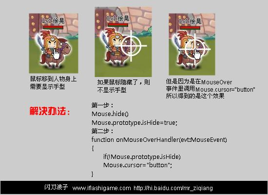

# 巧用原型继承解决游戏开发中的鼠标问题
今天在做游戏的时候游戏中有一个简单需求：

有一个人物，鼠标移到上面的时候需要显示手型指针。
if(MouseEvent.MOUSE_OVER)    Mouse.cursor="button";

但是玩家点击了攻击键之后，需要隐藏鼠标，用一个瞄准镜的MC来替代鼠标。此时当这个瞄准镜移动到人物身上的时候无需显示手型指针了。
Mouse.hide();
myMouse.visible=true;
myMouse.enterframe——》跟随鼠标

现在问题来了，由于Mouse.cursor=“button”封装在了人物类里面，我们需要让他知道鼠标已经被隐藏了，不用再显示手型了。如果通过破坏封装让人物类到外面取鼠标状态肯定不太好。而Mouse这个类又没有一个属性来查看鼠标时隐藏了还是显示着。

怎么办？？？

这个时候正好可以利用原型继承的特点可以很方便的实现（什么是原型继承)

对于这个问题我们只要能够记录鼠标是否被隐藏就能够解决问题，为了不破坏封装。我们把Mouse类当成一个我们自己的静态类来用。

首先，在Mouse.hide()执行的时候，添加一句  Mouse.prototype.isHide=true;
在Mouse.show()执行的时候，添加一句  Mouse.prototype.isHide=false;

然后在人物的MouseOver侦听事件加一个条件判断
if(!Mouse.prototype.isHide)
Mouse.cursor="button"
