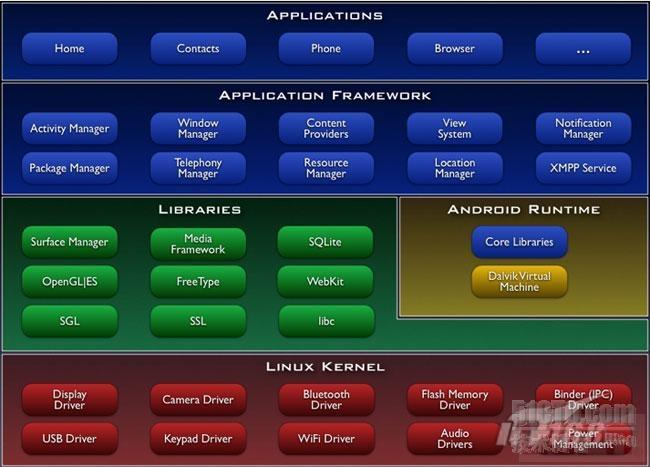

# Android系统架构图及简单的系统架构介绍
Android的系统架构和其操作系统一样，采用了分层的架构。从架构图看，android分为四个层，从高层到低层分别是应用程序层、应用程序框架层、系统运行库层和linux核心层。

Android系统架构图

## 1.应用程序
　　Android会同一系列核心应用程序包一起发布，该应用程序包包括email客户端，SMS短消息程序，日历，地图，浏览器，联系人管理程序等。所有的应用程序都是使用JAVA语言编写的。
## 2.应用程序框架
　　开发人员也可以完全访问核心应用程序所使用的API框架。该应用程序的架构设计简化了组件的重用;任何一个应用程序都可以发布它的功能块并且任何其它的应用程序都可以使用其所发布的功能块(不过得遵循框架的安全性限制)。同样，该应用程序重用机制也使用户可以方便的替换程序组件。
　　隐藏在每个应用后面的是一系列的服务和系统, 其中包括;
　　* 丰富而又可扩展的视图(Views)，可以用来构建应用程序， 它包括列表(lists)，网格(grids)，文本框(text boxes)，按钮(buttons)， 甚至可嵌入的web浏览器。
　　* 内容提供器(Content Providers)使得应用程序可以访问另一个应用程序的数据(如联系人数据库)， 或者共享它们自己的数据
　　* 资源管理器(Resource Manager)提供 非代码资源的访问，如本地字符串，图形，和布局文件( layout files )。
　　* 通知管理器 (Notification Manager) 使得应用程序可以在状态栏中显示自定义的提示信息。
　　* 活动管理器( Activity Manager) 用来管理应用程序生命周期并提供常用的导航回退功能。
　　有关更多的细节和怎样从头写一个应用程序，请参考 如何编写一个 Android 应用程序.
## 3.系统运行库
### 1)程序库
　　Android 包含一些C/C++库，这些库能被Android系统中不同的组件使用。它们通过 Android 应用程序框架为开发者提供服务。以下是一些核心库：
　　* 系统 C 库 - 一个从 BSD 继承来的标准 C 系统函数库( libc )， 它是专门为基于 embedded linux 的设备定制的。
　　* 媒体库 - 基于 PacketVideo OpenCORE;该库支持多种常用的音频、视频格式回放和录制，同时支持静态图像文件。编码格式包括MPEG4, H.264, MP3, AAC, AMR, JPG, PNG 。
　　* Surface Manager - 对显示子系统的管理，并且为多个应用程序提 供了2D和3D图层的无缝融合。
　　* LibWebCore - 一个最新的web浏览器引擎用，支持Android浏览器和一个可嵌入的web视图。
　　* SGL - 底层的2D图形引擎
　　* 3D libraries - 基于OpenGL ES 1.0 APIs实现;该库可以使用硬件 3D加速(如果可用)或者使用高度优化的3D软加速。
　　* FreeType -位图(bitmap)和矢量(vector)字体显示。
　　* SQLite - 一个对于所有应用程序可用，功能强劲的轻型关系型数据库引擎。
### 2)Android 运行库
　　Android 包括了一个核心库，该核心库提供了JAVA编程语言核心库的大多数功能。
　　每一个Android应用程序都在它自己的进程中运行，都拥有一个独立的Dalvik虚拟机实例。Dalvik被设计成一个设备可以同时高效地运行多个虚拟系统。 Dalvik虚拟机执行(.dex)的Dalvik可执行文件，该格式文件针对小内存使用做了优化。同时虚拟机是基于寄存器的，所有的类都经由JAVA编译器编译，然后通过SDK中 的 "dx" 工具转化成.dex格式由虚拟机执行。
　　Dalvik虚拟机依赖于linux内核的一些功能，比如线程机制和底层内存管理机制。
## 4.Linux 内核
　　Android 的核心系统服务依赖于 Linux 2.6 内核，如安全性，内存管理，进程管理， 网络协议栈和驱动模型。 Linux 内核也同时作为硬件和软件栈之间的抽象层。