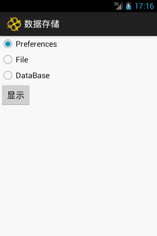
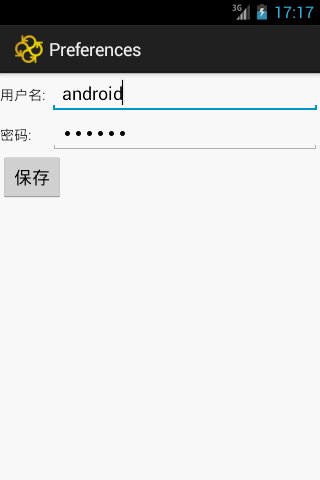
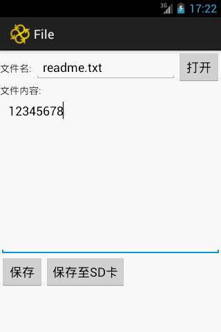

# Android 数据存储（数据库、文件、参数）操作实例
## 1. 主界面


Activity_main.xml
```
<ScrollView xmlns:android="http://schemas.android.com/apk/res/android"
    xmlns:tools="http://schemas.android.com/tools"
    android:layout_width="match_parent"
    android:layout_height="wrap_content"
    android:scrollbars="vertical" >

    <LinearLayout
        android:id="@+id/LinearLayout1"
        android:layout_width="match_parent"
        android:layout_height="wrap_content"
        android:orientation="vertical"
        tools:context=".MainActivity" >

        <RadioGroup
            android:id="@+id/radioClassName"
            android:layout_width="wrap_content"
            android:layout_height="wrap_content" >

            <RadioButton
                android:id="@+id/radio1"
                android:layout_width="wrap_content"
                android:layout_height="wrap_content"
                android:text="@string/title_activity_preferences" />
            <RadioButton
                android:id="@+id/radio2"
                android:layout_width="wrap_content"
                android:layout_height="wrap_content"
                android:text="@string/title_activity_file" />
            <RadioButton
                android:id="@+id/radio3"
                android:layout_width="wrap_content"
                android:layout_height="wrap_content"
                android:checked="true"
                android:text="@string/title_activity_data_base" />
        </RadioGroup>
        <Button
            android:layout_width="wrap_content"
            android:layout_height="wrap_content"
            android:onClick="display"
            android:text="@string/btn_display" />
    </LinearLayout>
</ScrollView>
```
## 2. 参数存储实例


Activity_preferences.xml
```
<LinearLayout xmlns:android="http://schemas.android.com/apk/res/android"
    xmlns:tools="http://schemas.android.com/tools"
    android:id="@+id/LinearLayout1"
    android:layout_width="match_parent"
    android:layout_height="match_parent"
    android:orientation="vertical"
    tools:context=".PreferencesActivity" >

    <LinearLayout
        android:layout_width="match_parent"
        android:layout_height="wrap_content"
        android:orientation="horizontal" >

        <TextView
            android:layout_width="50dp"
            android:layout_height="wrap_content"
            android:text="@string/lblUsername" />

        <EditText
            android:id="@+id/txtUsername"
            android:layout_width="match_parent"
            android:layout_height="wrap_content" />
    </LinearLayout>

    <LinearLayout
        android:layout_width="match_parent"
        android:layout_height="wrap_content"
        android:orientation="horizontal" >

        <TextView
            android:layout_width="50dp"
            android:layout_height="wrap_content"
            android:text="@string/lblPassword" />

        <EditText
            android:id="@+id/txtPassword"
            android:layout_width="match_parent"
            android:layout_height="wrap_content"
            android:inputType="textPassword" />
    </LinearLayout>

    <Button
        android:layout_width="wrap_content"
        android:layout_height="wrap_content"
        android:text="@string/btn_save"
        android:onClick="save" />

</LinearLayout>
```
文件存储路径：`/data/data/<package_name>/shared_prefs/<filename>.xml`
## 3. 文件存储实例


Activity_file.xml
```
<LinearLayout xmlns:android="http://schemas.android.com/apk/res/android"
    xmlns:tools="http://schemas.android.com/tools"
    android:id="@+id/LinearLayout2"
    android:layout_width="match_parent"
    android:layout_height="match_parent"
    android:orientation="vertical"
    tools:context=".PreferencesActivity" >

    <LinearLayout
        android:layout_width="match_parent"
        android:layout_height="wrap_content"
        android:orientation="horizontal" >

        <TextView
            android:layout_width="50dp"
            android:layout_height="wrap_content"
            android:text="@string/lblFilename" />

        <EditText
            android:id="@+id/txtFilename"
            android:layout_width="0dip"
            android:layout_height="wrap_content"
            android:layout_weight="1" />

        <Button
            android:layout_width="wrap_content"
            android:layout_height="wrap_content"
            android:onClick="open"
            android:text="@string/btn_open" />
    </LinearLayout>

    <TextView
        android:layout_width="wrap_content"
        android:layout_height="wrap_content"
        android:text="@string/lblFilecontent" />

    <EditText
        android:id="@+id/txtFilecontent"
        android:layout_width="match_parent"
        android:layout_height="wrap_content"
        android:gravity="top"
        android:inputType="textMultiLine"
        android:lines="10" />

    <LinearLayout
        android:layout_width="match_parent"
        android:layout_height="wrap_content"
        android:orientation="horizontal" >

        <Button
            android:layout_width="wrap_content"
            android:layout_height="wrap_content"
            android:onClick="save"
            android:text="@string/btn_save" />
        <Button
            android:layout_width="wrap_content"
            android:layout_height="wrap_content"
            android:onClick="save2sdcard"
            android:text="@string/btn_save2sdcard" />
    </LinearLayout>

</LinearLayout>
```


```
package com.example.data;

import android.app.Activity;
import android.os.Bundle;
import android.os.Environment;
import android.view.View;
import android.widget.EditText;
import android.widget.Toast;

import com.example.service.FileService;

public class FileActivity extends Activity {
    private EditText filenameEditText, filecontentEditText;
    private FileService service;

    @Override
    protected void onCreate(Bundle savedInstanceState) {
        super.onCreate(savedInstanceState);
        setContentView(R.layout.activity_file);
        service = new FileService(this);
        filenameEditText = (EditText) findViewById(R.id.txtFilename);
        filecontentEditText = (EditText) findViewById(R.id.txtFilecontent);
    }

    public void save(View view) {

        String filename = filenameEditText.getText().toString();
        String content = filecontentEditText.getText().toString();
        try {
            service.save(filename, content);
            Toast.makeText(this, getString(R.string.save_success), Toast.LENGTH_LONG).show();
        } catch (Exception e) {
            Toast.makeText(this, getString(R.string.save_fail), Toast.LENGTH_LONG).show();
            e.printStackTrace();
        }
    }
    public void save2sdcard(View view) {

        String filename = filenameEditText.getText().toString();
        String content = filecontentEditText.getText().toString();
        try {
            if (Environment.getExternalStorageState().equals(Environment.MEDIA_MOUNTED)) {
                service.save2sdcard(filename, content);
                Toast.makeText(this, getString(R.string.save_success), Toast.LENGTH_LONG).show();
            }
        } catch (Exception e) {
            Toast.makeText(this, getString(R.string.save_fail), Toast.LENGTH_LONG).show();
            e.printStackTrace();
        }
    }

    public void open(View view) {
        String filename = filenameEditText.getText().toString();
        try {
            String content=service.open(filename);
            filecontentEditText.setText(content);
            Toast.makeText(this, getString(R.string.open_success), Toast.LENGTH_LONG).show();
        } catch (Exception e) {
            Toast.makeText(this, getString(R.string.open_fail), Toast.LENGTH_LONG).show();
            e.printStackTrace();
        }
    }

}
```
```
package com.example.service;

import java.io.ByteArrayOutputStream;
import java.io.File;
import java.io.FileInputStream;
import java.io.FileOutputStream;

import android.content.Context;
import android.os.Environment;

public class FileService {
    private Context context;

    public FileService(Context content) {
        this.context = content;
    }
    ///data/data/<package_name>/files/<filename>
    public void save(String filename, String content) throws Exception {
        FileOutputStream outputStream = context.openFileOutput(filename, Context.MODE_PRIVATE);
        outputStream.write(content.getBytes());
        outputStream.close();
    }

    //path: /Android/data/<package_name>/files/<filename>
    public void save2sdcard(String filename, String content) throws Exception {
        //Environment.getExternalStoragePublicDirectory(Environment.DIRECTORY_DOWNLOADS);
        String path=Environment.getExternalStorageDirectory()+"/Android/data/com.example.data/files/";
        File file = new File(path, filename);
        new File(file.getParent()).mkdirs();
        FileOutputStream outputStream = new FileOutputStream(file);
        outputStream.write(content.getBytes());
        outputStream.close();
    }

    public String open(String filename) throws Exception {
        FileInputStream inputStream = context.openFileInput(filename);
        ByteArrayOutputStream outputStream = new ByteArrayOutputStream();
        byte[] buffer = new byte[1024] ;
        int len = 0;
        while ((len = inputStream.read(buffer)) != -1) {
            outputStream.write(buffer, 0, len);
        }
        return new String(outputStream.toByteArray());
    }

}
```
文件存储路径：
内部存储：/data/data/<package_name>/files/<filename>
SD卡存储：/Android/data/<package_name>/files/<filename>
## 4. 数据库存储实例


Activity_database.xml
```
<LinearLayout xmlns:android="http://schemas.android.com/apk/res/android"
    xmlns:tools="http://schemas.android.com/tools"
    android:id="@+id/LinearLayout3"
    android:layout_width="match_parent"
    android:layout_height="match_parent"
    android:orientation="vertical"
    tools:context=".PreferencesActivity" >

    <LinearLayout
        android:layout_width="match_parent"
        android:layout_height="wrap_content"
        android:orientation="horizontal" >

        <TextView
            android:layout_width="wrap_content"
            android:layout_height="wrap_content"
            android:text="@string/lblPhone" />

        <EditText
            android:id="@+id/txtPhone"
            android:layout_width="match_parent"
            android:layout_height="wrap_content"
            android:inputType="text" />
    </LinearLayout>

    <LinearLayout
        android:layout_width="match_parent"
        android:layout_height="wrap_content"
        android:orientation="horizontal" >

        <Button
            android:layout_width="wrap_content"
            android:layout_height="wrap_content"
            android:onClick="save"
            android:text="@string/btn_save2db" />

        <Button
            android:layout_width="wrap_content"
            android:layout_height="wrap_content"
            android:onClick="list"
            android:text="@string/btn_list" />
    </LinearLayout>

</LinearLayout>
```

数据库文件存储路径：`/data/data/<package_name>/databases/<databaseName>`