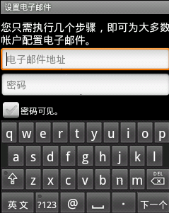
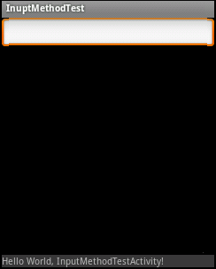
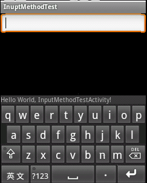
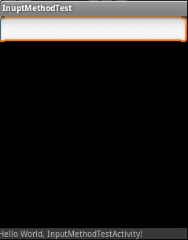
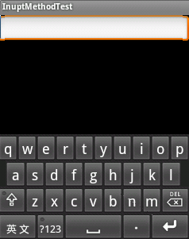
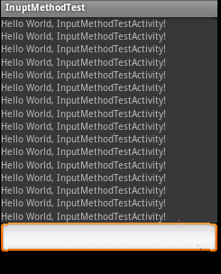
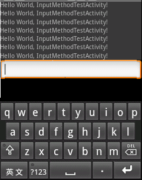
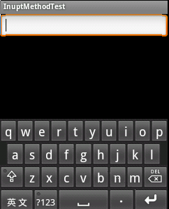

# Android软键盘的隐藏显示研究
 Android是一个针对触摸屏专门设计的操作系统，当点击编辑框，系统自动为用户弹出软键盘，以便用户进行输入。
    那么，弹出软键盘后必然会造成原有布局高度的减少，那么系统应该如何来处理布局的减少？我们能否在应用程序中进行自定义的控制？这些是本文要讨论的重点。



## 一、软键盘显示的原理
    软件盘的本质是什么？软键盘其实是一个Dialog！
    InputMethodService为我们的输入法创建了一个Dialog，并且将该Dialog的Window的某些参数（如Gravity）进行了设置，使之能够在底部或者全屏显示。当我们点击输入框时，系统对活动主窗口进行调整，从而为输入法腾出相应的空间，然后将该Dialog显示在底部，或者全屏显示。
## 二、活动主窗口调整
    android定义了一个属性，名字为windowSoftInputMode, 用它可以让程序可以控制活动主窗口调整的方式。我们可以在AndroidManifet.xml中对Activity进行设置。如：android:windowSoftInputMode="stateUnchanged|adjustPan"
    该属性可选的值有两部分，一部分为软键盘的状态控制，另一部分是活动主窗口的调整。前一部分本文不做讨论，请读者自行查阅android文档。
###  模式一，压缩模式
    windowSoftInputMode的值如果设置为adjustResize，那么该Activity主窗口总是被调整大小以便留出软键盘的空间。
我们通过一段代码来测试一下，当我们设置了该属性后，弹出输入法时，系统做了什么。
    重写Layout布局：
```
public class ResizeLayout extends LinearLayout{
    private static int count = 0;

    public ResizeLayout(Context context, AttributeSet attrs) {
        super(context, attrs);
    }

    @Override
    protected void onSizeChanged(int w, int h, int oldw, int oldh) {
        super.onSizeChanged(w, h, oldw, oldh);

        Log.e("onSizeChanged " + count++, "=>onResize called! w="+w + ",h="+h+",oldw="+oldw+",oldh="+oldh);
    }

    @Override
    protected void onLayout(boolean changed, int l, int t, int r, int b) {
        super.onLayout(changed, l, t, r, b);
        Log.e("onLayout " + count++, "=>OnLayout called! l=" + l + ", t=" + t + ",r=" + r + ",b="+b);
    }

    @Override
    protected void onMeasure(int widthMeasureSpec, int heightMeasureSpec) {
        super.onMeasure(widthMeasureSpec, heightMeasureSpec);

        Log.e("onMeasure " + count++, "=>onMeasure called! widthMeasureSpec=" + widthMeasureSpec + ", heightMeasureSpec=" + heightMeasureSpec);
    }
```

    我们的布局设置为：
```
<com.winuxxan.inputMethodTest.ResizeLayout
    xmlns:android="http://schemas.android.com/apk/res/android"
    android:id="@+id/root_layout"
    android:layout_width="fill_parent"
    android:layout_height="fill_parent"
    android:orientation="vertical"
    >

    <EditText
        android:layout_width="fill_parent"
        android:layout_height="wrap_content"
    />

    <LinearLayout
            android:id="@+id/bottom_layout"
            android:layout_width="fill_parent"
            android:layout_height="fill_parent"
            android:orientation="vertical"
            android:gravity="bottom">s

    <TextView
        android:layout_width="fill_parent"
        android:layout_height="wrap_content"
        android:text="@string/hello"
        android:background="#77777777"
      />
   </LinearLayout>
</com.winuxxan.inputMethodTest.ResizeLayout>
```
    AndroidManifest.xml的Activity设置属性：`android:windowSoftInputMode = "adjustResize"`
    运行程序，点击文本框，查看调试信息：
```
    E/onMeasure 6(7960): =>onMeasure called! widthMeasureSpec=1073742144, heightMeasureSpec = 1073742024
    E/onMeasure 7(7960): =>onMeasure called! widthMeasureSpec=1073742144, heightMeasureSpec = 1073742025
    E/onSizeChanged 8(7960): =>onSizeChanged called! w=320,h=201,oldw=320,oldh=377
    E/onLayout 9(7960): =>OnLayout called! l=0, t=0,r=320,b=201
```
    从调试结果我们可以看出，当我们点击文本框后，根布局调用了onMeasure，onSizeChanged和onLayout。
    实际上，当设置为adjustResize后，软键盘弹出时，要对主窗口布局重新进行measure和layout，而在layout时，发现窗口的大小发生的变化，因此调用了onSizeChanged。
    从下图的运行结果我们也可以看出，原本在下方的TextView被顶到了输入法的上方。





###  模式二，平移模式
    windowSoftInputMode的值如果设置为adjustPan，那么该Activity主窗口并不调整屏幕的大小以便留出软键盘的空间。相反，当前窗口的内容将自动移动以便当前焦点从不被键盘覆盖和用户能总是看到输入内容的部分。这个通常是不期望比调整大小，因为用户可能关闭软键盘以便获得与被覆盖内容的交互操作。
    上面的例子中，我们将AndroidManifest.xml的属性进行更改：`android: windowSoftInputMode = "adjustPan"`

    重新运行，并点击文本框，查看调试信息：
```
    E/onMeasure 6(8378): =>onMeasure called! widthMeasureSpec=1073742144, heightMeasureSpec=1073742200
    E/onMeasure 7(8378): =>onMeasure called! widthMeasureSpec=1073742144, heightMeasureSpec=1073742201
    E/onLayout 8(8378): =>OnLayout called! l=0, t=0,r=320,b=377
```
    我们看到：系统也重新进行了measrue和layout，但是我们发现，layout过程中onSizeChanged并没有调用，这说明输入法弹出前后并没有改变原有布局的大小。
    从下图的运行结果我们可以看到，下方的TextView并没有被顶到输入法上方。





    事实上，当输入框不会被遮挡时，该模式没有对布局进行调整，然而当输入框将要被遮挡时，窗口就会进行平移。也就是说，该模式始终是保持输入框为可见。如下图，整个窗口，包括标题栏均被上移，以保证文本框可见。





### 模式三 自动模式
    当属性windowSoftInputMode被设置为adjustUspecified时，它不被指定是否该Activity主窗口调整大小以便留出软键盘的空间，或是否窗口上的内容得到屏幕上当前的焦点是可见的。系统将自动选择这些模式中一种主要依赖于是否窗口的内容有任何布局视图能够滚动他们的内容。如果有这样的一个视图，这个窗口将调整大小，这样的假设可以使滚动窗口的内容在一个较小的区域中可见的。这个是主窗口默认的行为设置。
    也就是说，系统自动决定是采用平移模式还是压缩模式，决定因素在于内容是否可以滚动。

## 三、侦听软键盘的显示隐藏
    有时候，借助系统本身的机制来实现主窗口的调整并非我们想要的结果，我们可能希望在软键盘显示隐藏的时候，手动的对布局进行修改，以便使软键盘弹出时更加美观。这时就需要对软键盘的显示隐藏进行侦听。
    直接对软键盘的显示隐藏侦听的方法本人没有找到，如果哪位找到的方法请务必告诉本人一声。还有本方法针对压缩模式，平移模式不一定有效。
    我们可以借助软键盘显示和隐藏时，对主窗口进行了重新布局这个特性来进行侦听。如果我们设置的模式为压缩模式，那么我们可以对布局的onSizeChanged函数进行跟踪，如果为平移模式，那么该函数可能不会被调用。
    我们可以重写根布局，因为根布局的高度一般情况下是不发生变化的。
    假设跟布局为线性布局，模式为压缩模式，我们写一个例子，当输入法弹出时隐藏某个view，输入法隐藏时显示某个view。
```
public class ResizeLayout extends LinearLayout{
    private OnResizeListener mListener;

    public interface OnResizeListener {
        void OnResize(int w, int h, int oldw, int oldh);
    }

    public void setOnResizeListener(OnResizeListener l) {
        mListener = l;
    }

    public ResizeLayout(Context context, AttributeSet attrs) {
        super(context, attrs);
    }

    @Override
    protected void onSizeChanged(int w, int h, int oldw, int oldh) {
        super.onSizeChanged(w, h, oldw, oldh);

        if (mListener != null) {
            mListener.OnResize(w, h, oldw, oldh);
        }
    }
}
```
    在我们的Activity中，通过如下方法调用：
```
public class InputMethodTestActivity extends Activity {
    private static final int BIGGER = 1;
    private static final int SMALLER = 2;
    private static final int MSG_RESIZE = 1;

    private static final int HEIGHT_THREADHOLD = 30;

    class InputHandler extends Handler {
        @Override
        public void handleMessage(Message msg) {
            switch (msg.what) {
            case MSG_RESIZE: {
                if (msg.arg1 == BIGGER) {
                    findViewById(R.id.bottom_layout).setVisibility(View.VISIBLE);
                } else {
                    findViewById(R.id.bottom_layout).setVisibility(View.GONE);
                }
            }
                break;

            default:
                break;
            }
            super.handleMessage(msg);
        }
    }

    private InputHandler mHandler = new InputHandler();

    /** Called when the activity is first created. */
    @Override
    public void onCreate(Bundle savedInstanceState) {
        super.onCreate(savedInstanceState);
        setContentView(R.layout.main);

        ResizeLayout layout = (ResizeLayout) findViewById(R.id.root_layout);
        layout.setOnResizeListener(new ResizeLayout.OnResizeListener() {

            public void OnResize(int w, int h, int oldw, int oldh) {
                int change = BIGGER;
                if (h < oldh) {
                    change = SMALLER;
                }

                Message msg = new Message();
                msg.what = 1;
                msg.arg1 = change;
                mHandler.sendMessage(msg);
            }
        });
    }
}
```
    这里特别需要注意的是，不能直接在OnResizeListener中对要改变的View进行更改，因为OnSizeChanged函数实际上是运行在View的layout方法中，如果直接在onSizeChange中改变view的显示属性，那么很可能需要重新调用layout方法才能显示正确。然而我们的方法又是在layout中调用的，因此会出现错误。因此我们在例子中采用了Handler的方法。



