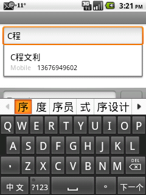
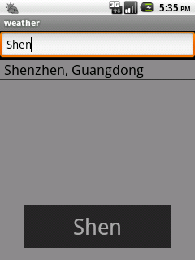
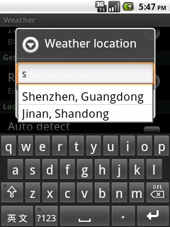

# Android的数据过滤机制
## 一、何谓Android的过滤机制？

    Android对数据的处理是分层的，从上到下，可以分为：数据层、提供层、Cursor层（不好意思，没找到一个词来表示）、适配层、显示层。每个层次通过一定的机制，可以使数据发生变化时能够上下通知。如下图：

* 显示层（ListView，GridView,AutoCompleteTextView等）
* 适配层（Adpater）
* Cursor层（Cursor）
* 提供层（ContentProvider）
* 数据层（文件、sqlite、SharedPreference）

    数据层是数据具体的存储方式，它可以包括文件、sqlite数据库以及SharedPreference。提供层向上层提供了统一的数据调用方式，并负责向其它应用共享数据。Cursor层将查询的数据统一成Cursor的形式来使用。适配层用来连接Cursor层和显示层，将数据和界面连接起来。显示层负责数据的显示。
    另外，Andriod提供了数据的过滤机制，也就是在不改变数据存储的情况下，异步或同步的过滤符合条件的数据，并即时的显示在界面上。
    Android原生的例子当中，最明显的例子就是AutoCompleteTextView，见下图。



    当输入“C程”时，数据库中自动过滤出了还有该字符串的联系人姓名，并显示出来。

##  二、Android做了哪些？
    1、为了实现数据的过滤，andorid设计了抽象类Filter，进行异步和同步的数据过滤操作。
    2、在Adapter中继承Filterable，提供给使用者Filter，进行过滤。
    3、在不同的View中，获得查询约束字符串，传递给Adapter，并且提供配合数据过滤的界面支持。

## 三、Filter类
    Filter的使用流程如下：
    调用filter方法 ->在另一线程中调用performFiltering进行数据查询->得到数据过滤结果后调用publishResults将结果返回到使用它的客户端。
    该类中的performFiltering和publishResults均为抽象方法，需要继承者自己重写。
    CursorFilter类就是Filter类的继承。CursorFilter在performFiltering中并没有直接进行数据的过滤，而是加入了CursorFilterClient成员，将过滤的操作转让给了CursorFilterClient,实际上CursorAdpater就是继承了CursorFilterClient接口，也就是说过滤操作实际上是在CursorAdapter中执行的。

## 四、Filterable接口
    常用的Adapter基本上都继承了Filterable接口，如CursorAdapter，ArrayAdapter，SimpleAdapter等。该接口只有一个函数，名为getFilter，通过该函数可以通过Adaper获取Filter，然后通过该Filter进行过滤。

    在CursorAdapter中，可以更改过滤的流程，有两种方式：
    1、通过重写CursorAdapter的runQueryOnBackgroundThread函数，在函数中根据过滤约束字符串，重新查找生成新的Cursor。Adapter会适时将旧的Cursor进行替换。
    2、通过调用setFilterQueryProvider函数，提供一个FilterQueryProvider，该对象含有runQuery方法，作用同runQueryOnBackgroundThread方法相同。

    使用那种方法取决于您是不是重载CursorAdapter，以及您的过滤动作需要在Adpter中实现还是在主程序中实现。

## 五、数据过滤功能的View的界面支持。
    为了实现数据过滤的功能，在数据显示层，也有相应的支持。比如ListView和GridView，设置了setFilterText函数，通过该函数可以一方面进行数据的过滤，另一方面显示一个PopupWindow,提示用户输入了那种过滤条件。AutoCompleteTextView当用户在文本框输入文字时，自动进行过滤，并弹出列表显示过滤数据。




## 六、实战

    知道了Android的过滤机制，我们就以AutoCompleteTextView为例，通过输入文本筛选数据库中的数据。

### 1、首先写ContentProvider
    由于代码量比较多，只写出对外的接口。
```
public static final class Location implements BaseColumns {
    public static final Uri CONTENT_URI = Uri.withAppendedPath(AUTHORITY_URI, "location");
    public static final String CONTENT_TYPE = "vnd.android.cursor.dir/weather_location";
    public static final String CONTENT_ITEM_TYPE = "vnd.android.cursor.item/weather_location";
    public static final String CONTENT_DIRECTORY = "location";

    public static final String LOCATION_NAME = "location_name";
    public static final String LONGITUDE = "longitude";
    public static final String ALTITUDE = "altitude";
}
```
### 2、写CursorAdapter
```
private static class LocationAdapter extends CursorAdapter {
    private LayoutInflater mInflater;
    private Context mContext;
    private Cursor mCursor;
    public LocationAdapter(Context context, Cursor c) {
        super(context, c);
        mContext = context;
        mInflater = (LayoutInflater) context.getSystemService(Context.LAYOUT_INFLATER_SERVICE);
    }

    @Override
    public void bindView(View view, Context context, Cursor cursor) {
        TextView textView = (TextView) view;
        String location = cursor.getString(cursor.getColumnIndex(Location.LOCATION_NAME));
        textView.setText(location);
    }

    @Override
    public View newView(Context context, Cursor cursor, ViewGroup parent) {
        return mInflater.inflate(android.R.layout.simple_dropdown_item_1line, null);
    }

    @Override
    public Cursor runQueryOnBackgroundThread(CharSequence constraint) {
        String selection = Location.LOCATION_NAME + " LIKE '%" + constraint + "%'";
        return mContext.getContentResolver().query(Location.CONTENT_URI
                , null, selection, null, null);
    }

    /**一定要重写该方法，否则AutoCompleteTextView选中某一项后，文本框显示的不是所要的文本*/
    @Override
    public CharSequence convertToString(Cursor cursor) {
        return cursor.getString(cursor.getColumnIndex(Location.LOCATION_NAME));
    }
}
```
### 3、AutoCompleteTextView与Adapter关联。
```
private void initialTextView() {
    mTextView = new AutoCompleteTextView(mContext);
    mTextView.setThreshold(0);

    Cursor cursor = mContext.getContentResolver().query(Location.CONTENT_URI
            , null, null, null, null);
    LocationAdapter adapter = new LocationAdapter(mContext, cursor);
    mTextView.setAdapter(adapter);
}
```
    需要提醒的是：AutoCompleteTextView内部的数据筛选并没用采用异步筛选的方式，而是直接调用了Filter内部的performFiltering,所以尽量不要在筛选的函数内做太费时间的事情，否则就乎出现不流畅的情况。

    Enjoy it！

