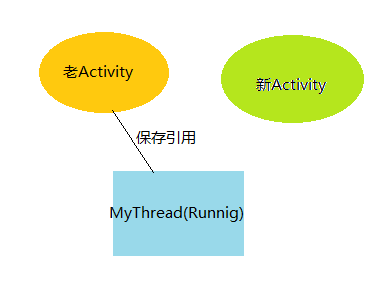

# Android，谁动了我的内存
## 一、 Android的内存机制

    Android的程序由Java语言编写，所以Android的内存管理与Java的内存管理相似。程序员通过new为对象分配内存，所有对象在java堆内分配空间；然而对象的释放是由垃圾回收器来完成的。C／C++中的内存机制是“谁污染，谁治理”，java的就比较人性化了，给我们请了一个专门的清洁工（GC）。
    那么GC怎么能够确认某一个对象是不是已经被废弃了呢？Java采用了有向图的原理。Java将引用关系考虑为图的有向边，有向边从引用者指向引用对象。线程对象可以作为有向图的起始顶点，该图就是从起始顶点开始的一棵树，根顶点可以到达的对象都是有效对象，GC不会回收这些对象。如果某个对象 (连通子图)与这个根顶点不可达(注意，该图为有向图)，那么我们认为这个(这些)对象不再被引用，可以被GC回收。

## 二、Android的内存溢出

    Android的内存溢出是如何发生的?

    Android的虚拟机是基于寄存器的Dalvik，它的最大堆大小一般是16M，有的机器为24M。因此我们所能利用的内存空间是有限的。如果我们的内存占用超过了一定的水平就会出现OutOfMemory的错误。

为什么会出现内存不够用的情况呢？我想原因主要有两个：

由于我们程序的失误，长期保持某些资源（如Context）的引用，造成内存泄露，资源造成得不到释放。
保存了多个耗用内存过大的对象（如Bitmap），造成内存超出限制。
## 三、万恶的static

    static是Java中的一个关键字，当用它来修饰成员变量时，那么该变量就属于该类，而不是该类的实例。所以用static修饰的变量，它的生命周期是很长的，如果用它来引用一些资源耗费过多的实例（Context的情况最多），这时就要谨慎对待了。

```
public class ClassName {
     private static Context mContext;
     //省略
}
```

以上的代码是很危险的，如果将Activity赋值到么mContext的话。那么即使该Activity已经onDestroy，但是由于仍有对象保存它的引用，因此该Activity依然不会被释放。


    我们举Android文档中的一个例子。

```
private static Drawable sBackground;

 @Override
 protected void onCreate(Bundle state) {
   super.onCreate(state);

   TextView label = new TextView(this);
   label.setText("Leaks are bad");

   if (sBackground == null) {
     sBackground = getDrawable(R.drawable.large_bitmap);
   }
   label.setBackgroundDrawable(sBackground);

   setContentView(label);
 }
```
    sBackground, 是一个静态的变量，但是我们发现，我们并没有显式的保存Contex的引用，但是，当Drawable与View连接之后，Drawable就将View设置为一个回调，由于View中是包含Context的引用的，所以，实际上我们依然保存了Context的引用。这个引用链如下：

    Drawable->TextView->Context

    所以，最终该Context也没有得到释放，发生了内存泄露。

    如何才能有效的避免这种引用的发生呢？

    第一，应该尽量避免static成员变量引用资源耗费过多的实例，比如Context。

    第二、Context尽量使用Application Context，因为Application的Context的生命周期比较长，引用它不会出现内存泄露的问题。

    第三、使用WeakReference代替强引用。比如可以使用WeakReference<Context> mContextRef;

    该部分的详细内容也可以参考Android文档中Article部分。

## 四、都是线程惹的祸

    线程也是造成内存泄露的一个重要的源头。线程产生内存泄露的主要原因在于线程生命周期的不可控。我们来考虑下面一段代码。
```
public class MyActivity extends Activity {
    @Override
    public void onCreate(Bundle savedInstanceState) {
        super.onCreate(savedInstanceState);
        setContentView(R.layout.main);
        new MyThread().start();
    }

    private class MyThread extends Thread{
        @Override
        public void run() {
            super.run();
            //do somthing
        }
    }
}
```
    这段代码很平常也很简单，是我们经常使用的形式。我们思考一个问题：假设MyThread的run函数是一个很费时的操作，当我们开启该线程后，将设备的横屏变为了竖屏，一般情况下当屏幕转换时会重新创建Activity，按照我们的想法，老的Activity应该会被销毁才对，然而事实上并非如此。

    由于我们的线程是Activity的内部类，所以MyThread中保存了Activity的一个引用，当MyThread的run函数没有结束时，MyThread是不会被销毁的，因此它所引用的老的Activity也不会被销毁，因此就出现了内存泄露的问题。



    有些人喜欢用Android提供的AsyncTask，但事实上AsyncTask的问题更加严重，Thread只有在run函数不结束时才出现这种内存泄露问题，然而AsyncTask内部的实现机制是运用了ThreadPoolExcutor,该类产生的Thread对象的生命周期是不确定的，是应用程序无法控制的，因此如果AsyncTask作为Activity的内部类，就更容易出现内存泄露的问题。

    这种线程导致的内存泄露问题应该如何解决呢？

    第一、将线程的内部类，改为静态内部类。

    第二、在线程内部采用弱引用保存Context引用。

    解决的模型如下：
```
public abstract class WeakAsyncTask<Params, Progress, Result, WeakTarget> extends
        AsyncTask<Params, Progress, Result> {
    protected WeakReference<WeakTarget> mTarget;

    public WeakAsyncTask(WeakTarget target) {
        mTarget = new WeakReference<WeakTarget>(target);
    }

    /** {@inheritDoc} */
    @Override
    protected final void onPreExecute() {
        final WeakTarget target = mTarget.get();
        if (target != null) {
            this.onPreExecute(target);
        }
    }

    /** {@inheritDoc} */
    @Override
    protected final Result doInBackground=\'#\'" /span>
        final WeakTarget target = mTarget.get();
        if (target != null) {
            return this.doInBackground=\'#\'" /span>
        } else {
            return null;
        }
    }

    /** {@inheritDoc} */
    @Override
    protected final void onPostExecute(Result result) {
        final WeakTarget target = mTarget.get();
        if (target != null) {
            this.onPostExecute(target, result);
        }
    }

    protected void onPreExecute(WeakTarget target) {
        // No default action
    }

    protected abstract Result doInBackground(WeakTarget target, Params... params);

    protected void onPostExecute(WeakTarget target, Result result) {
        // No default action
    }
}
```

    事实上，线程的问题并不仅仅在于内存泄露，还会带来一些灾难性的问题。由于本文讨论的是内存问题，所以在此不做讨论。

## 五、超级大胖子Bitmap


    可以说出现OutOfMemory问题的绝大多数人，都是因为Bitmap的问题。因为Bitmap占用的内存实在是太多了，它是一个“超级大胖子”，特别是分辨率大的图片，如果要显示多张那问题就更显著了。

    如何解决Bitmap带给我们的内存问题？

### 第一、及时的销毁。

    虽然，系统能够确认Bitmap分配的内存最终会被销毁，但是由于它占用的内存过多，所以很可能会超过java堆的限制。因此，在用完Bitmap时，要及时的recycle掉。recycle并不能确定立即就会将Bitmap释放掉，但是会给虚拟机一个暗示：“该图片可以释放了”。

### 第二、设置一定的采样率。

    有时候，我们要显示的区域很小，没有必要将整个图片都加载出来，而只需要记载一个缩小过的图片，这时候可以设置一定的采样率，那么就可以大大减小占用的内存。如下面的代码：
```
 private ImageView preview;
 BitmapFactory.Options options = new BitmapFactory.Options();
 options.inSampleSize = 2;//图片宽高都为原来的二分之一，即图片为原来的四分之一
 Bitmap bitmap = BitmapFactory.decodeStream(cr.openInputStream(uri), null, options);
preview.setImageBitmap(bitmap);
```
### 第三、巧妙的运用软引用（SoftRefrence）

    有些时候，我们使用Bitmap后没有保留对它的引用，因此就无法调用Recycle函数。这时候巧妙的运用软引用，可以使Bitmap在内存快不足时得到有效的释放。如下例：
```
/**本例子为博主随手一写，来说明用法，并未验证*/
private class MyAdapter extends BaseAdapter {

    private ArrayList<SoftReference<Bitmap>> mBitmapRefs = new ArrayList<SoftReference<Bitmap>>();
    private ArrayList<Value> mValues;
    private Context mContext;
    private LayoutInflater mInflater;

    MyAdapter(Context context, ArrayList<Value> values) {
        mContext = context;
        mValues = values;
        mInflater = (LayoutInflater) context.getSystemService(Context.LAYOUT_INFLATER_SERVICE);
    }
    public int getCount() {
        return mValues.size();
    }

    public Object getItem(int i) {
        return mValues.get(i);
    }

    public long getItemId(int i) {
        return i;
    }

    public View getView(int i, View view, ViewGroup viewGroup) {
        View newView = null;
        if(view != null) {
            newView = view;
        } else {
            newView =(View)mInflater.inflate(R.layout.image_view, false);
        }

        Bitmap bitmap = BitmapFactory.decodeFile(mValues.get(i).fileName);
        mBitmapRefs.add(new SoftReference<Bitmap>(bitmap));     //此处加入ArrayList
        ((ImageView)newView).setImageBitmap(bitmap);

        return newView;
    }
}
```
## 六、行踪诡异的Cursor

    Cursor是Android查询数据后得到的一个管理数据集合的类，正常情况下，如果查询得到的数据量较小时不会有内存问题，而且虚拟机能够保证Cusor最终会被释放掉。

    然而如果Cursor的数据量特表大，特别是如果里面有Blob信息时，应该保证Cursor占用的内存被及时的释放掉，而不是等待GC来处理。并且Android明显是倾向于编程者手动的将Cursor close掉，因为在源代码中我们发现，如果等到垃圾回收器来回收时，会给用户以错误提示。

    所以我们使用Cursor的方式一般如下：
```
Cursor cursor = null;
try {
    cursor = mContext.getContentResolver().query(uri,null, null,null,null);
    if(cursor != null) {
        cursor.moveToFirst();
        //do something
    }
} catch (Exception e) {
    e.printStackTrace();
} finally {
    if (cursor != null) {
       cursor.close();
    }
}
```
    有一种情况下，我们不能直接将Cursor关闭掉，这就是在CursorAdapter中应用的情况，但是注意，CursorAdapter在Acivity结束时并没有自动的将Cursor关闭掉，因此，你需要在onDestroy函数中，手动关闭。
```
@Override
protected void onDestroy() {
    if (mAdapter != null && mAdapter.getCurosr() != null) {
        mAdapter.getCursor().close();
    }
    super.onDestroy();
}
```
  CursorAdapter中的changeCursor函数，会将原来的Cursor释放掉，并替换为新的Cursor，所以你不用担心原来的Cursor没有被关闭。

  你可能会想到使用Activity的managedQuery来生成Cursor，这样Cursor就会与Acitivity的生命周期一致了，多么完美的解决方法！然而事实上managedQuery也有很大的局限性。

    managedQuery生成的Cursor必须确保不会被替换，因为可能很多程序事实上查询条件都是不确定的，因此我们经常会用新查询的Cursor来替换掉原先的Cursor。因此这种方法适用范围也是很小。

## 七、其它要说的。

    其实，要减小内存的使用，其实还有很多方法和要求。比如不要使用整张整张的图，尽量使用9path图片。Adapter要使用convertView等等，好多细节都可以节省内存。这些都需要我们去挖掘，谁叫Android的内存不给力来着。