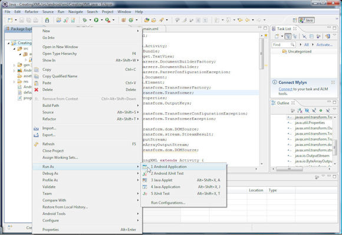
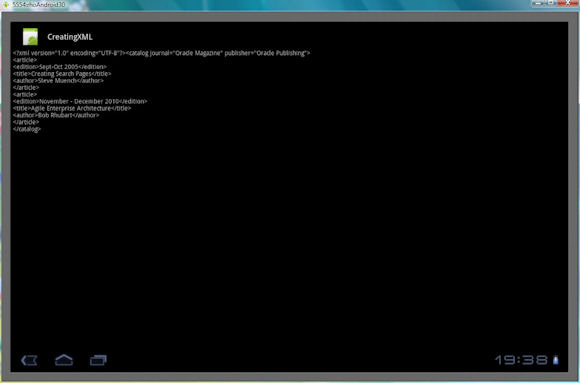

# 在 Android 3.0 平台上创建和解析 XML
## 简介

作为最常用的智能手机平台，Android 可同时用于智能手机和移动平板电脑。Motorola XOOM 是一个 Android 平板电脑。在本文中，您可以学习如何在 Android 设备上创建和解析 XML 文档。要输出 XML，您可以使用标准的 javax.xml.transform.Transformer 类。要在 Android 上解析 XML，则可以使用 DOM 与 SAX 解析器。org.xmlpull.v1.XmlPullParser pull 解析器也可以用于解析 XML。本文中的示例使用了 Android Platform 3.0 来处理 XML。

下载 本文中使用的示例应用程序。


## 组建环境

要使用本文中给出的示例，则需要安装和配置以下软件。请参见 参考资料 中的相关链接。

常用缩写词
ADT: Android Development Tools，Android 开发工具
API: Application programming interface，应用程序编程接口
AVD: Android Virtual Device，Android 虚拟设备
DOM: Document object model，文档对象模型
IDE: Integrated Development Environment，集成开发环境
JSON: JavaScript Object Notation，JavaScript 对象表示法
SAX: Simple API for XML，XML 简易 API
SDK: Software Development Kit，软件开发包
UI: User Interface，用户界面
XML: Extensible Markup Language，可扩展标记语言

- 安装 Eclipse IDE。
- 安装针对 Eclipse 的 Android Development Tools (ADT)插件，它提供一组在 Eclipse 中开发 Android 应用程序的扩展。
- 下载并安装 Android SDK Platform，它提供用于开发 Android 应用程序的工具。
- 选择 Window > Android SDK 和 AVD Manager，在 Eclipse 中启动 Android SDK 和 AVD Manager。
- 在 Android SDK 和 AVD Manager 中创建一个 Android Virtual Device (AVD)，它是 Android 的模拟器。

请为 AVD 选择 Platform 3.0 和 API 11。

###创建一份 XML 文档

在这一节中，您将在 Android 上创建一份 XML 文档。第一步是创建一个 Android 项目。

1.在 Eclipse IDE 中选择 File > New。在 New 对话框中，选择Android > Android Project。然后单击 Next。
2.在 New Android Project 窗口中，如 图 1 中所示，指定：
* 项目名称：CreatingXML
* Build Target 复选框：Android Platform 3.0 和 API 11
* 属性：
    * 应用程序名称：CreatingXML
    * 包名称：android.xml
    * 选择创建活动：活动类 (CreatingXML)。一个活动代表一次用户交互。该类扩展了 Activity 类，为 UI 创建了一个窗口。
    * 最低 SDK 版本：11


图 1. 为平台 3.0 创建一个 Android 项目


3.单击 Next。
4.单击 Finish。这样就创建好了一个用于创建 XML 文档的 Android 项目。Android 项目包含以下这些文件：
* 一个活动类 CreatingXML，它扩展了 Activity 类。
* res/layout/main.xml 文件，它指定了 Android UI 组件的布局。
*
AndroidManifest.xml 文件，它包含应用程序配置，比如包名称，启动 Android 应用程序时启动的主要活动、应用程序组件、进程以及最低的 API 级别。
图 2 显示了 Android 项目 CreatingXML 的目录结构。


图 2. 用于创建 XML 文档的 Android 项目


在 res/layout/main.xml 文件中，指定 Android UI 组件的布局。创建一个 LinearLayout，并将 android:orientation 设置为vertical。在这个例子中，您将以文本消息的形式显示 XML 文档。添加一个 id 为 xmlresult 的 TextView 元素，以显示 XML 文档，如 清单 1 中所示。


清单 1. 布局文件 main.xml
```
				<?xml version="1.0" encoding="utf-8"?>
<LinearLayout xmlns:android="http://schemas.android.com/apk/res/android"
     android:orientation="vertical" android:layout_width="fill_parent"
     android:layout_height="fill_parent">
     <TextView android:id="@+id/xmlresult" android:layout_width="fill_parent"
          android:layout_height="wrap_content" />
</LinearLayout>
```
在 AndroidManifest.xml 文件中，指定 Activity 运行 CreatingXML。使用 uses-sdk 元素 11 指定最低的 Android 版本。使用活动元素与子元素指定活动 intent-filter 和 action。清单 2 显示了该文件。


清单 2. 配置文件 AndroidManifest.xml
```
				<?xml version="1.0" encoding="utf-8"?>
<manifest xmlns:android="http://schemas.android.com/apk/res/android"
      package="android.xml"
      android:versionCode="1"
      android:versionName="1.0">
    <uses-sdk android:minSdkVersion="11" />

    <application android:icon="@drawable/icon" android:label="@string/app_name">
        <activity android:name=".CreatingXML"
                  android:label="@string/app_name">
            <intent-filter>
                <action android:name="android.intent.action.MAIN" />
                <category android:name="android.intent.category.LAUNCHER" />
            </intent-filter>
        </activity>

    </application>
</manifest>
```
现在，您将在活动类 CreatingXML 中创建一份 XML 文档，该类扩展了 Activity 类。因为示例使用javax.xml.parsers.DocumentBuilder 来创建 XML 文档，需要导入以下内容。

* javax.xml.parsers.DocumentBuilder 类
* javax.xml.parsers.DocumentBuilderFactory 类
* org.w3c.dom 包
* javax.xml.transform.TransformerFactory 类
* javax.xml.transform.Transformer 类
* javax.xml.transform.dom.DOMSource 类
* javax.xml.transform.stream.StreamResult 类

启动该活动时将调用 onCreate(Bundle savedInstanceState) 方法。在 onCreate 方法中，可以使用 setContentView 方法设置 UI，并使用 setContentView(R.layout.main); 设置布局资源。

在 main.xml 文件中使用 findViewById 方法定义 Android 小部件 TextView 对象（其 id 为 xmlresult），如下所示： TextView xmlResult = (TextView) findViewById(R.id.xmlresult); 。

使用静态方法 newInstance() 创建 DocumentBuilderFactory 对象的一个实例。使用 DocumentBuilderFactory 类的newDocumentBuilder() 方法创建一个 DocumentBuilder 对象，如 清单 3 中所示。


清单 3. 创建一个 DocumentBuilder
```
				DocumentBuilderFactory documentBuilderFactory = DocumentBuilderFactory.newInstance();
DocumentBuilder documentBuilder = documentBuilderFactory.newDocumentBuilder();
```
XML 文档由 DOM 结构表示。使用 DocumentBuilder 类的 newDocument() 方法创建一个新的 Document 对象：Document document = documentBuilder.newDocument();。

使用 createElement() 方法可创建 Document 对象的根元素 "catalog"：Element rootElement = document.createElement("catalog");。

正如 清单 4 中所示，可以使用 setAttribute 方法设置根元素上的 publisher 和 journal 属性。


清单 4. 设置根元素属性
```
				rootElement.setAttribute("journal", "Oracle Magazine");
rootElement.setAttribute("publisher", "Oracle Publishing");
```
使用 appendChild() 方法将根元素附加到 Document 对象： document.appendChild(rootElement);。

使用 createElement() 方法创建一个 "article" 元素。使用 appendChild() 方法将该元素附加到根元素，如 清单 5 中所示。


清单 5. 创建一个 "article" 元素
```
				Element articleElement = document.createElement("article");
rootElement.appendChild(articleElement);
```
如 清单 6 中所示，向 "article" 元素添加一个 "edition" 元素。


清单 6. 添加 "edition" 元素
```
				Element editionElement = document.createElement("edition");
articleElement.appendChild(editionElement);
```
使用 createTextNode() 方法向 "edition" 元素添加一个文本节点。将文本节点的值设置为 "Sept-Oct 2005"，如下所示：editionElement.appendChild(document.createTextNode("Sept-Oct 2005"));.

类似地，创建一个 "title" 元素并将它添加给 "article" 元素。如 清单 7 中所示，向 "title" 元素添加一个文本节点，并将其值设为"Creating Search Pages"。


清单 7. 创建一个文本节点
```
				Element titleElement = document.createElement("title");
articleElement.appendChild(titleElement);
titleElement.appendChild(document.createTextNode("Creating Search Pages"));
```
向 "article" 元素添加一个 "author" 元素。向 "author" 元素添加一个文本节点，并将其值设为 "Steve Muench"，如 清单 8 中所示。


清单 8. 添加 "author" 元素
```
				authorElement = document.createElement("author");
articleElement.appendChild(authorElement);
authorElement.appendChild(document.createTextNode("Steve Muench"));
```
向根元素添加另一个 "article" 元素。您可以使用与非 Android 应用程序相同的方式来创建 XML 文档 DOM 结构。这个示例将执行以下操作：

* 将 DOM Document 对象输出到一个 ByteArrayOutputStream 中
* 以字符串的形式从 OutputStream 获取 XML 文档
* 设置 Android 上的 TextView 小部件上的字符串

使用静态方法 newInstance() 创建一个 TransformerFactory 对象。如 清单 9 中所示，使用 factory 对象的 newTransformer() 方法创建一个 Transformer 对象。


清单 9. 创建一个转换器对象
````
				TransformerFactory factory = TransformerFactory.newInstance();
Transformer transformer = factory.newTransformer();
```
创建一个 java.util.Properties 对象，并设置以下输出属性：

* 缩进 (INDENT)
* 输出格式 (METHOD)
* XML 声明 (OMIT_XML_DECLARATION)
* XML 版本 (VERSION)
* XML 文档的编码方式 (ENCODING)

要转换 DOM 结构，则需要使用 Source 对象与 Result 对象。从 Document 对象创建一个 DOMSource 对象。为了获得输出，我们将从ByteArrayOutputStream 创建一个 ByteArrayOutputStream 对象和一个 StreamResult 对象，如 清单 10 中所示。


清单 10. 转换 DOM 结构
```
				DOMSource domSource = new DOMSource(document.getDocumentElement());
OutputStream output = new ByteArrayOutputStream();
StreamResult result = new StreamResult(output);
```
使用 Transformer对象的 transform() 方法转换 Document 对象，如下所示： transformer.transform(domSource, result);。

从 ByteArrayOutputStream 对象获取 String 对象，并设置 TextView 小部件 xmlResult 上的 String。


清单 11. 获取与设置字符串
```
				String xmlString = output.toString();
xmlResult.setText(xmlString);
```
清单 12 显示了 Activity 类 CreatingXML。


清单 12. Activity 类 CreatingXML
```
				package android.xml;

import android.app.Activity;
import android.os.Bundle;
import android.widget.TextView;
import javax.xml.parsers.DocumentBuilderFactory;
import javax.xml.parsers.DocumentBuilder;
import javax.xml.parsers.ParserConfigurationException;
import org.w3c.dom.Document;
import org.w3c.dom.Element;
import javax.xml.transform.TransformerFactory;
import javax.xml.transform.Transformer;
import java.util.Properties;
import javax.xml.transform.OutputKeys;

import javax.xml.transform.TransformerConfigurationException;
import javax.xml.transform.TransformerException;

import javax.xml.transform.dom.DOMSource;
import javax.xml.transform.stream.StreamResult;
import java.io.OutputStream;
import java.io.ByteArrayOutputStream;
import javax.xml.transform.dom.DOMSource;

public class CreatingXML extends Activity {
    /** Called when the activity is first created. */
    @Override
    public void onCreate(Bundle savedInstanceState) {
        super.onCreate(savedInstanceState);
        setContentView(R.layout.main);
        TextView     xmlResult = (TextView) findViewById(R.id.xmlresult);

        try {
        DocumentBuilderFactory documentBuilderFactory = DocumentBuilderFactory
                      .newInstance();
            DocumentBuilder documentBuilder = documentBuilderFactory
                      .newDocumentBuilder();
            Document document = documentBuilder.newDocument();

            Element rootElement = document.createElement("catalog");
            rootElement.setAttribute("journal", "Oracle Magazine");
            rootElement.setAttribute("publisher", "Oracle Publishing");
            document.appendChild(rootElement);

            Element articleElement = document.createElement("article");
            rootElement.appendChild(articleElement);

            Element editionElement = document.createElement("edition");
            articleElement.appendChild(editionElement);
            editionElement.
            appendChild(document.createTextNode("Sept-Oct 2005"));

            Element titleElement = document.createElement("title");
            articleElement.appendChild(titleElement);
            titleElement.appendChild(document
                      .createTextNode("Creating Search Pages"));

            Element authorElement = document.createElement("author");
            articleElement.appendChild(authorElement);
            authorElement.
            appendChild(document.createTextNode("Steve Muench"));

            articleElement = document.createElement("article");
            rootElement.appendChild(articleElement);

            editionElement = document.createElement("edition");
            articleElement.appendChild(editionElement);
            editionElement.appendChild(document
                      .createTextNode("November - December 2010"));

            titleElement = document.createElement("title");
            articleElement.appendChild(titleElement);
            titleElement.appendChild(document
                      .createTextNode("Agile Enterprise Architecture"));

            authorElement = document.createElement("author");
            articleElement.appendChild(authorElement);
            authorElement.appendChild(document.createTextNode("Bob Rhubart"));

            TransformerFactory factory = TransformerFactory.newInstance();
            Transformer transformer = factory.newTransformer();
            Properties outFormat = new Properties();
            outFormat.setProperty(OutputKeys.INDENT, "yes");
            outFormat.setProperty(OutputKeys.METHOD, "xml");
            outFormat.setProperty(OutputKeys.OMIT_XML_DECLARATION, "no");
            outFormat.setProperty(OutputKeys.VERSION, "1.0");
            outFormat.setProperty(OutputKeys.ENCODING, "UTF-8");
            transformer.setOutputProperties(outFormat);
            DOMSource domSource =
            new DOMSource(document.getDocumentElement());
            OutputStream output = new ByteArrayOutputStream();
            StreamResult result = new StreamResult(output);
            transformer.transform(domSource, result);
            String xmlString = output.toString();
            xmlResult.setText(xmlString);

        } catch (ParserConfigurationException e) {
        } catch (TransformerConfigurationException e) {
        } catch (TransformerException e) {
        }

    }
}
```
现在您可以运行 Android 应用程序了。右键单击 CreatingXML 应用程序节点并选择 Run As > Android Application，如 图 3 中所示。


图 3. 运行 Android 应用程序


Android AVD 启动，而 Android 应用程序部署在 AVD 上，如 图 4 中所示。


图 4. 安装在 Android 设备上的应用程序


单击 CreatingXML 应用程序图标。启动应用程序活动，在 Android 设备上将创建和显示 XML 文档，如 图 5 中所示。


图 5. 在 Android 设备上创建并显示一份 XML 文档



## 解析 XML 文档

本节介绍如何解析 XML 文档。您可以使用标准的 DOM 与 SAX 解析器或其他解析器。在使用了 org.xmlpull.v1.XmlPullParser 的示例中，将要解析 XML 文档 catalog.xml，如 清单 13 中所示。


清单 13. catalog.xml
```
				<?xml version = '1.0' encoding = 'UTF-8'?>
<catalog journal="Oracle Magazine" publisher="Oracle Publishing">
     <article>
          <edition>Sept-Oct 2005</edition>
          <title>Creating Search Pages</title>
          <author>Steve Muench</author>
     </article>
     <article>
          <edition>November - December 2010</edition>
          <title>Agile Enterprise Architecture</title>
          <author>Bob Rhubart</author>
     </article>
</catalog>
```
和前一节 创建一份 XML 文档 中一样，您需要创建一个 Android 项目来解析 XML 文档。

1.在 Eclipse IDE 中选择 File > New。在 New 对话框中，选择 Android > Android Project。然后单击 Next。
2.在 New Android Project 窗口中，如 图 6 中一样指定：
* 项目名称：ParsingXML
* Build Target 复选框：Android Platform 3.0 与 API 11。
* 属性：
    * 应用程序名称：ParsingXML
    * 包名称：android.xml
    * 选择 Create Activity：Activity 类 (ParsingXML)
    * 最低 SDK 版本：11


图 6. 创建一个 Android 项目来解析 XML 文档
~[创建一个 Android 项目来解析 XML 文档的屏幕截图](img/a060_006.jpg)

3.单击 Finish。
这样就创建好了一个 Android 项目，它包含以下内容：

* 一个 Activity 类 ParsingXML
* 一个 res/layout/main.xml 布局文件
* 一个 AndroidManifest.xml 应用程序配置文件

解析 XML 文档并使用标签输出元素值，将标签与元素文本节点值输出到 TextView 小部件上。

- 在 main.xml 文件中，为每个标签和元素文本节点值添加一个 TextView 小部件。
- 创建一个 LinearLayout 并将 android:orientation 设置为 "vertical"。
- 添加具有以下 id 的 TextView 元素：
* "journal_label"
* "journal"
* "publisher_label"
* "publisher"
* "edition1_label"
* "edition1"
* "title1_label"
* "title1"
* "author1_label"
* "author1"
* "edition2_label"
* "title2_label"
* "title2"
* "author2_label"
* "author2"
清单 14 显示了 main.xml 文件。


清单 14. 布局文件 main.xml
```
				<?xml version="1.0" encoding="utf-8"?>
<LinearLayout xmlns:android="http://schemas.android.com/apk/res/android"
     android:orientation="vertical" android:layout_width="fill_parent"
     android:layout_height="fill_parent">
          <TextView android:id="@+id/journal_label"
               android:layout_width="fill_parent"
               android:layout_height="wrap_content"
               android:text="Journal:" />
          <TextView android:id="@+id/journal" android:singleLine="true"
               android:layout_width="fill_parent"
               android:layout_height="wrap_content" />
          <TextView android:id="@+id/publisher_label"
               android:layout_width="fill_parent"
               android:layout_height="wrap_content"
               android:text="Publisher:" />
          <TextView android:id="@+id/publisher"
               android:singleLine="true"
               android:layout_width="fill_parent"
               android:layout_height="wrap_content" />
          <TextView android:id="@+id/edition1_label"
               android:layout_width="fill_parent"
               android:layout_height="wrap_content"
               android:text="Edition:" />
          <TextView android:id="@+id/edition1" android:singleLine="true"
               android:layout_width="fill_parent"
               android:layout_height="wrap_content" />
          <TextView android:layout_width="fill_parent"
               android:id="@+id/title1_label"
               android:layout_height="wrap_content" android:text="Title:" />
          <TextView android:id="@+id/title1"
               android:singleLine="true" android:layout_width="fill_parent"
               android:layout_height="wrap_content" />
          <TextView android:layout_width="fill_parent"
               android:id="@+id/author1_label"
               android:layout_height="wrap_content" android:text="Author:" />

          <TextView android:id="@+id/author1" android:singleLine="true"
               android:layout_width="fill_parent"
               android:layout_height="wrap_content" />
          <TextView android:id="@+id/edition2_label"
               android:layout_width="fill_parent"
               android:layout_height="wrap_content"
               android:text="Edition:" />


          <TextView android:id="@+id/edition2" android:singleLine="true"
               android:layout_width="fill_parent"
               android:layout_height="wrap_content" />
          <TextView android:layout_width="fill_parent"
               android:id="@+id/title2_label"
               android:layout_height="wrap_content" android:text="Title:" />
          <TextView android:id="@+id/title2"
               android:singleLine="true" android:layout_width="fill_parent"
               android:layout_height="wrap_content" />
          <TextView android:layout_width="fill_parent"
               android:id="@+id/author2_label"
               android:layout_height="wrap_content" android:text="Author:" />
          <TextView android:id="@+id/author2" android:singleLine="true"
               android:layout_width="fill_parent"
               android:layout_height="wrap_content" />
</LinearLayout>
```
在 AndroidManifest.xml 文件中指定以下内容：

要运行的 activity，指定为 ParsingXML
使用 uses-sdk 元素将最低的 Android 版本指定为 11
使用活动元素与子元素指定 activity、intent-filter 与 action
清单 15 显示了最后获得的 AndroidManifest.xml 文件：


清单 15. 配置文件 AndroidManifest.xml
```
				<?xml version="1.0" encoding="utf-8"?>
<manifest xmlns:android="http://schemas.android.com/apk/res/android"
      package="android.xml"
      android:versionCode="1"
      android:versionName="1.0">
    <uses-sdk android:minSdkVersion="11" />

    <application android:icon="@drawable/icon" android:label="@string/app_name">
        <activity android:name=".ParsingXML"
                  android:label="@string/app_name">
            <intent-filter>
                <action android:name="android.intent.action.MAIN" />
                <category android:name="android.intent.category.LAUNCHER" />
            </intent-filter>
        </activity>

    </application>
</manifest>
```
为了解析 XML 文档源，该示例使用了 android.content.res.XmlResourceParser，它扩展了 XmlPullParser 接口。您需要在 res 目录中为 XML 文档创建一个目录。

- 在 res 目录中创建一个名为 xml 的目录，然后将 XML 文档复制到 res/xml 目录中。
- 在 ParsingXML 活动类中，导入 android.content.res.XmlResourceParser 和 org.xmlpull.v1.XmlPullParser 接口。
- 启动活动时调用了 onCreate(Bundle savedInstanceState) 方法。
- 在 onCreate 方法中，使用 setContentView 方法和布局资源设置 UI，比如： setContentView(R.layout.main);
- 使用 findViewById 方法与小部件 id 获取 main.xml 文件中定义的 Android TextView 小部件，如 清单 16 中所示。

清单 16. 获取 TextView 小部件
```
				TextView journal = (TextView) findViewById(R.id.journal);
TextView publisher = (TextView) findViewById(R.id.publisher);
TextView edition1 = (TextView) findViewById(R.id.edition1);
TextView title1 = (TextView) findViewById(R.id.title1);
TextView author1 = (TextView) findViewById(R.id.author1);
TextView edition2 = (TextView) findViewById(R.id.edition2);
TextView title2 = (TextView) findViewById(R.id.title2);
TextView author2 = (TextView) findViewById(R.id.author2);
```
从 res/xml 目录下的 catalog.xml 文档创建一个 XmlResourceParser 对象，代码如下： XmlResourceParser xpp = getResources().getXml(R.xml.catalog);。

您将使用 XmlResourceParser 来解析 XML 文档，它也是一个 pull 解析器（扩展了 XmlPullParser 接口）。该 pull 解析器将 XML 文档处理为一系列解析事件。可以使用 next() 方法获得下一个解析事件，代码如下： xpp.next();。

使用 getEventType 方法 int 获取事件类型，它返回一个 int 值：eventType = xpp.getEventType();。

Table 1 中显示了所有可能返回的 int 值。


表 1. 事件类型 int 值

int 值	描述
COMMENT	一段 XML 注释
DOCDECL	XML 文档类型描述
END_DOCUMENT	文档结尾
END_TAG	一个元素标签的结尾
IGNORABLE_WHITESPACE	可忽略的空格
PROCESSING_INSTRUCTION	处理指令
START_DOCUMENT	文档开始
START_TAG	一个元素标签的开始
TEXT	字符数据

XML 文档只需要解析元素与元素文本节点。这些属性不会生成事件，您可以从元素中检索它们。您只会看到 START_TAG 与 TEXT 事件类型，它们分别对应于元素开始标签与元素文本节点。您首先要确定元素标签，然后获得元素标签的文本节点值。使用 int 变量 iter来表示 XML 文档中不同的 "article" 元素，同时使用 String 变量 elemtext 来制定元素标签名称。要为迭代器指定一个 int 变量并为元素名称指定一个 String 变量，请使用 清单 17 中的代码。


清单 17. 指定变量
```
				int iter = 0;
String elemtext = null;
```
当到达 XML 文档的结尾之前：

* 确定事件类型
* 获得元素标签名称与元素标签文本值
* 设置对应 TextView 小部件上的文本节点值

例如，像 清单 18 中一样获得元素标签名称。


清单 18. 获得开始标签的元素名称
```
				while (eventType != XmlPullParser.END_DOCUMENT) {
              if (eventType == XmlPullParser.START_TAG) {
         String elemName = xpp.getName();
...
...
```                                                         }
                                                 }

如果元素标签名称是 "catalog"，请获得 "journal" 与 "publisher" 的属性值，并设置 "journal" 与 "publisher" TextView 小部件上的属性值。可以使用 XmlResourceParser 的 getAttributeValue() 方法来获得属性值，如 清单 19 中所示。


清单 19. 获得与设置属性值
```
				if (elemName.equals("catalog")) {
String journalAttr = xpp.getAttributeValue(null,"journal");
String publisherAttr = xpp.getAttributeValue(null,"publisher");
journal.setText(journalAttr);
publisher.setText(publisherAttr);
...
}
```
增加每个 "article" 元素的迭代器变量 iter 的值，如 清单 20 中所示。


清单 20. 增加变量的值
```
				if (elemName.equals("article")) {
     iter = iter + 1;
```                                 }

如果事件类型为 TEXT 则获得文本节点值，并在相应的 TextView 小部件上设置文本节点值。可以使用 elemtext String 变量来获得元素标签名称，该变量是为事件类型 START_TAG 设置的。使用 XmlResourceParser 的 getText() 方法获得文本节点值。使用 setText 方法设置 TextView 小部件上的文本节点值，如 清单 21 中所示。


清单 21. 获得文本节点值
```
				else if (eventType == XmlPullParser.TEXT) {
//Obtain the element name and element text node values and
//set the text node values on the corresponding TextView
//widgets
}
```
清单 22 显示了 Activity 类 ParsingXML。


清单 22. Activity 类 ParsingXML
```
				package android.xml;

import android.app.Activity;
import android.os.Bundle;
import android.widget.TextView;
import org.xmlpull.v1.XmlPullParser;
import org.xmlpull.v1.XmlPullParserException;
import java.io.IOException;
import android.content.res.XmlResourceParser;

public class ParsingXML extends Activity {
    /** Called when the activity is first created. */
    @Override
    public void onCreate(Bundle savedInstanceState) {
         super.onCreate(savedInstanceState);
         //setContentView(R.layout.main);
         setContentView(R.layout.relativelayout);
         TextView journal = (TextView) findViewById(R.id.journal);
         TextView publisher = (TextView) findViewById(R.id.publisher);
         TextView edition1 = (TextView) findViewById(R.id.edition1);
         TextView title1 = (TextView) findViewById(R.id.title1);
         TextView author1 = (TextView) findViewById(R.id.author1);

         TextView edition2 = (TextView) findViewById(R.id.edition2);
         TextView title2 = (TextView) findViewById(R.id.title2);
         TextView author2 = (TextView) findViewById(R.id.author2);
         try {
              XmlResourceParser xpp = getResources().getXml(R.xml.catalog);

              xpp.next();
              int eventType = xpp.getEventType();
              int iter = 0;
              String elemtext = null;

              while (eventType != XmlPullParser.END_DOCUMENT) {

                 if (eventType == XmlPullParser.START_TAG) {

                     String elemName = xpp.getName();
                     if (elemName.equals("catalog")) {
                 String journalAttr = xpp.getAttributeValue(null,
                                  "journal");
                 String publisherAttr = xpp.getAttributeValue(null,
                                  "publisher");
                        journal.setText(journalAttr);
                        publisher.setText(publisherAttr);
                     }
                     if (elemName.equals("article")) {
                        iter = iter + 1;
                     }

                     if (elemName.equals("edition")) {
                        elemtext = "edition";
                     }
                     if (elemName.equals("title")) {
                        elemtext = "title";
                     }
                     if (elemName.equals("author")) {
                        elemtext = "author";
                     }
                 }

                 else if (eventType == XmlPullParser.TEXT) {
                     if (iter == 1) {
                        if (elemtext.equals("edition")) {
                             edition1.setText(xpp.getText());
                        } else if (elemtext.equals("title")) {
                             title1.setText(xpp.getText());
                        } else if (elemtext.equals("author")) {
                             author1.setText(xpp.getText());
                        }
                     }

                     else if (iter == 2) {
                        if (elemtext.equals("edition")) {
                             edition2.setText(xpp.getText());
                        } else if (elemtext.equals("title")) {
                             title2.setText(xpp.getText());
                        } else if (elemtext.equals("author")) {
                             author2.setText(xpp.getText());
                        }

                     }
                 }
                 eventType = xpp.next();
              }

         } catch (XmlPullParserException e) {
         } catch (IOException e) {
         }

    }
}
```
要运行 Android 应用程序，请右键单击 ParsingXML 应用程序并选择 Run As > Android Application，如 图 7 中所示。


图 7. 运行一个 Android 应用程序来解析 XML 文档
Screen capture of running the Android application to parse an XML document

Android AVD 已启动，而且 ParsingXML 应用程序已经安装在了 Android 设备上，如 图 8 中所示。


图 8. 安装在 Android 设备上的 ParsingXML 应用程序


单击 ParsingXML 应用程序启动应用程序活动。然后解析 XML 文档 catalog.xml 并将它输出到 Android 设备，如 图 9 中所示。


图 9. 通过解析获得的 XML 文档节点值


元素标签与元素文本节点是垂直堆放的。文本节点值位于相应标签右侧的布局更为可取。为了实现文本节点值位于标签右侧的自定义布局，可以使用 RelativeLayout 代替 LinearLayout。使用 TextView 小部件的 android:layout_marginLeft 属性可以让文本节点值出现在标签的右侧。使用 android:layout_below 属性可以让文本节点值出现在前一行中文本节点值的下方。

RelativeLayout 提供了其他属性，比如 android:layout_toRightOf，用于输出一个小部件在另一个小部件的右侧；还提供了android:layout_toLeftOf，用于输出一个组件在另一个组件的左侧。清单 23 显示了相对布局的 main.xml。


清单 23. 相对布局
```
				<?xml version="1.0" encoding="utf-8"?>

<RelativeLayout
     xmlns:android="http://schemas.android.com/apk/res/android"
     android:layout_width="fill_parent"
     android:layout_height="wrap_content"
     android:padding="5px">

          <TextView android:id="@+id/journal_label"
               android:layout_width="fill_parent"
               android:layout_height="wrap_content"
               android:text="Journal:" />

          <TextView android:id="@+id/journal"
               android:layout_marginLeft="50px"
               android:layout_width="fill_parent"
               android:layout_height="wrap_content" />

          <TextView android:id="@+id/publisher_label"
               android:layout_below="@id/journal_label"
               android:layout_width="fill_parent"
               android:layout_height="wrap_content"
               android:text="Publisher:" />

          <TextView android:id="@+id/publisher"
               android:layout_below="@id/journal"
               android:layout_marginLeft="70px"
               android:layout_width="fill_parent"
               android:layout_height="wrap_content" />

          <TextView android:id="@+id/edition1_label"
               android:layout_below="@id/publisher_label"
               android:layout_width="fill_parent"
               android:layout_height="wrap_content"
               android:text="Edition:" />

          <TextView android:id="@+id/edition1"
               android:layout_below="@id/publisher"
               android:layout_width="fill_parent"
               android:layout_marginLeft="50px"
               android:layout_height="wrap_content" />

          <TextView android:layout_width="fill_parent"
               android:id="@+id/title1_label"
               android:layout_below="@id/edition1_label"
               android:layout_height="wrap_content"
               android:text="Title:" />

          <TextView android:id="@+id/title1"
               android:layout_marginLeft="40px"
               android:layout_below="@id/edition1"
               android:layout_width="fill_parent"
               android:layout_height="wrap_content" />

          <TextView android:layout_width="fill_parent"
               android:id="@+id/author1_label"
               android:layout_below="@id/title1_label"
               android:layout_height="wrap_content"
               android:text="Author:" />

          <TextView android:id="@+id/author1"
               android:layout_below="@id/title1"
               android:layout_width="fill_parent"
               android:layout_marginLeft="50px"
               android:layout_height="wrap_content" />

          <TextView android:id="@+id/edition2_label"
               android:layout_below="@id/author1_label"
               android:layout_width="fill_parent"
               android:layout_height="wrap_content"
               android:text="Edition:" />

          <TextView android:id="@+id/edition2"
               android:layout_below="@id/author1"
               android:layout_width="fill_parent"
               android:layout_marginLeft="50px"
               android:layout_height="wrap_content" />

          <TextView android:layout_width="fill_parent"
               android:id="@id/title2_label"
               android:layout_below="@id/edition2_label"
               android:layout_height="wrap_content"
               android:text="Title:" />

          <TextView android:id="@+id/title2"
               android:layout_marginLeft="40px"
               android:layout_below="@id/edition2"
               android:layout_width="fill_parent"
               android:layout_height="wrap_content" />

          <TextView android:layout_width="fill_parent"
               android:id="@+id/author2_label"
               android:layout_below="@id/title2_label"
               android:layout_height="wrap_content"
               android:text="Author:" />

          <TextView android:id="@+id/author2"
               android:layout_below="@id/title2"
               android:layout_width="fill_parent"
               android:layout_marginLeft="50px"
               android:layout_height="wrap_content" />

</RelativeLayout>
```
修改布局后返回 ParsingXML 应用程序。XML 文档将在指定布局中解析与输出节点值，如 图 10 中所示。


图 10. 格式化的 XML 文档节点值
Screen capture of the formatted XML Document node values


## 结束语

您可以在 Android 3.0 平台上创建与解析 XML 文档，该平台既适用于智能手机，也适用于移动平板电脑。在本文中的示例中，在 Android 上使用了标准的 DocumentBuilder 和 Transformer API 来创建 XML 文档。您应该已经学会了如何使用XMLResourceParser（它扩展了 XmlPullParser）来解析 XML 文档。