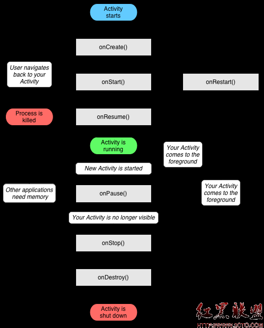

# sActivity生命周期详解
学习并掌握Activity生命周期，对从事Android开发（或者打算日后从事这方面的开发工作）的朋友来讲，是至关重要的。本文将用图解和实例的方式，向大家详细讲解Activity生命周期的有关知识。
Activity有三个状态：
1.当它在屏幕前台时（位于当前任务堆栈的顶部），它是激活或运行状态。它就是响应用户操作的Activity。
2.当它上面有另外一个Activity，使它失去了焦点但仍然对用户可见时（如图），它处于暂停状态。在它之上的Activity没有完全覆盖屏幕，或者是透明的，被暂停的Activity仍然对用户可见，并且是存活状态（它保留着所有的状态和成员信息并保持和窗口管理器的连接）。如果系统处于内存不足时会杀死这个Activity。



3.当它完全被另一个Activity覆盖时则处于停止状态。它仍然保留所有的状态和成员信息。然而对用户是不可见的，所以它的窗口将被隐藏，如果其它地方需要内存，则系统经常会杀死这个Activity。
当Activity从一种状态转变到另一种状态时，会调用以下保护方法来通知这种变化：
void onCreate(Bundle savedInstanceState)
void onStart()
void onRestart()
void onResume()
void onPause()
void onStop()
void onDestroy()

这七个方法定义了Activity的完整生命周期。实现这些方法可以帮助我们监视其中的三个嵌套生命周期循环：
Activity的完整生命周期自第一次调用onCreate()开始，直至调用onDestroy()为止。Activity在onCreate()中设置所有“全局”状态以完成初始化，而在onDestroy()中释放所有系统资源。例如，如果Activity有一个线程在后台运行从网络下载数据，它会在onCreate()创建线程，而在 onDestroy()销毁线程。

 Activity的可视生命周期自onStart()调用开始直到相应的onStop()调用结束。在此期间，用户可以在屏幕上看到Activity，尽管它也许并不是位于前台或者也不与用户进行交互。在这两个方法之间，我们可以保留用来向用户显示这个Activity所需的资源。例如，当用户不再看见我们显示的内容时，我们可以在onStart()中注册一个BroadcastReceiver来监控会影响UI的变化，而在onStop()中来注消。onStart() 和 onStop() 方法可以随着应用程序是否为用户可见而被多次调用。

 Activity的前台生命周期自onResume()调用起，至相应的onPause()调用为止。在此期间，Activity位于前台最上面并与用户进行交互。Activity会经常在暂停和恢复之间进行状态转换——例如当设备转入休眠状态或者有新的Activity启动时，将调用onPause() 方法。当Activity获得结果或者接收到新的Intent时会调用onResume() 方法。


说了一大堆的理论，下面一起动手来开发一个小实例，帮助大家快速理解。不妨试着动手去敲代码，然后自己监控控制台上的日志记录。
先贴出Activity部分的代码：
最先是一个MainActivity，这个也是软件启动时默认打开的。
```
package cn.itcast.life;

import android.app.Activity;
import android.content.Intent;
import android.os.Bundle;
import android.util.Log;
import android.view.View;
import android.widget.Button;

public class MainActivity extends Activity {
    private static final String TAG = "MainActivity";

    @Override
    public void onCreate(Bundle savedInstanceState) {
        super.onCreate(savedInstanceState);
        setContentView(R.layout.main);
        Log.i(TAG, "onCreate()");

        Button button = (Button) this.findViewById(R.id.button);
        button.setOnClickListener(new View.OnClickListener() {

            @Override
            public void onClick(View v) {
                Intent intent = new Intent(MainActivity.this, OtherActivity.class);
                startActivity(intent);
            }
        });

        Button threebutton = (Button) this.findViewById(R.id.threebutton);
        threebutton.setOnClickListener(new View.OnClickListener() {

            @Override
            public void onClick(View v) {
                Intent intent = new Intent(MainActivity.this, ThreeActivity.class);
                startActivity(intent);
            }
        });
    }

    @Override
    protected void onDestroy() {
        Log.i(TAG, "onDestroy()");
        super.onDestroy();
    }

    @Override
    protected void onPause() {
         Log.i(TAG, "onPause()");
        super.onPause();
    }

    @Override
    protected void onRestart() {
         Log.i(TAG, "onRestart()");
        super.onRestart();
    }

    @Override
    protected void onResume() {
         Log.i(TAG, "onResume()");
        super.onResume();
    }

    @Override
    protected void onStart() {
         Log.i(TAG, "onStart()");
        super.onStart();
    }

    @Override
    protected void onStop() {
         Log.i(TAG, "onStop()");
        super.onStop();
    }

}
```
MainActivity所匹配的xml布局文件：
```
<?xml version="1.0" encoding="utf-8"?>
<LinearLayout xmlns:android="http://schemas.android.com/apk/res/android"
    android:orientation="vertical"
    android:layout_width="fill_parent"
    android:layout_height="fill_parent"
    >
<TextView
    android:layout_width="fill_parent"
    android:layout_height="wrap_content"
    android:text="@string/hello"
    />

    <Button
        android:layout_width="wrap_content"
        android:layout_height="wrap_content"
         android:text="打开OtherActivity"
        android:id="@+id/button"
        />

     <Button
        android:layout_width="wrap_content"
        android:layout_height="wrap_content"
         android:text="打开ThreeActivity"
        android:id="@+id/threebutton"
        />
</LinearLayout>
```

下面将是一个新的Activity，为了验证“onstop”方法，我们要用这个OtherActivity将前面的MainActivity覆盖掉。
```
package cn.itcast.life;

import android.app.Activity;
import android.os.Bundle;

public class OtherActivity extends Activity {

    @Override
    protected void onCreate(Bundle savedInstanceState) {
        // TODO Auto-generated method stub
        super.onCreate(savedInstanceState);
        setContentView(R.layout.other);
    }

}


<?xml version="1.0" encoding="utf-8"?>
<LinearLayout
  xmlns:android="http://schemas.android.com/apk/res/android"
  android:orientation="vertical"
  android:layout_width="fill_parent"
  android:layout_height="fill_parent">

  <TextView
    android:layout_width="fill_parent"
    android:layout_height="wrap_content"
    android:text="这是OtherActivity"
    />
</LinearLayout>
```
还有一个Activity，是用于测试onpause方法的。使用半透明或者提示框的形式，覆盖掉前面的MainActivity
```
package cn.itcast.life;

import android.app.Activity;
import android.os.Bundle;

public class ThreeActivity extends Activity {
    @Override
    protected void onCreate(Bundle savedInstanceState) {
        // TODO Auto-generated method stub
        super.onCreate(savedInstanceState);
        setContentView(R.layout.three);
    }
}


<?xml version="1.0" encoding="utf-8"?>
<LinearLayout
  xmlns:android="http://schemas.android.com/apk/res/android"
  android:layout_width="wrap_content"
  android:layout_height="wrap_content">

  <TextView
    android:layout_width="fill_parent"
    android:layout_height="wrap_content"
    android:text="第三个Activity"
    />
</LinearLayout>
```
下面是项目清单文件，注意使用android:theme="@android:style/Theme.Dialog"来设置activity 的样式风格--弹出框
```
<?xml version="1.0" encoding="utf-8"?>
<manifest xmlns:android="http://schemas.android.com/apk/res/android"
      package="cn.itcast.life"
      android:versionCode="1"
      android:versionName="1.0">
    <application android:icon="@drawable/icon" android:label="@string/app_name">
        <activity android:name=".MainActivity"
                  android:label="@string/app_name">
            <intent-filter>
                <action android:name="android.intent.action.MAIN" />
                <category android:name="android.intent.category.LAUNCHER" />
            </intent-filter>
        </activity>
        <activity android:name=".OtherActivity" android:theme="@android:style/Theme.Dialog"/>
        <activity android:name=".ThreeActivity"/>
    </application>
    <uses-sdk android:minSdkVersion="8" />

</manifest>
```
在模拟器中部署该应用，观察控制台中的日志显示，看这些生命周期的执行顺序，拭目以待吧。。。。。。
参照那张图片，“当系统内存不足...”的这种情况，我暂时就不去模拟操作了。
补充：
Activity的 onSaveInstanceState() 和 onRestoreInstanceState()并不是生命周期方法，它们不同于 onCreate()、onPause()等生命周期方法，它们并不一定会被触发。当应用遇到意外情况（如：内存不足、用户直接按Home键）由系统销毁一个Activity时，onSaveInstanceState()才会被调用。但是当用户主动去销毁一个Activity时，例如在应用中按返回键，onSaveInstanceState()就不会被调用。因为在这种情况下，用户的行为决定了不需要保存Activity的状态。通常onSaveInstanceState()只适合用于保存一些临时性的状态，而onPause()适合用于数据的持久化保存。
提示：在小例子“Android音乐播放器”中，就使用到了该方法。典型的应用场景：比如用户正在听音乐，在这首歌的1：32秒钟时候，突然来电话了（发生意外，音乐播放器的Activity会被电话的Activity覆盖掉），此时音乐会暂停，用户正常的接听电话。等用户接完电话后，音乐播放器会记住当时的记录是1：32，可以自动去继续播放..