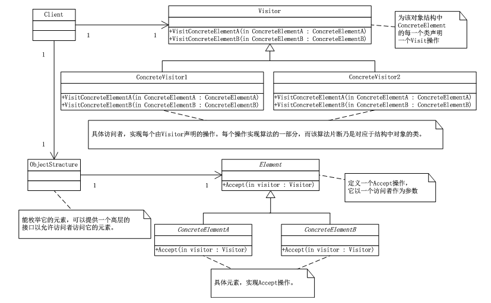
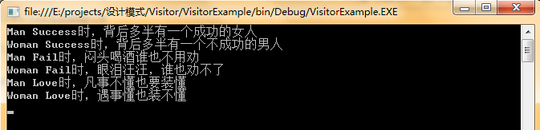

# 访问者模式（Visitor）
  访问者模式（Visitor），表示一个作用于某对象结构中各元素的操作，它使你可以不改变各元素的类的前提下定义作用于这些元素的新操作。

      访问者模式适合于数据结构相对稳定的系统。它把数据结构和作用于结构上的操作之间的耦合解脱开，使得操作集合可以相对自由的演化。

      访问者模式的目的是要把处理从数据结构分离出来，很多系统可以按照算法和数据结构分开，如果这样的系统有比较稳定的数据结构，又有易于变化的算法的话，使用访问者模式就是比较合适的，因为访问者模式使得算法操作的增加变得容易。

## 访问者模式UML类图：



如上图所示：Visitor类，为该对象结构中ConcreteElement的每一个类声明一个Visit操作；ConcreteVisitor1和ConcreteVisitor2类，具体访问者，实现每个由Visitor声明的操作，每个操作实现算法的一部分，而该算法片断乃是对应于结构中对象的类；Element类，定义一个Accept操作，它以一个访问者为参数；ConcreteElementA和ConcreteElementB类，具体操作实现Accept操作；ObjectStructure类，能枚举它的元素，可以提供一个高层的接口以允许访问它的元素。

## 访问者模式代码实现：

```
using System;
using System.Collections.Generic;
using System.Linq;
using System.Text;

namespace Visitor
{
   /*Visitor类，为该对象结构中ConcreteElement的每一个类声明一个Visit操作*/
   abstract class Visitor
   {
       public abstract void VisitConcreteElementA(ConcreteElementA elementA);
       public abstract void VisitConcreteElementB(ConcreteElementB elementB);
   }

   /*ConcreteVisitor1和ConcreteVisitor2类，具体访问者，实现每个由Visitor声明的操作，每个操作实现
    算法的一部分，而该算法片断乃是对应于结构中对象的类*/
   class ConcreteVisitor1 : Visitor
   {
       public override void VisitConcreteElementA(ConcreteElementA elementA)
       {
           Console.WriteLine("{0}被{1}访问",elementA.GetType().Name,this.GetType().Name);
       }

       public override void VisitConcreteElementB(ConcreteElementB elementB)
       {
           Console.WriteLine("{0}被{1}访问", elementB.GetType().Name, this.GetType().Name);
       }
   }

   class ConcreteVisitor2 : Visitor
   {
       public override void VisitConcreteElementA(ConcreteElementA elementA)
       {
           Console.WriteLine("{0}被{1}访问", elementA.GetType().Name, this.GetType().Name);
       }

       public override void VisitConcreteElementB(ConcreteElementB elementB)
       {
           Console.WriteLine("{0}被{1}访问", elementB.GetType().Name, this.GetType().Name);
       }
   }

   /*Element类，定义一个Accept操作，它以一个访问者为参数*/
   abstract class Element
   {
       public abstract void Accept(Visitor visitor);
   }

   /*ConcreteElementA和ConcreteElementB类，具体操作实现Accept操作*/
   class ConcreteElementA : Element
   {
       //充分利用双份派技术实现处理与数据结构的分离
       public override void Accept(Visitor visitor)
       {
           visitor.VisitConcreteElementA(this);
       }
       //其它的相关方法
       public void OperationA()
       { }
   }

   class ConcreteElementB : Element
   {
       //充分利用双份派技术实现处理与数据结构的分离
       public override void Accept(Visitor visitor)
       {
           visitor.VisitConcreteElementB(this);
       }
       //其它的相关方法
       public void OperationB()
       { }
   }

   /*ObjectStructure类，能枚举它的元素，可以提供一个高层的接口以允许访问它的元素*/
   class ObjectStructure
   {
       private IList<Element> elements = new List<Element>();

       public void Attach(Element element)
       {
           elements.Add(element);
       }

       public void Detach(Element element)
       {
           elements.Remove(element);
       }

       public void Accept(Visitor visitor)
       {
           foreach (Element e in elements)
           {
               e.Accept(visitor);
           }
       }
   }
}
```
客户端：

```
using System;
using System.Collections.Generic;
using System.Linq;
using System.Text;

namespace Visitor
{
   /*客户端*/
   class Program
   {
       static void Main(string[] args)
       {
           ObjectStructure o = new ObjectStructure();
           o.Attach(new ConcreteElementA());
           o.Attach(new ConcreteElementB());

           ConcreteVisitor1 v1 = new ConcreteVisitor1();
           ConcreteVisitor2 v2 = new ConcreteVisitor2();

           o.Accept(v1);
           o.Accept(v2);

           Console.Read();
       }
   }
}
```
## 访问者模式总结：

访问者模式优点是增加新的操作很容易，因为增加新的操作就意味着增加一个新的访问者。访问者模式将有关的行为集中到一个访问者对象中。

那访问者模式的缺点是是增加新的数据结构变得困难了。


## 访问者模式案例：

```
using System;
using System.Collections.Generic;
using System.Linq;
using System.Text;

namespace VisitorExample
{
   /*状态的抽象类*/
   abstract class Action
   {
       //得到男人结论或反应
       public abstract void GetManConclusion(Man m);
       //得到女人结论或反应
       public abstract void GetWomamConclusion(Woman w);
   }

   abstract class Person
   {
       //用来获得状态对象
       public abstract void Accept(Action action);
   }

   class Success : Action
   {
       public override void GetManConclusion(Man m)
       {
           Console.WriteLine("{0} {1}时，背后多半有一个成功的女人",m.GetType().Name,this.GetType().Name);
       }
       public override void GetWomamConclusion(Woman w)
       {
           Console.WriteLine("{0} {1}时，背后多半有一个不成功的男人",w.GetType().Name,this.GetType().Name);
       }

   }

   class Fail : Action
   {
       public override void GetManConclusion(Man m)
       {
           Console.WriteLine("{0} {1}时，闷头喝酒谁也不用劝", m.GetType().Name, this.GetType().Name);
       }
       public override void GetWomamConclusion(Woman w)
       {
           Console.WriteLine("{0} {1}时，眼泪汪汪，谁也劝不了", w.GetType().Name, this.GetType().Name);
       }

   }

   class Love : Action
   {
       public override void GetManConclusion(Man m)
       {
           Console.WriteLine("{0} {1}时，凡事不懂也要装懂", m.GetType().Name, this.GetType().Name);
       }
       public override void GetWomamConclusion(Woman w)
       {
           Console.WriteLine("{0} {1}时，遇事懂也装不懂", w.GetType().Name, this.GetType().Name);
       }

   }

   class Man : Person
   {
       public override void Accept(Action action)
       {
           /*首先在客户程序中将具体状态作为参数传递给“男人”类完成了一次分派，然后“男人”类调用
            作为参数的“具体状态”中的方法“男人反应”,同时将自己作为参数传递进去，这便完成了第二次分派*/
           action.GetManConclusion(this);
       }
   }
   class Woman : Person
   {
       public override void Accept(Action action)
       {
          action.GetWomamConclusion(this);
       }
   }

   /*对象结构*/
   class ObjectStructure
   {
       private IList<Person> persons = new List<Person>();

       //增加
       public void Attach(Person p)
       {
           persons.Add(p);
       }

       //移除
       public void Detach(Person p)
       {
           persons.Remove(p);
       }

       //查看显示
       public void Display(Action a)
       {
           foreach (Person p in persons)
           {
               p.Accept(a);
           }
       }
   }
}
```
客户端：

```
using System;
using System.Collections.Generic;
using System.Linq;
using System.Text;

namespace VisitorExample
{
   class Program
   {
       static void Main(string[] args)
       {
           ObjectStructure os = new ObjectStructure();
           os.Attach(new Man());
           os.Attach(new Woman());

           //成功时的反应
           Success s = new Success();
           os.Display(s);

           //失败时反应
           Fail f = new Fail();
           os.Display(f);

           //恋爱时的反应
           Love l = new Love();
           os.Display(l);

           Console.Read();
       }
   }
}
```
运行结果：

