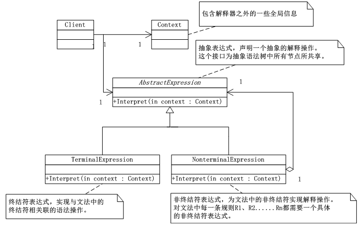

# 解释器模式（Interpreter）
 解释器模式（Interpreter），给定一个语言，定义它的文法的一种表示，并定义一个解释器，这个解释器使用该表示来解释语言中的句子。

      解释器模式需要解决的问题是，如果一种特定类型的问题发生的频率足够高，那么可能就值得将该问题的各个实例表述为一个简单语言中的句子。这样就可以构建一个解释器，该解释器通过解释这些句子来解决该问题。

## 解释器模式UML类图：



      如上图所示：AbstractExpression(抽象表达式)，声明一个抽象的解释操作，这个接口为抽象语法树中所有的节点所共享；TerminalExpression(终结符表达式)，实现与文法中的终结符相关联的解释操作，实现抽象表达式中所要求的 接口，主要是一个interpret()方法，文法中每一个终结符都有一个具体终结表达式与之相对应；NonterminalExpression(非终结符表达式),为文法中的非终结符实现解释操作。对文法中每一条规则R1，R2......Rn 都需要一个具体的非终结符表达式类。通过实现抽象表达式的interpret()方法实现解释操作。解释操作以递归形式调用上面所提到的代表R1，R2......Rn中各个符号的实例变量；Context，包含解释器之外的一些全局信息；客户端代码，构建表示该文法定义的语言中一个特定的句子的抽象语法树。


## 解释器模式实现：

```
using System;
using System.Collections.Generic;
using System.Linq;
using System.Text;

namespace Interpreter
{

   /*AbstractExpression(抽象表达式)，声明一个抽象的解释操作，这个接口为抽象语法树中所有的节点所共享.*/
   abstract class AbstractExpression
   {
       public abstract void Interpret(Context context);
   }

   /*TerminalExpression(终结符表达式)，实现与文法中的终结符相关联的解释操作，实现抽象表达式中所要求的
    接口，主要是一个interpret()方法，文法中每一个终结符都有一个具体终结表达式与之相对应。*/
   class TerminalExpression : AbstractExpression
   {
       public override void Interpret(Context context)
       {
           Console.WriteLine("终端解释器...");
           //throw new NotImplementedException();
       }
   }
   /*NonterminalExpression(非终结符表达式),为文法中的非终结符实现解释操作。对文法中每一条规则R1，R2......Rn
    都需要一个具体的非终结符表达式类。通过实现抽象表达式的interpret()方法实现解释操作。解释操作以递归形式
    调用上面所提到的代表R1，R2......Rn中各个符号的实例变量。*/
   class NonterminalExpression : AbstractExpression
   {
       public override void Interpret(Context context)
       {
           Console.WriteLine("非终端解释器...");
           //throw new NotImplementedException();
       }
   }
   /*Context，包含解释器之外的一些全局信息*/
   class Context
   {
       private string input;
       public string Input
       {
           get { return input; }
           set { input = value; }
       }

       private string output;
       public string Output
       {
           get { return output; }
           set { output = value; }
       }
   }
}
```
客户端：

```
using System;
using System.Collections.Generic;
using System.Linq;
using System.Text;

namespace Interpreter
{
   /*客户端代码，构建表示该文法定义的语言中一个特定的句子的抽象语法树。*/
   class Program
   {
       static void Main(string[] args)
       {
           Context context = new Context();
           IList<AbstractExpression> list = new List<AbstractExpression>();
           list.Add(new TerminalExpression());
           list.Add(new NonterminalExpression());
           list.Add(new TerminalExpression());
           list.Add(new NonterminalExpression());

           foreach (AbstractExpression ae in list)
           {
               ae.Interpret(context);
           }

           Console.Read();
       }
   }
}
```
## 解释器模式总结：

      通常当有一个语言需要解释执行，并且你可将该语言中的句子表示为一个抽象语法树时，可使用解释器模式。

      使用了解释器模式，就意味着可以很容易的改变和扩展文法，因为该模式使用类来表示文法规则，你可以使用继承来改变或扩展该文法。也比较容易实现文法，因为定义抽象语法树中各个节点的类的实现大体类似，这些类都易于直接编码。

      但是使用解释器模式也有不足，解释器模式为文法中的每一条规则至少定义了一个类，因此包含许多规则的文法可能难以管理和维护。建议当文法非常复杂时，使用其它的技术如语法分析程序或编译器生成器来处理。