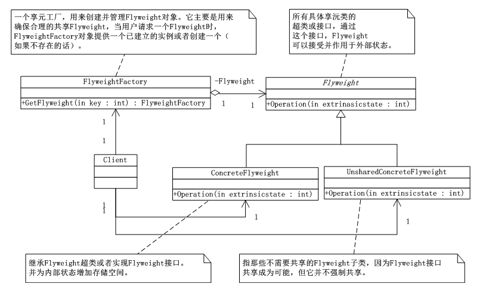
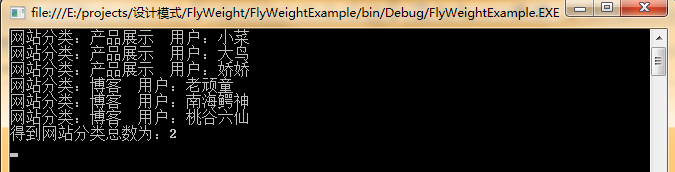

# 享元模式（FlyWeight）
享元模式（FlyWeight），运用共享技术有效的支持大量细粒度的对象。也就是说当项目中需要应用大量相同或相似的功能代码时，那么对于硬盘、内存、CPU、数据库空间的等服务器资源均可达到共享，以减少服务器资源，提高利用率。

## 享元模式UML类图：



      如上图所示，FlyWeight类，它是所有具体享元类的超类或者接口，通过这个接口，FlyWeight可以接受并作用于外部状态；ConcreteFlyWeight是继承FlyWeight超类或者实现FlyWeight接口，并为内部状态增加存储空间；UnsharedConcreteFlyWeight是指那些不需要共享的FlyWeight子类。因为FlyWeight接口共享成为可能，但它并不强制共享；FlyWeightFactory是一个享元工厂，用来创建并管理FlyWeight对象，它主要是用来确保合理地共享FlyWeight，当用户请求一个flyWeight时，FlyWeightFactory对象提供一个已创建的实例或者创建一个（如果没有的话）。


## 享元模式代码实现：

```
using System;
using System.Collections.Generic;
using System.Linq;
using System.Text;
using System.Collections;
namespace FlyWeight
{
   /*FlyWeight类，它是所有具体享元类的超类或者接口，通过这个接口，FlyWeight可以接受并作用于外部状态。 */
   abstract  class FlyWeight
   {
       public abstract void Operation(int extrinsicstate);
   }

   /*ConcreteFlyWeight是继承FlyWeight超类或者实现FlyWeight接口，并为内部状态增加存储空间。*/
   class ConcreteFlyWeight : FlyWeight
   {
       public override void Operation(int extrinsicstate)
       {
           Console.WriteLine("共享的具体FlyWeight："+extrinsicstate);
           //throw new NotImplementedException();
       }
   }

   /*UnsharedConcreteFlyWeight是指那些不需要共享的FlyWeight子类。因为FlyWeight接口共享成为可能，但它并不强制共享。*/
   class UnsharedFlyWeight : FlyWeight
   {
       public override void Operation(int extrinsicstate)
       {
           Console.WriteLine("不共享的具体FlyWeight："+extrinsicstate);
           //throw new NotImplementedException();
       }
   }

   /*FlyWeightFactory是一个享元工厂，用来创建并管理FlyWeight对象。它主要是用来确保合理地共享FlyWeight，当用户请求一个
    flyWeight时，FlyWeightFactory对象提供一个已创建的实例或者创建一个（如果没有的话）*/
   class FlyWeightFactory
   {
       private Hashtable flyweights = new Hashtable();
       public FlyWeightFactory()
       {
           flyweights.Add("x",new ConcreteFlyWeight());
           flyweights.Add("y",new ConcreteFlyWeight());
           flyweights.Add("z",new ConcreteFlyWeight());
       }

       public FlyWeight getFlyWeight(string key)
       {
           return ((FlyWeight)flyweights[key]);
       }
   }
}
```
客户端：

```
using System;
using System.Collections.Generic;
using System.Linq;
using System.Text;

namespace FlyWeight
{
   class Program
   {
       static void Main(string[] args)
       {
           int extrinsicstate = 22;
           FlyWeightFactory f = new FlyWeightFactory();

           FlyWeight fx = f.getFlyWeight("x");
           fx.Operation(--extrinsicstate);

           FlyWeight fy = f.getFlyWeight("y");
           fx.Operation(--extrinsicstate);

           FlyWeight fz = f.getFlyWeight("z");
           fx.Operation(--extrinsicstate);

           FlyWeight uf = new UnsharedFlyWeight();
           uf.Operation(--extrinsicstate);

           Console.Read();

       }
   }
}
```

## 享元模式总结：

      在享元对象内部并且不会随环境改变而改变的共享部分，可以称之为是享元对象的内部状态，而随环境改变而改变的、不可以共享的状态就是外部状态了。事实上，享元模式可以避免大量非常相似类的开销。在程序设计中，有时需要生成大量细粒度的类实例来表示数据。如果能发现这些实例除了几个参数外基本上都是相同的，有时就能够受大幅度减少需要实例化的类的数量。如果能把那些参数移到类实例的外面，在方法调用时将它们传递进来，就可以通过共享大幅度地减少单个实例的数目。也就是说，享元模式FlyWeight执行时所需要的状态是有内部的也可能有外部的，内部状态存储于ConcreteFlyWeight对象之中，而外部对象则应该考虑由客户端对象存储或计算，当调用FlyWeight对象的操作时，将该状态传递给它。

      如果一个应用程序使用了大量的对象，而大量的这些对象造成了存储开销时就应该考虑使用；还有就是对象的大多数状态可以外部状态，如果删除对象的外部状态，那么可以用相对较少的共享对象取代很多组对象，此时可以考虑用享元模式。


## 享元模式应用案例——网站共享

```
using System;
using System.Collections.Generic;
using System.Linq;
using System.Text;
using System.Collections;

namespace FlyWeightExample
{
   //用户类
   public class User
   {
       private string name;

       public User(string name)
       {
           this.name = name;
       }

       public string Name
       {
           get { return name;}
       }
   }

   //网站抽象类
   abstract class WebSite
   {
       public abstract void Use(User user);//Use方法需要传递User对象
   }

   //具体网站类
   class ConcreteWebSite : WebSite
   {
       private string name = "";

       public ConcreteWebSite(string name)
       {
           this.name = name;
       }

       public override void Use(User user)//实现Use方法
       {
           Console.WriteLine("网站分类："+name+"  用户："+user.Name);
           //throw new NotImplementedException();
       }
   }

   //网站工厂类
   class WebSiteFactory
   {
       private Hashtable flyweights = new Hashtable();

       //获得网站分类
       public WebSite getWebSite(string key)
       {
           if (!flyweights.ContainsKey(key))
               flyweights.Add(key, new ConcreteWebSite(key));
           return ((WebSite)flyweights[key]);
       }
       //获得网站分类总数
       public int getWebSiteCount()
       {
           return flyweights.Count;
       }

   }
}
```
客户端
```
using System;
using System.Collections.Generic;
using System.Linq;
using System.Text;

namespace FlyWeightExample
{
   class Program
   {
       static void Main(string[] args)
       {
           WebSiteFactory wsf = new WebSiteFactory();

           WebSite ws1 = wsf.getWebSite("产品展示");
           ws1.Use(new User("小菜"));

           WebSite ws2 = wsf.getWebSite("产品展示");
           ws2.Use(new User("大鸟"));

           WebSite ws3 = wsf.getWebSite("产品展示");
           ws3.Use(new User("娇娇"));


           WebSite ws4 = wsf.getWebSite("博客");
           ws4.Use(new User("老顽童"));

           WebSite ws5 = wsf.getWebSite("博客");
           ws5.Use(new User("南海鳄神"));

           WebSite ws6 = wsf.getWebSite("博客");
           ws6.Use(new User("桃谷六仙"));

           Console.WriteLine("得到网站分类总数为：{0}",wsf.getWebSiteCount());

           Console.Read();

       }
   }
}
```
运行结果：

