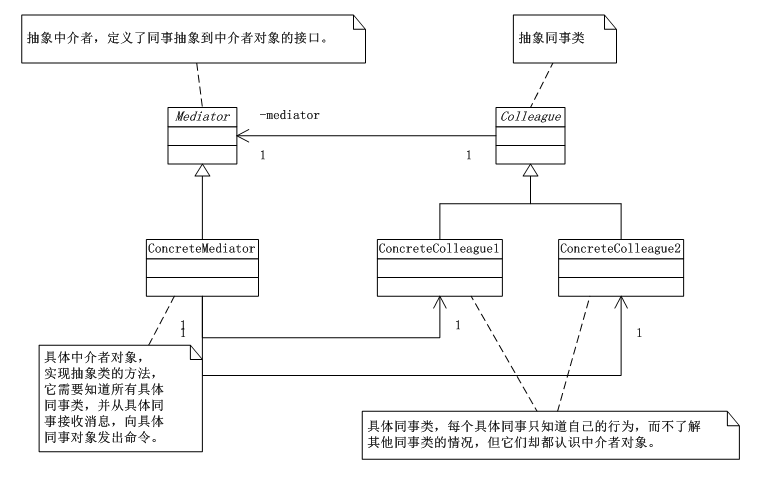

# 中介者模式（Mediator）
中介者模式（Mediator），用一个中介对象来封装一系列的对象交互。中介者使各对象不需要显式的相互引用，从而使其耦合松散，而且可以独立的改变它们之间的交互。

## 中介者模式UML类图：



      由上图可以看出：Mediator 抽象中介者类，定义了同事对象到中介者对象的接口；Colleague抽象同事类；ConcreteMediator具体中介者类，实现抽象类的方法，它需要知道所有的具体同事类，并从同事接收消息，向具体同事对象发出命令；具体同事类，每个具体同事对象只知道自己的行为，而不了解其它同事类的情况，但它们却都认识中介者对象。

## 中介者模式实现：

```
using System;
using System.Collections.Generic;
using System.Linq;
using System.Text;

namespace Mediator
{
   /*Mediator 抽象中介者类，定义了同事对象到中介者对象的接口。*/
   abstract class Mediator
   {
       public abstract void Send(string message,Colleague colleague);
   }

   /*Colleague抽象同事类*/
   abstract class Colleague
   {
       protected Mediator mediator;

       public Colleague(Mediator mediator)
       {
           this.mediator = mediator;
       }
   }

   /*具体中介者类，实现抽象类的方法，它需要知道所有的具体同事类，并从同事接收消息，向具体同事对象发出命令*/
   class ConcreteMediator : Mediator
   {
       /*中介者对象需要了解所有的同事*/
       private ConcreteClooeague1 colleague1;
       private ConcreteClooeague2 colleague2;

       public ConcreteClooeague1 Colleague1
       {
           set { this.colleague1 = value; }
       }

       public ConcreteClooeague2 Colleague2
       {
           set { this.colleague2 = value; }
       }

       /*重写发送信息的方法，根据对象来做出选择判断，通知对象。*/
       public override void Send(string message, Colleague colleague)
       {
           if (colleague == colleague1)
           {
               colleague2.Notify(message);
           }
           else
           {
               colleague1.Notify(message);
           }
       }
   }

   /*具体同事类，每个具体同事对象只知道自己的行为，而不了解其它同事类的情况，但它们却都认识中介者对象。*/
   class ConcreteClooeague1 : Colleague
   {
       public ConcreteClooeague1(Mediator mediator)
           : base(mediator)
       { }

       public void Send(string message)
       {
           this.mediator.Send(message,this);
       }

       public void Notify(string message)
       {
           Console.WriteLine("同事1 得到信息："+message);
       }
   }

   class ConcreteClooeague2 : Colleague
   {
       public ConcreteClooeague2(Mediator mediator)
           : base(mediator)
       { }

       public void Send(string message)
       {
           this.mediator.Send(message,this);
       }

       public void Notify(string message)
       {
           Console.WriteLine("同事2 得到信息：" + message);
       }
   }
}
```
客户端：

```
using System;
using System.Collections.Generic;
using System.Linq;
using System.Text;

namespace Mediator
{
   class Program
   {
       static void Main(string[] args)
       {
           ConcreteMediator cm = new ConcreteMediator();

           /*让两个具体同事对象认识同一个中介者*/
           ConcreteClooeague1 c1 = new ConcreteClooeague1(cm);
           ConcreteClooeague2 c2 = new ConcreteClooeague2(cm);

           /*让中介者对象认识所有的同事对象*/
           cm.Colleague1 = c1;
           cm.Colleague2 = c2;

           /*具体同事类对象的发送信息都是通过中介者来转发*/
           c1.Send("吃饭了没？");
           c2.Send("还没，要请客吗？");

           Console.Read();
       }
   }
}
```

## 中介者模式总结：

      对于中介者模式，该设计模式很容易在系统中应用，也很容易在系统中误用。当系统出现了‘多对多’交互复杂的对象群时，不要急于使用中介者模式，而要先反思你的系统在设计上是不是合理。

      中介者模式的使用有很多优点，首先，Mediator的出现减少了各个Colleague的耦合，使得可以独立的改变和复用各个Colleague类和Mediator；

      其次，由于把对象如何协作进行了抽象，将中介作为一个独立的概念并将其封装在一个对象中，这样关注的对象就从对象各自本身的行为转移到了它们之间的交互上来，也就是站在一个更宏观的角度去看待系统。

      然而，由于ConcreteMediator控制了集中化，于是就把交互复杂性变成了中介者的复杂性，这就使得中介者会变得比任何一个ConcreteColleague更复杂。


## 中介者模式案例—安理会：

```
using System;
using System.Collections.Generic;
using System.Linq;
using System.Text;

namespace MediatorExample
{
   /*联合国机构作为中介者*/
   abstract class UnitedNations
   {
       public abstract void Send(string message, Country country);
   }

   /*Country作为抽象同事类*/
   abstract class Country
   {
       protected UnitedNations un;

       public Country(UnitedNations un)
       {
           this.un = un;
       }
   }

   /*具体中介者类-联合国安全理事会，实现抽象类的方法，它需要知道所有的具体同事类，并从同事接收消息，向具体同事对象发出命令*/
   class UnitedNationSecurityCouncil : UnitedNations
   {
       /*中介者对象需要了解所有的同事*/
       private USA colleague1;
       private Iraq colleague2;

       public USA Colleague1
       {
           set { this.colleague1 = value; }
       }

       public Iraq Colleague2
       {
           set { this.colleague2 = value; }
       }

       /*重写发送信息的方法，根据对象来做出选择判断，通知对象。*/
       public override void Send(string message, Country country)
       {
           if (country == colleague1)
           {
               colleague2.Notify(message);
           }
           else
           {
               colleague1.Notify(message);
           }
       }
   }

   /*具体同事类-美国，每个具体同事对象只知道自己的行为，而不了解其它同事类的情况，但它们却都认识中介者对象。*/
   class USA : Country
   {
       public USA(UnitedNations un)
           : base(un)
       { }

       public void Send(string message)
       {
           this.un.Send(message, this);
       }

       public void Notify(string message)
       {
           Console.WriteLine("美国 得到信息：" + message);
       }
   }

   /*伊拉克*/
   class Iraq : Country
   {
       public Iraq(UnitedNations un)
           : base(un)
       { }

       public void Send(string message)
       {
           this.un.Send(message, this);
       }

       public void Notify(string message)
       {
           Console.WriteLine("伊拉克 得到信息：" + message);
       }
   }

}
```

客户端：
```
using System;
using System.Collections.Generic;
using System.Linq;
using System.Text;

namespace MediatorExample
{
   class Program
   {
       static void Main(string[] args)
       {
           UnitedNationSecurityCouncil un = new UnitedNationSecurityCouncil();

           /*让两个具体同事对象认识同一个中介者*/
           USA usa = new USA(un);
           Iraq iraq = new Iraq(un);

           /*让中介者对象认识所有的同事对象*/
           un.Colleague1 = usa;
           un.Colleague2 = iraq;

           /*具体同事类对象的发送信息都是通过中介者来转发*/
           usa.Send("不准研制核武器，否则要发动战争。");
           iraq.Send("我们没有核武器，也不怕侵略。");

           Console.Read();
       }
   }
}
```
运行结果：

