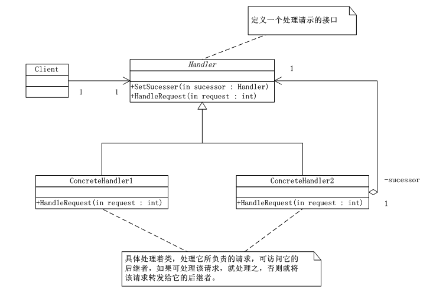
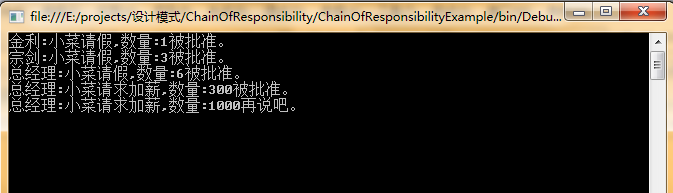

# 职责链模式（Chain Of Responsibility）
职责链模式（Chain Of Responsibility），使多个对象都有机会处理请求，从而避免请求的发送者和接收者之间的耦合关系。将这个对象连成一条链，并沿着这条链传递该请求，直到有一个对象处理它为止。

      这里发出这个请求的客户端并不知道这当中的哪一个对象最终处理该请求，这样系统的更改可以在不影响客户端的情况下动态的重新组织和分配责任。


## 职责链模式UML类图：



      如上图所示：Handler类，定义一个处理请示的接口；ConcreteHandler 类，具体处理者类，处理它所负责的请求，可访问它的后继者，如果可处理该请求就处理之，否则就将该请求转发给它的后继者；客户端代码，向链上的具体处理者对象提交请求。


## 职责链模式代码实现：


```
using System;
using System.Collections.Generic;
using System.Linq;
using System.Text;

namespace ChainOfResponsibility
{
   /*Handler类，定义一个处理请示的接口*/
   abstract class Handler
   {
       protected Handler successor;
       /*设置继任务*/
       public void setSuccessor(Handler successor)
       {
           this.successor = successor;
       }

       /*处理请求的抽象方法*/
       public abstract void HandleRequest(int Request);

   }

   /*ConcreteHandler 类，具体处理者类，处理它所负责的请求，可访问它的后继者，如果可处理该请求就
    处理之，否则就将该请求转发给它的后继者。*/
   /*ConcreteHandler1 当请求在0-10之间时，有权处理，否则转到下一位。*/
   class ConcreteHandler1 : Handler
   {
       public override void HandleRequest(int Request)
       {
           if (Request >= 0 && Request < 10)
           {
               Console.WriteLine("{0}处理请求{1}", this.GetType().Name, Request);
           }
           else if(successor != null)
           {
               successor.HandleRequest(Request);
           }
           else
           {
               Console.WriteLine("{0}拒绝处理{1}", this.GetType().Name, Request);
           }
       }
   }

   /*ConcreteHandler2 当请求在10-20之间时，有权处理，否则转到下一位。*/
   class ConcreteHandler2 : Handler
   {
       public override void HandleRequest(int Request)
       {
           if (Request >= 10 && Request < 20)
           {
               Console.WriteLine("{0}处理请求{1}", this.GetType().Name, Request);
           }
           else if (successor != null)
           {
               successor.HandleRequest(Request);
           }
           else
           {
               Console.WriteLine("{0}拒绝处理{1}", this.GetType().Name, Request);
           }
       }
   }

   /*ConcreteHandler3 当请求在20-30之间时，有权处理，否则转到下一位。*/
   class ConcreteHandler3 : Handler
   {
       public override void HandleRequest(int Request)
       {
           if (Request >= 20 && Request < 30)
           {
               Console.WriteLine("{0}处理请求{1}", this.GetType().Name, Request);
           }
           else if (successor != null)
           {
               successor.HandleRequest(Request);
           }
           else
           {
               Console.WriteLine("{0}拒绝处理{1}", this.GetType().Name, Request);
           }
       }
   }

   /*ConcreteHandler 当请求在<100之间时，有权处理，否则转到下一位。*/
   class ConcreteHandler : Handler
   {
       public override void HandleRequest(int Request)
       {
           if (Request < 100)
           {
               Console.WriteLine("{0}处理请求{1}", this.GetType().Name, Request);
           }
           else if (successor != null)
           {
               successor.HandleRequest(Request);
           }
           else
           {
               Console.WriteLine("{0}拒绝处理{1}", this.GetType().Name, Request);
           }
       }
   }
}
```
客户端：

```
using System;
using System.Collections.Generic;
using System.Linq;
using System.Text;

namespace ChainOfResponsibility
{
   class Program
   {
       /*客户端代码，向链上的具体处理者对象提交请求*/
       static void Main(string[] args)
       {
           Handler h1 = new ConcreteHandler1();
           Handler h2 = new ConcreteHandler2();
           Handler h3 = new ConcreteHandler3();
           Handler h = new ConcreteHandler();

           h1.setSuccessor(h2);
           h2.setSuccessor(h3);
           h3.setSuccessor(h);

           int[] request = { 2,5,11,19,21,31,99,100};

           foreach (int r in request)
           {
               h1.HandleRequest(r);
           }

           Console.Read();
       }
   }
}
```

## 职责链模式总结：

      职责链模式中最关键的就是当客户提交一个请求时，请求时沿链传递直至有一个ConcreteHandler对象负责处理它为止。

      这就使得接收者和发送者都没有对方的明确信息，且链中的对象自己也不知道链的结构。

      职责链可简化对象的相互链接，它们仅需保持一个指向其后继者的引用，而不需保持它所有的候选接受者的引用。

      职责链模式使得可以随时的增加或修改处理一个请求的结构增强了给对象指派职责的灵活性。


## 职责链模式应用案例—小菜加薪：


```
using System;
using System.Collections.Generic;
using System.Linq;
using System.Text;

namespace ChainOfResponsibilityExample
{
   //管理者
   abstract class Manager
   {
       protected string name;
       protected Manager superior;

       public Manager(string name)
       {
           this.name = name;
       }
       public void setSuperior(Manager superior)
       {
           this.superior = superior;
       }

       public abstract void RequestApplication(Request request);

   }


   //请求
   class Request
   {
       private string requestType;

       public string RequestType
       {
           get { return requestType; }
           set { requestType = value; }
       }

       private string requestContent;

       public string RequestContent
       {
           get { return requestContent; }
           set { requestContent = value; }
       }

       private int number;

       public int Number
       {
           get { return number; }
           set { number = value; }
       }
   }

   class CommonManager : Manager
   {
       public CommonManager(string name)
           : base(name)
       { }

       public override void RequestApplication(Request request)
       {
           if (request.RequestType == "请假" && request.Number <= 2)
           {
               Console.WriteLine("{0}:{1},数量:{2}被批准。", name, request.RequestContent, request.Number);
           }
           else if(superior != null)
           {
               superior.RequestApplication(request);
           }
       }
   }

   class MajorDomo : Manager
   {
       public MajorDomo(string name)
           : base(name)
       { }

       public override void RequestApplication(Request request)
       {
           if (request.RequestType == "请假" && request.Number <= 5)
           {
               Console.WriteLine("{0}:{1},数量:{2}被批准。", name, request.RequestContent, request.Number);
           }
           else if (superior != null)
           {
               superior.RequestApplication(request);
           }
       }
   }

   class GeneralManager : Manager
   {
       public GeneralManager(string name)
           : base(name)
       { }

       public override void RequestApplication(Request request)
       {
           if (request.RequestType == "请假")
           {
               Console.WriteLine("{0}:{1},数量:{2}被批准。", name, request.RequestContent, request.Number);
           }
           else if (request.RequestType == "加薪" && request.Number <= 500)
           {
               Console.WriteLine("{0}:{1},数量:{2}被批准。", name, request.RequestContent, request.Number);
           }
           else if (request.RequestType == "加薪" && request.Number > 500)
           {
               Console.WriteLine("{0}:{1},数量:{2}再说吧。", name, request.RequestContent, request.Number);
           }
       }
   }

}
```
客户端：


```
using System;
using System.Collections.Generic;
using System.Linq;
using System.Text;

namespace ChainOfResponsibilityExample
{
   class Program
   {
       static void Main(string[] args)
       {
           CommonManager commonManager = new CommonManager("金利");
           MajorDomo majorDomo = new MajorDomo("宗剑");
           GeneralManager generalManager = new GeneralManager("总经理");

           commonManager.setSuperior(majorDomo);
           majorDomo.setSuperior(generalManager);

           Request request1 = new Request();
           request1.RequestType = "请假";
           request1.RequestContent = "小菜请假";
           request1.Number = 1;

           commonManager.RequestApplication(request1);

           Request request2 = new Request();
           request2.RequestType = "请假";
           request2.RequestContent = "小菜请假";
           request2.Number = 3;

           commonManager.RequestApplication(request2);

           Request request3 = new Request();
           request3.RequestType = "请假";
           request3.RequestContent = "小菜请假";
           request3.Number = 6;

           commonManager.RequestApplication(request3);

           Request request4 = new Request();
           request4.RequestType = "加薪";
           request4.RequestContent = "小菜请求加薪";
           request4.Number = 300;

           commonManager.RequestApplication(request4);

           Request request5 = new Request();
           request5.RequestType = "加薪";
           request5.RequestContent = "小菜请求加薪";
           request5.Number = 1000;

           commonManager.RequestApplication(request5);

           Console.Read();
       }
   }
}
```
运行结果：

