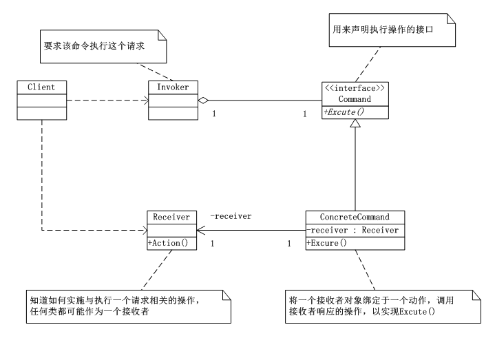
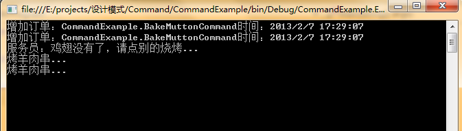

# 命令模式（Command）
   命令模式（Command），将一个请求封装成一个对象，从而使你可以用不同的请求对客户进行参数化；对请求排队或记录请求日志，以及支持可撤销的操作。

## 命令模式UML类图：



      如上图所示：Command类是用来声明执行操作的接口；ConcreteCommand类，将一个接收者对象绑定于一个动作，调用接收者相应的操作，以实现Execute；Receiver类，知道如何实施与执行一个与请求相关的操作，任何类都可能作为一个接收者；Invoker类，要求该命令执行这个命令。

## 命令模式实现：


```
using System;
using System.Collections.Generic;
using System.Linq;
using System.Text;

namespace Command
{
   /*用来声明执行操作的接口*/
   abstract class Command
   {
       protected Receiver receiver;

       public Command(Receiver receiver)
       {
           this.receiver = receiver;
       }

       abstract public void Excute();
   }


   /*ConcreteCommand类，将一个接收者对象绑定于一个动作，调用接收者相应的操作，以实现Execute*/
   class ConcreteCommand : Command
   {
       public ConcreteCommand(Receiver receiver)
           : base(receiver)
       {}

       public override void  Excute()
       {
           this.receiver.Action();
           //throw new NotImplementedException();
       }
   }

   /*Receiver类，知道如何实施与执行一个与请求相关的操作，任何类都可能作为一个接收者*/
   class Receiver
   {
       public void Action()
       {
           Console.WriteLine("执行请求...");
       }
   }

   /*Invoker类，要求该命令执行这个命令*/
   class Invoker
   {
       private Command command;

       public void SetCommand(Command command)
       {
           this.command = command;
       }

       public void ExecuteCommand()
       {
           this.command.Excute();
       }
   }

}
```
客户端：

```
using System;
using System.Collections.Generic;
using System.Linq;
using System.Text;

namespace Command
{
   class Program
   {
       static void Main(string[] args)
       {
           Receiver r = new Receiver();
           Command c = new ConcreteCommand(r);
           Invoker i = new Invoker();

           i.SetCommand(c);
           i.ExecuteCommand();

           Console.Read();
       }
   }
}
```
## 命令模式总结：

      第一，命令模式能较容易的设计一个命令队列；

      第二，在需要的情况下，可以较容易的将命令记入日志；

      第三，允许接收请求的一方决定是否要否决该请求；

      第四，可以容易的实现对请求的撤销和重构；

      第五，由于加入新的具体命令类不影响其它的类，因此增加新的具体命令很容易；

      第六，命令模式把请求一个操作的对象与知道怎么执行一个操作的对象分割开。


## 命令模式案例—烧烤摊：

```
using System;
using System.Collections.Generic;
using System.Linq;
using System.Text;

namespace CommandExample
{
   /*烤肉串者类*/
   public class Barbecuer
   {
       //烤羊肉
       public void BakeMutton()
       {
           Console.WriteLine("烤羊肉串...");
       }
       //烤鸡翅
       public void BackChickenWing()
       {
           Console.WriteLine("烤鸡翅...");
       }
   }

   /*抽象命令*/
   public abstract class Command
   {
       protected Barbecuer receiver;

       public Command(Barbecuer receiver)//抽象命令类，只需要确定“烤肉串者”是谁
       {
           this.receiver = receiver;
       }

       //执行命令
       public abstract void ExcuteCommand();
   }

   /*具体命令类，烤羊肉串命令*/
   class BakeMuttonCommand : Command
   {
       public BakeMuttonCommand(Barbecuer receiver) : base(receiver)
       {}

       public override void ExcuteCommand()
       {
           receiver.BakeMutton();
           //throw new NotImplementedException();
       }
   }

   /*烤鸡翅命令*/
   class BackChickenWingCommand : Command
   {
       public BackChickenWingCommand(Barbecuer receiver)
           : base(receiver)
       { }

       public override void ExcuteCommand()
       {
           this.receiver.BackChickenWing();
           //throw new NotImplementedException();
       }
   }

   /*服务员*/
   public class Waiter
   {
       private IList<Command> orders = new List<Command>();

       //设置订单
       public void SetOrder(Command command)
       {
           if (command.ToString() == "CommandExample.BackChickenWingCommand")
           {
               Console.WriteLine("服务员：鸡翅没有了，请点别的烧烤...");
           }
           else
           {
               orders.Add(command);
               Console.WriteLine("增加订单："+ command.ToString()+"时间："+DateTime.Now.ToString());
           }
       }

       //取消订单
       public void CancelOrder(Command command)
       {
           orders.Remove(command);
           Console.WriteLine("取消订单：" + command.ToString() + "时间：" + DateTime.Now.ToString());
       }

       //通知全部执行
       public void Notify()
       {
           foreach (Command c in orders)
           {
               c.ExcuteCommand();
           }
       }
   }
}
```
客户端：

```
using System;
using System.Collections.Generic;
using System.Linq;
using System.Text;

namespace CommandExample
{
   class Program
   {
       static void Main(string[] args)
       {
           //开店前的准备
           Barbecuer boy = new Barbecuer();
           Command bakeMuttonCommand1 = new BakeMuttonCommand(boy);
           Command bakeMuttonCommand2 = new BakeMuttonCommand(boy);
           Command bakeChickenCommand1 = new BackChickenWingCommand(boy);

           Waiter girl = new Waiter();

           //开门营业 顾客点菜
           girl.SetOrder(bakeMuttonCommand1);
           girl.SetOrder(bakeMuttonCommand2);
           girl.SetOrder(bakeChickenCommand1);

           //订单下好后，一次性通知厨房
           girl.Notify();

           Console.Read();
       }
   }
}
```
运行结果：

