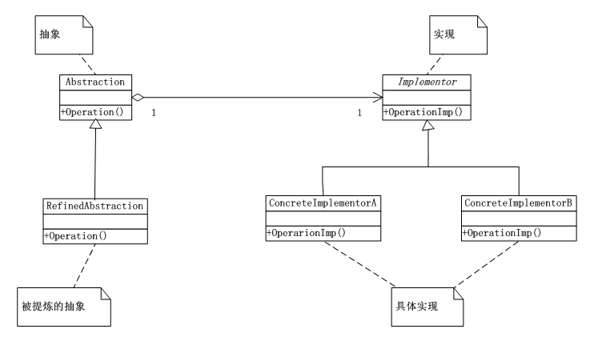
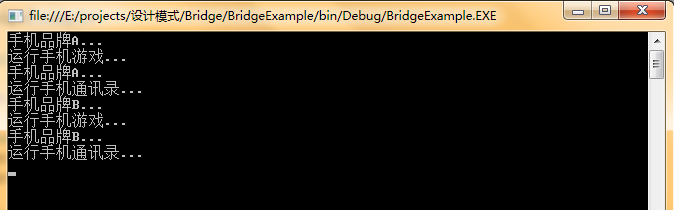

# 桥接模式（Bridge）
桥接模式（Bridge），将抽象部分与它的实现部分分离，使它们都可以独立地变化。对于模式中描述的抽象与它实现分离，这并不是说，让抽象类与派生类分离，因为这没有任何意义。实现指的是抽象类和它的派生类用来实现自己的对象。

## 桥接模式（Bridge）UML类图：



## 桥接模式（Bridge）实现：


```
using System;
using System.Collections.Generic;
using System.Linq;
using System.Text;

namespace Bridge
{
   /*实现类*/
   abstract class Implementor
   {
       public abstract void Operation();
   }
   /*抽象类*/
   class Abstraction
   {
       protected Implementor implementor;

       public void SetImplementor(Implementor implementor)
       {
           this.implementor = implementor;
       }

       public virtual void Operation()
       {
           this.implementor.Operation();
       }
   }

   class ConcreteImplementorA : Implementor
   {
       public override void Operation()
       {
           Console.WriteLine("具体实现A的方法执行...");
           //throw new NotImplementedException();
       }
   }

   class ConcreteImplementorB : Implementor
   {
       public override void Operation()
       {
           Console.WriteLine("具体实现B的方法执行...");
       }
   }

   class RefinedAbstraction : Abstraction
   {
       public override void Operation()
       {
           this.implementor.Operation();
       }
   }
}
```
客户端：


```
using System;
using System.Collections.Generic;
using System.Linq;
using System.Text;

namespace Bridge
{
   class Program
   {
       static void Main(string[] args)
       {
           Abstraction ab = new RefinedAbstraction();

           ab.SetImplementor(new ConcreteImplementorA());
           ab.Operation();

           ab.SetImplementor(new ConcreteImplementorB());
           ab.Operation();

           Console.Read();
       }
   }
}
```
## 桥接模式总结：

### 优点：

      （1）桥接模式的主要目的是将一个对象的变化因素抽象出来，不是通过类继承的方式来满足这个因素的变化，而是通过对象组合的方式来依赖因素的抽象，这样当依赖的因素的具体实现发生变化后，而我们的具体的引用却不用发生改变，因为我们的对象是依赖于抽象的，而不是具体的实现。

      （2）而且，通过这样的依赖抽象，我们在多个对象共享这样的因素的时候，就成为可能，如果我们使用的是具体的因素的共享，当我们改变这个变化因素的时候，我们必须把使用这个因素的所有的对象，都进行相应的修改，而如果所有的引用这个变化因素的对象都依赖于抽象而不是具体的依赖呢？这也为我们的共享的提供了变化性。

### 应用场景：

      （1）当一个对象有多个变化因素的时候，通过抽象这些变化因素，将依赖具体实现，修改为依赖抽象。

     （2）当某个变化因素在多个对象中共享时。我们可以抽象出这个变化因素，然后实现这些不同的变化因素。

     （3）当我们期望一个对象的多个变化因素可以动态的变化，而且不影响客户的程序的使用时。

## 桥接模式（Bridge）案例—手机品牌软件：


```
using System;
using System.Collections.Generic;
using System.Linq;
using System.Text;

namespace BridgeExample
{
   /*手机软件*/
   abstract class HandsetSoft
   {
       public abstract void Run();
   }
   /*手机通讯录、游戏等具体类*/
   class HandsetAddressList : HandsetSoft
   {
       public override void Run()
       {
           Console.WriteLine("运行手机通讯录...");
           //throw new NotImplementedException();
       }
   }
   class HandsetGame : HandsetSoft
   {
       public override void Run()
       {
           Console.WriteLine("运行手机游戏...");
           //throw new NotImplementedException();
       }
   }

   abstract class HandsetBrand
   {
       protected HandsetSoft handSoft;

       public void setHandsetSoft(HandsetSoft handSoft)
       {
           this.handSoft = handSoft;
       }

       public abstract void Run();
   }

   class HandsetBrandA : HandsetBrand
   {
       public override void Run()
       {
           Console.WriteLine("手机品牌A...");
           this.handSoft.Run();
           //throw new NotImplementedException();
       }
   }

   class HandsetBrandB : HandsetBrand
   {
       public override void Run()
       {
           Console.WriteLine("手机品牌B...");
           this.handSoft.Run();
           //throw new NotImplementedException();
       }
   }
}
```
客户端：


```
using System;
using System.Collections.Generic;
using System.Linq;
using System.Text;

namespace BridgeExample
{
   class Program
   {
       static void Main(string[] args)
       {
           HandsetBrand BrandA = new HandsetBrandA();
           BrandA.setHandsetSoft(new HandsetGame());
           BrandA.Run();

           BrandA.setHandsetSoft(new HandsetAddressList());
           BrandA.Run();

           HandsetBrand BrandB = new HandsetBrandB();
           BrandB.setHandsetSoft(new HandsetGame());
           BrandB.Run();

           BrandB.setHandsetSoft(new HandsetAddressList());
           BrandB.Run();

           Console.Read();

       }
   }
}
```
运行结果：

