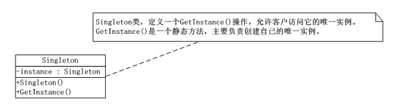

# 单例模式（Singleton）
单例模式（Singleton），保证一个类仅有一个实例，并提供一个访问它的全局访问点。

      通常我们可以让一个全局变量使得一个对象被访问，但它不能防止你实例化多个对象。一个最好的办法就是，让类自身负责保存它的唯一实例。这个类可以保证没有其他实例可以被创建，并且它可以提供一个访问该实例的方法。

## 单例模式（Singleton）UML类图：



分析：

      Singleton类定义一个GetInstance()操作，允许客户访问它的唯一实例。GetInstance()是一个静态方法，主要负责创建自己的唯一实例。

## 单例模式（Singleton）实现：


```
using System;
using System.Collections.Generic;
using System.Linq;
using System.Text;

namespace Singleton
{
   /*Singleton类定义一个GetInstance()操作，允许客户访问它的唯一实例。GetInstance()是
    一个静态方法，主要负责创建自己的唯一实例。*/
   class Singleton
   {
       private static Singleton instance;
       /*构造方法让其private，这就堵死了外界利用new创建此类实例的可能*/
       private Singleton()
       { }
       /*此方法是获得本类实例的唯一全局访问点。*/
       public static Singleton getInstance()
       {
           if (instance == null)
           {
               /*若实例不存在，则new一个新实例，否则返回已有实例*/
               instance = new Singleton();
           }

           return instance;
       }
   }
}
```

客户端：


```
using System;
using System.Collections.Generic;
using System.Linq;
using System.Text;

namespace Singleton
{
   class Program
   {
       static void Main(string[] args)
       {
           Singleton s1 = Singleton.getInstance();
           Singleton s2 = Singleton.getInstance();
           if (s1 == s2)//比较两次实例化后对象的结果是实例相同
           {
               Console.WriteLine("两个对象是相同的实例");
           }

           Console.Read();
       }
   }
}
```
    单例模式因为Singleton类封装它的唯一实例，这样它可以严格地控制客户怎样访问它以及何时访问它。简单的说就是对唯一实例的受控访问。

## 多线程时的单例：

       多线程的程序中，多个线程同时访问Singleton类，调用GetInstance()方法，会有可能造成创建多个实例的。此时，可以给进程一把锁来处理。lock语句是确保当一个线程位于代码的临界区时，另一个线程不进入临界区。如果其他线程试图进入锁定的代码，则它将一直等待（即被阻止），知道该对象被释放。

      此时，Singleton类代码如下（客户端不变）：


```
using System;
using System.Collections.Generic;
using System.Linq;
using System.Text;

namespace MulThreadSingleton
{
   class Singleton
   {
       private static Singleton instance;
       /*程序运行时创建一个静态只读的进程辅助对象。*/
       private static readonly object syncRoot = new object();

       private Singleton()
       { }

       public static Singleton getInstance()
       {
           /*在同一时刻加了锁的那部分程序只有一个线程可以进入*/
           lock (syncRoot)
           {
               if (instance == null)
               {
                   /*若实例不存在，则new一个新实例，否则返回已有实例*/
                   instance = new Singleton();
               }
           }

           return instance;
       }

   }
}
```
### 双重锁定：

     由于在多线程单例中，每次调用GetInstance()方法，都需要lock，会影响性能，采用下列“双重锁定”方式。这种方式不用让线程每次都加锁，而是只在实例未被创建的时候再加锁处理，同时也能保证多线程的安全，也就是因此这种方式被称为Double-Check Locking（双重锁定）。

```
using System;
using System.Collections.Generic;
using System.Linq;
using System.Text;

namespace MulThreadSingleton
{
   class Singleton
   {
       private static Singleton instance;
       /*程序运行时创建一个静态只读的进程辅助对象。*/
       private static readonly object syncRoot = new object();

       private Singleton()
       { }

       public static Singleton getInstance()
       {
           /*先判断实例是否存在，若不存在再加锁处理。*/
           if (instance == null)
           {
               /*在同一时刻加了锁的那部分程序只有一个线程可以进入*/
               lock (syncRoot)
               {
                   if (instance == null)
                   {
                       /*若实例不存在，则new一个新实例，否则返回已有实例*/
                       instance = new Singleton();
                   }
               }
           }

           return instance;
       }

   }
}
```
### 静态初始化方法：
      其实在实际应用中，C#与公共语言运行库也提供了一种“静态初始化”的方法，这种方法不需要开发人员显式的编写线程安全代码，即可解决多线程环境下它是不安全的问题。


```
/*sealed 阻止发生派生，而派生可能会增加实例*/
  public sealed class Singleton
  {
      /*在第一次引用类的任何成员时创建实例，公共语言运行库负责处理变量初始化*/
      private static readonly Singleton instance = new Singleton();
      private Singleton()
      { }

      public static Singleton getInstance()
      {
          return instance;
      }
  }
```

## 单例模式总结：
      单例模式中主要需要解决的是两个问题：全局访问和实例化控制问题。

      静态初始化方式是在自己被加载时就将自己实例化，被形象的称为饿汉式单例类。这种方式是类一加载就实例化的对象，要提前占用系统资源。

      原先的单例模式处理方式第要在第一次被引用时，才会将自己实例化，所以称为懒汉式单例类。该方式面临着多线程访问的安全性问题，需要双重锁定这样的处理才能达到保证安全。