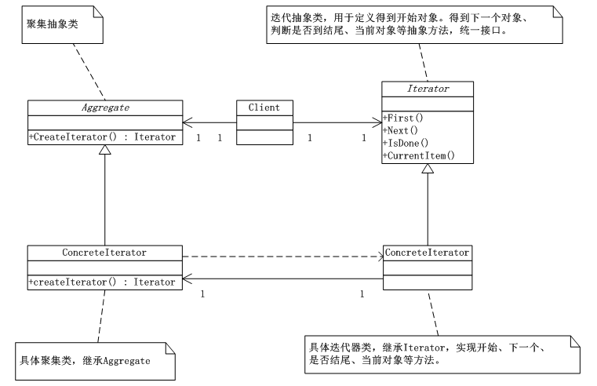
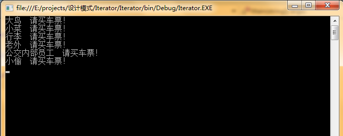

# 迭代器模式（Iterator）
 迭代器模式（Iterator），提供一种方法顺序访问一个聚合对象中的各种元素，而又不暴露该对象的内部表示。

      当你需要访问一个聚合对象，而且不管这些对象是什么都需要遍历的时候，就应该考虑使用迭代器模式。另外，当需要对聚集有多种方式遍历时，可以考虑去使用迭代器模式。迭代器模式为遍历不同的聚集结构提供如开始、下一个、是否结束、当前哪一项等统一的接口。

## 迭代器模式UML类图：



## 迭代器模式实现：


```
using System;
using System.Collections.Generic;
using System.Linq;
using System.Text;

namespace Iterator
{
   /*Iterator迭代器抽象类*/
   abstract  class Iterator
   {
       public abstract object First();
       public abstract object Next();
       public abstract object CurrentItem();
       public abstract bool IsDone();
   }
   /*Aggregate聚集抽象类*/
   abstract class Aggregate
   {
       public abstract Iterator createIterator();
   }

   class ConcreteIterator : Iterator
   {

       // 定义了一个具体聚集对象
       private ConcreteAggregate aggregate;

       private int current = 0;

       // 初始化对象将具体聚集类传入
       public ConcreteIterator(ConcreteAggregate aggregate)
       {
           this.aggregate = aggregate;
       }

       // 第一个对象
       public override object First()
       {
           return aggregate[0];
       }

       // 得到聚集的下一对象
       public override object Next()
       {
           object ret = null;
           current++;
           if (current < aggregate.Count)
           {
               ret = aggregate[current];
           }
           return ret;
       }

       // 是否到结尾
       public override bool IsDone()
       {
           return current >= aggregate.Count ? true : false;
       }

       // 返回当前聚集对象
       public override object CurrentItem()
       {
           return aggregate[current];
       }
   }

   class ConcreteAggregate : Aggregate
   {
       private IList<object> items = new List<object>();

       public override Iterator createIterator()
       {
           return new ConcreteIterator(this);
       }

       // 返回聚集总个数
       public int Count
       {
           get { return items.Count; }
       }

       // 声明一个索引器
       public object this[int index]
       {
           get { return items[index]; }
           set { items.Insert(index, value); }
       }
   }
}
```

客户端：

```
using System;
using System.Collections.Generic;
using System.Linq;
using System.Text;

namespace Iterator
{
   class Program
   {
       static void Main(string[] args)
       {
           ConcreteAggregate ca = new ConcreteAggregate();
           ca[0] = "大鸟";
           ca[1] = "小菜";
           ca[2] = "行李";
           ca[3] = "老外";
           ca[4] = "公交内部员工";
           ca[5] = "小偷";

           Iterator i = new ConcreteIterator(ca);
           object obj = i.First();
           while (!i.IsDone())
           {
               Console.WriteLine("{0}  请买车票！",i.CurrentItem());
               i.Next();
           }
           Console.Read();
       }
   }
}
```
运行结果：





## .NET的迭代器实现：

      其实.net框架已经准备好了迭代器接口，只需要实现接口就行了IEumerator 支持对非泛型集合的简单迭代。


```
using System;
using System.Collections.Generic;
using System.Linq;
using System.Text;

namespace Iterator.Net
{
   public interface IEumerator
   {
       object Current
       {
           get;
       }

       bool MoveNext();

       void Reset();
   }

   public interface IEnumerable
   {
       IEnumerable GetEnumerator();
   }

}
```
客户端：


```
using System;
using System.Collections.Generic;
using System.Linq;
using System.Text;

namespace Iterator.Net
{
   class Program
   {
       static void Main(string[] args)
       {
           IList<string> ca = new List<string>();
           ca.Add("大鸟");
           ca.Add("小菜");
           ca.Add("行李");
           ca.Add("老外");
           ca.Add("公交内部员工");
           ca.Add("小偷");

           foreach (string item in ca)
           {
               Console.WriteLine("{0} 请买车票！",item);
           }

           Console.Read();
       }
   }
}
```
运行结果：


## 迭代器模式总结：

      迭代器模式（Iterator）就是分离了聚合对象的遍历行为，抽象出一个迭代器来负责这样既可以做到不暴露集合的内部结构，又可让外部代码透明的访问集合内部数据。