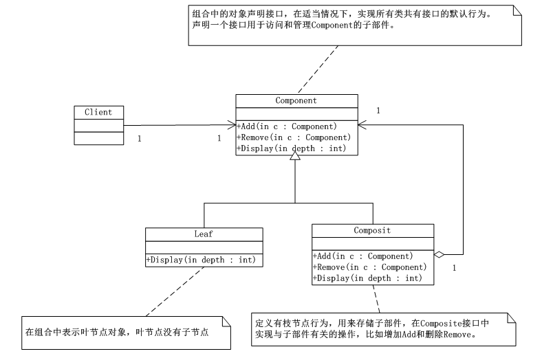
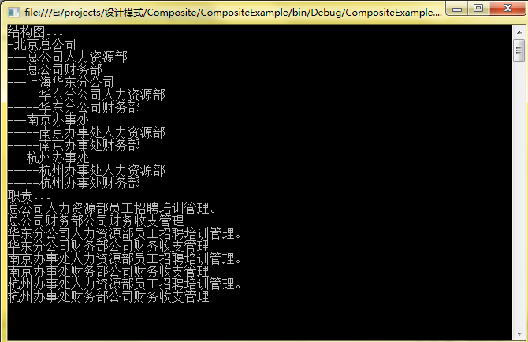

# 组合模式（Composite）
 组合模式（Composite），将对象组合成树形结构以表示‘部分-整体’的层次结构。组合模式使得用户对单个对象和组合对象的使用具有一致性。

## 组合模式UML类图：



      由上图可知，Component：为组合中的对象声明接口，在适当情况下，实现所有类共有接口的 默认行为。声明一个接口用于访问和管理Component的子类。

      Leaf：在组合中表示叶节点对象，叶节点没有子节点。

      Composite：定义有枝节点行为，用来存储子部件，在Component接口中实现与子部件有关的操作，比如增加Add()，Remove()。

      客户端代码能通过Component接口操作组合部件的对象。

## 组合模式（Composite）实现：


```
using System;
using System.Collections.Generic;
using System.Linq;
using System.Text;

namespace Composite
{
   /*Component为组合中的对象声明接口，在适当情况下，实现所有类共有接口的
    默认行为。声明一个接口用于访问和管理Component的子类。*/
   abstract class Component
   {
       protected string name;
       public Component(string name)
       {
           this.name = name;
       }
       /*通常用Add(),Remove()方法来完成增加或者移除树叶或树枝的功能*/
       public abstract void Add(Component c);
       public abstract void Remove(Component c);
       public abstract void Display(int depth);

   }

   class Leaf : Component
   {
       public Leaf(string name)
           : base(name)
       { }
       /*由于叶子没有再增加分支和树叶，所以Add()和Remove()方法实现的没有意义，
        但这样做可以消除叶节点和枝节点对象在抽象层次的区别，它们具备完全一致
        接口。*/
       public override void Add(Component c)
       {
           Console.WriteLine("Cannot add a component to a leaf!");
           //throw new NotImplementedException();
       }

       public override void Remove(Component c)
       {
           Console.WriteLine("Cannot remove a component from a Leaf!");
           //throw new NotImplementedException();
       }

       /*叶节点的具体方法，此处是显示器名称和级别。*/
       public override void Display(int depth)
       {
           Console.WriteLine(new String('-',depth) + this.name);
           //throw new NotImplementedException();
       }
   }
   class Composite : Component
   {
       private List<Component> children = new List<Component>();

       public Composite(string name)
           : base(name)
       { }

       public override void Add(Component c)
       {
           this.children.Add(c);
           //throw new NotImplementedException();
       }

       public override void Remove(Component c)
       {
           this.children.Remove(c);
           //throw new NotImplementedException();
       }

       public override void Display(int depth)
       {
           Console.WriteLine(new String('-',depth) + this.name);

           foreach (Component c in this.children)
           {
               c.Display(depth + 2);
           }
           //throw new NotImplementedException();
       }
   }
}
```
客户端：


```
using System;
using System.Collections.Generic;
using System.Linq;
using System.Text;

namespace Composite
{
   class Program
   {
       static void Main(string[] args)
       {
           Composite root = new Composite("Root");//生成树根root，根上长出两个叶LeafA，LeafB
           root.Add(new Leaf("Leaf A"));
           root.Add(new Leaf("Leaf B"));

           Composite co = new Composite("Composite X");//根上长出分支CompositeX，Y
           co.Add(new Leaf("Leaf XA"));//分支长出叶
           co.Add(new Leaf("Leaf XB"));

           root.Add(co);

           Composite co2 = new Composite("Composite Y");

           Composite y1 = new Composite("Composite Y1");//分支继续长出分支
           y1.Add(new Leaf("Leaf Y1A"));
           y1.Add(new Leaf("Leaf Y2B"));

           co2.Add(y1);

           Composite y2 = new Composite("Composite Y2");
           y2.Add(new Leaf("Leaf Y2A"));
           y2.Add(new Leaf("Leaf Y2B"));

           co2.Add(y2);

           root.Add(co2);

           root.Add(new Leaf("C"));
           root.Display(1);


           Console.Read();
       }
   }
}
```
## 组合模式（Composite）总结：

      对于组合模式的实现分为透明方式和安全方式。

    （1）透明方式：在Component中声明所有用来管理对象的方法，其中包括Add(),Remove()等。这样实现Component接口的所有子类都具备了Add()，Remove()。这样做的好处是叶节点和枝节点对于外界没有区别，它们具备完全一致的行为接口。但问题也很明显，因为Leaf类本身不具备Add()，Remove()方法的功能，所以实现它没有意义。

   （2）安全方式：在Component接口中不去声明Add()，Remove()方法，那么子类Leaf就不需要实现它，而是在Composite声明所有用来管理子类对象的方法，但是这样做由于不够透明，所以树叶和树枝类将不具有相同的接口，客户端的调用需要做相应的判断，带来了不便。

   （3）我们一般在当发现需求中是体现部分与整体层次的结构时，以及你希望用户可以忽略组合对象与单个对象的不同，统一地使用组合结构中的所有对象时，就应该考虑使用组合模式。


## 组合模式案例—公司管理系统：

```
using System;
using System.Collections.Generic;
using System.Linq;
using System.Text;

namespace CompositeExample
{
   abstract class Company
   {
       protected string name;

       public Company(string name)
       {
           this.name = name;
       }

       public abstract void Add(Company c);//增加
       public abstract void Remove(Company c);//移除
       public abstract void Display(int depth);//显示
       public abstract void LineOfDuty();//履行职责
   }

   class ConcreteCompany : Company
   {
       private List<Company> companys = new List<Company>();

       public ConcreteCompany(string name)
           : base(name)
       { }

       public override void Add(Company c)
       {
           this.companys.Add(c);
           //throw new NotImplementedException();
       }
       public override void Remove(Company c)
       {
           this.companys.Remove(c);
           //throw new NotImplementedException();
       }
       public override void Display(int depth)
       {
           Console.WriteLine(new String('-',depth)+ this.name);
           foreach (Company c in this.companys)
           {
               c.Display(depth+2);
           }
           //throw new NotImplementedException();
       }
       public override void LineOfDuty()
       {
           foreach (Company c in this.companys)
           {
               c.LineOfDuty();
           }
           //throw new NotImplementedException();
       }
   }
   /*人力资源部*/
   class HRDepartment : Company
   {
       public HRDepartment(string name)
           : base(name)
       { }

       public override void Add(Company c)
       {
           //throw new NotImplementedException();
       }
       public override void Remove(Company c)
       {
           //throw new NotImplementedException();
       }
       public override void Display(int depth)
       {
           Console.WriteLine(new String('-',depth) + name);
           //throw new NotImplementedException();
       }
       public override void LineOfDuty()
       {
           Console.WriteLine("{0}员工招聘培训管理。", this.name);
           //throw new NotImplementedException();
       }
   }
   /*财务部*/
   class FinaceDepartment : Company
   {
       public FinaceDepartment(string name)
           : base(name)
       { }

       public override void Add(Company c)
       {
           //throw new NotImplementedException();
       }
       public override void Remove(Company c)
       {
           //throw new NotImplementedException();
       }
       public override void Display(int depth)
       {
           Console.WriteLine(new String('-',depth)+ this.name);
           //throw new NotImplementedException();
       }
       public override void LineOfDuty()
       {
           Console.WriteLine("{0}公司财务收支管理",this.name);
           //throw new NotImplementedException();
       }
   }

}
```
客户端：


```
using System;
using System.Collections.Generic;
using System.Linq;
using System.Text;

namespace CompositeExample
{
   class Program
   {
       static void Main(string[] args)
       {
           ConcreteCompany root = new ConcreteCompany("北京总公司");
           root.Add(new HRDepartment("总公司人力资源部"));
           root.Add(new FinaceDepartment("总公司财务部"));

           ConcreteCompany comp = new ConcreteCompany("上海华东分公司");
           comp.Add(new HRDepartment("华东分公司人力资源部"));
           comp.Add(new FinaceDepartment("华东分公司财务部"));

           root.Add(comp);

           ConcreteCompany comp1 = new ConcreteCompany("南京办事处");
           comp1.Add(new HRDepartment("南京办事处人力资源部"));
           comp1.Add(new FinaceDepartment("南京办事处财务部"));

           root.Add(comp1);

           ConcreteCompany comp2 = new ConcreteCompany("杭州办事处");
           comp2.Add(new HRDepartment("杭州办事处人力资源部"));
           comp2.Add(new FinaceDepartment("杭州办事处财务部"));

           root.Add(comp2);

           Console.WriteLine("结构图...");
           root.Display(1);

           Console.WriteLine("职责...");
           root.LineOfDuty();

           Console.Read();

       }
   }
}
```
运行结果：

