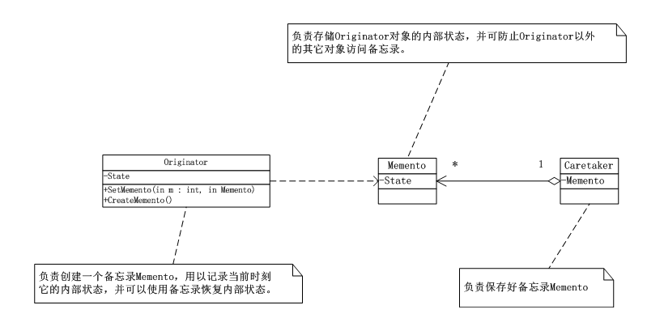
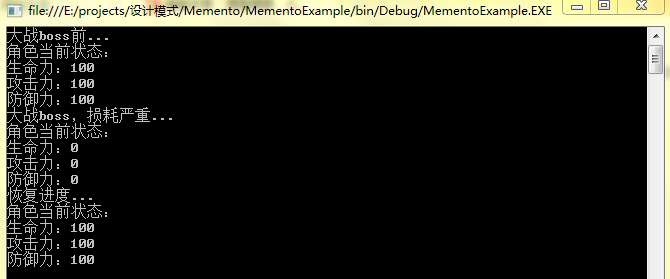

# 备忘录模式（Memento）
 备忘录模式（Memento），在不破坏封装性的前提下，捕获一个对象的内部状态，并在该对象之外保存这个状态，这样就可以将该对象状态恢复到原先保存的状态。

## 备忘录模式UML类图：



    由上图可知，Originator（发起人）类：负责创建一个备忘录Memento，用以记录当前时刻它的内部状态，并可使用备忘录恢复内部状态，Originator可根据需要决定Memento存储Originator的哪些内部状态 。

      Memento（备忘录）：负责存储Originator对象的内部状态，并可防止Originator以外的其它对象访问备忘录Memento。备忘录有两个接口，Caretaker只能看到Memento的窄接口，它只能将备忘录传递给其它对象，Originator看到一个宽接口允许它访问返回到先前状态所需的所有数据。

      Caretaker（管理者）：负责保存好备忘录Memento，不能对备忘录的内容进行操作或检查。

## 备忘录模式（Memento）实现：


```
using System;
using System.Collections.Generic;
using System.Linq;
using System.Text;

namespace Memento
{
   /*
    * 备忘录Memento类，负责存储Originator对象的内部状态，
    * 并可防止Originator以外的其它对象访问备忘录。
    */
   class Memento
   {
       private string state;

       public Memento(string state)//构造方法将相关数据导入
       {
           this.state = state;
       }

       public string getState()//需要保存的数据属性，可以是多个
       {
           return this.state;
       }
   }
   /*
    * Originator发起人类，负责创建一个备忘录Memento，
    * 用以记录当前时刻它的内部状态，并可以使用备忘录恢复内部状态。
    */
   class Originator
   {
       private string state;//需要保存属性可能有多个

       public string getState()
       {
           return this.state;
       }

       public void setState(string state)
       {
           this.state = state;
       }

       public Memento CreateMemento()//创建备忘录，将当前需要保存的信息导入并实例化出一个Memento对象
       {
           return new Memento(this.getState());
       }

       public void RecoveryMemento(Memento memento)//恢复备忘录，将Memento导入并将相关数据恢复
       {
           this.state = memento.getState();
       }

       public void show()//显示数据
       {
           Console.WriteLine("state:" + this.state);
       }
   }
   /*
    * Caretaker负责保存好备忘录Memento
    */
   class Caretaker
   {
       private Memento memento;

       public Memento getMemento()//得到备忘录
       {
           return this.memento;
       }

       public void setMemento(Memento memento)//设置备忘录
       {
           this.memento = memento;
       }
   }
}
```
客户端：


```
using System;
using System.Collections.Generic;
using System.Linq;
using System.Text;

namespace Memento
{
   class Program
   {
       static void Main(string[] args)
       {
           Originator o = new Originator();
           Console.WriteLine("Originator对象o的初始状态...");
           o.setState("on");
           o.show();

           Caretaker c = new Caretaker();
           /*
            * 保存状态时，由于有了很好的封装，可以隐藏Originator的实现细节
            */
           c.setMemento(o.CreateMemento());
           Console.WriteLine("Originator对象o改变了状态属性为“off”...");
           o.setState("off");
           o.show();

           Console.WriteLine("恢复初始状态...");
           o.RecoveryMemento(c.getMemento());
           o.show();

           Console.Read();

       }
   }
}
```
## 备忘录模式总结：

      （1）使用备忘录模式，也就是将要保存的细节给封装在了Memento中，哪一天要更改保存的细节也不用影响客户端了。

     （2）备忘录模式比较适用于功能比较复杂的，但需要维护或记录属性历史的类，或者需要保存的属性只是众多属性的一小部分时，Originator可以根据保存的Memento信息还原到前一状态。

     （3）如果在某个系统中使用命令模式时，需要实现命令模式的撤销功能，那么命令模式可以使用备忘录模式来存储可撤销操作的状态。

     （4）在当角色的状态改变的时候有可能这个状态无效，这时，就可以使用暂时存储起来的备忘录将状态复原。


## 备忘录模式案例——游戏进度备忘


```
using System;
using System.Collections.Generic;
using System.Linq;
using System.Text;

namespace MementoExample
{
   class Memento
   {
   }
   //游戏角色类
   class GameRole
   {
       //生命力
       private int vit;
       //攻击力
       private int atk;
       //防御力
       private int def;

       public int getVit()
       {
           return this.vit;
       }
       public void setVit(int vit)
       {
           this.vit = vit;
       }

       public int getAtk()
       {
           return this.atk;
       }
       public void setAtk(int atk)
       {
           this.atk = atk;
       }

       public int getDef()
       {
           return this.def;
       }
       public void setzdef(int def)
       {
           this.def = def;
       }
       /*设置初始状态*/
       public void InitState()
       {
           this.vit = 100;
           this.atk = 100;
           this.def = 100;
       }
       /*当前状态显示*/
       public void ShowState()
       {
           Console.WriteLine("角色当前状态：");
           Console.WriteLine("生命力：{0}",this.vit);
           Console.WriteLine("攻击力：{0}",this.atk);
           Console.WriteLine("防御力：{0}",this.def);
       }

       /*战斗*/
       public void Fight()
       {
           this.vit = 0;
           this.atk = 0;
           this.def = 0;
       }
       /*保存角色状态*/
       public RoleStateMemento SaveRoleState()
       {
           return new RoleStateMemento(this.vit,this.atk,this.def);
       }
       /*恢复角色状态*/
       public void RecoveryState(RoleStateMemento rsm)
       {
           this.vit = rsm.getVit();
           this.atk = rsm.getAtk();
           this.def = rsm.getDef();
       }
   }


   /*角色状态备忘录*/
   class RoleStateMemento
   {
       //生命力
       private int vit;
       //攻击力
       private int atk;
       //防御力
       private int def;

       public RoleStateMemento(int vit,int atk,int def)
       {
           this.vit = vit;
           this.atk = atk;
           this.def = def;
       }

       public int getVit()
       {
           return this.vit;
       }
       public void setVit(int vit)
       {
           this.vit = vit;
       }

       public int getAtk()
       {
           return this.atk;
       }
       public void setAtk(int atk)
       {
           this.atk = atk;
       }

       public int getDef()
       {
           return this.def;
       }
       public void setzdef(int def)
       {
           this.def = def;
       }

   }
   /*游戏管理者类*/
   class RoleStateCaretaker
   {
       private RoleStateMemento rsm;

       public RoleStateMemento getRsm()
       {
           return this.rsm;
       }

       public void setRsm(RoleStateMemento rsm)
       {
           this.rsm = rsm;
       }
   }
}

```
客户端：


```
using System;
using System.Collections.Generic;
using System.Linq;
using System.Text;

namespace MementoExample
{
   class Program
   {
       static void Main(string[] args)
       {
           //大战boss前
           Console.WriteLine("大战boss前...");
           GameRole gr = new GameRole();
           gr.InitState();
           gr.ShowState();

           //保存进度
           RoleStateCaretaker rsc = new RoleStateCaretaker();
           rsc.setRsm(gr.SaveRoleState());

           //大战boss，损耗严重
           Console.WriteLine("大战boss，损耗严重...");
           gr.Fight();
           gr.ShowState();

           //恢复进度
           Console.WriteLine("恢复进度...");
           gr.RecoveryState(rsc.getRsm());
           gr.ShowState();

           Console.Read();

       }
   }
}

```
运行结果：

