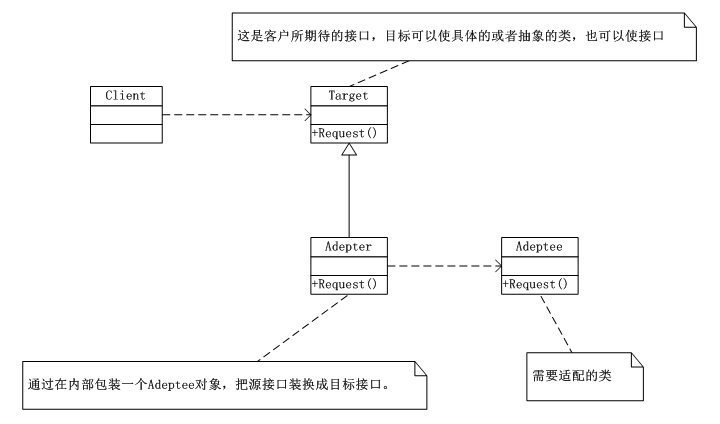
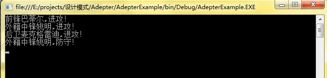

# 适配器模式（Adepter）
 适配器模式（Adepter），将一个类的接口转换成客户希望的另外一个接口。Adepter模式使得原本由于模式不兼容而不能一起工作的那些类，可以一起工作。

     在软件开发中，当系统的数据和行为都正确，但接口不符时，我们应该考虑用适配器模式，目的是使控制范围之外的一个原有对象与某个接口匹配，适配器模式主要应用于希望复用一些现存的类，但是接口又与复用环境不一致的情况，比如要在需要对早起代码复用，一些功能等应用上很有实用价值。

## 适配器模式UML类图：



      分析：

      Target是客户所期待的接口，目标可以是具体的或抽象的类也可以是接口；Adeptee是需要适配的类；Adepter是适配器类，通过在内部包装一个Adeptee对象把源接口转换成目标接口。

## 适配器模式实现：

```
using System;
using System.Collections.Generic;
using System.Linq;
using System.Text;

namespace Adepter
{
   /*
    * 这是客户所期待的接口，目标可以是具体的或抽象的类也可以是接口
    */
   class Target
   {
       public virtual void Request()
       {
           Console.WriteLine("普通请求...");
       }
   }
   /**
    * 需要适配的类
    */
   class Adeptee
   {
       public void SpecificRequest()
       {
           Console.WriteLine("特殊请求...");
       }
   }

   /*
    * Adepter通过在内部包装一个Adeptee对象把源接口转换成目标接口
    */
   class Adepter : Target
   {
       private Adeptee adeptee = new Adeptee();//这是一个私有的Adeptee对象

       public override void Request()
       {
           this.adeptee.SpecificRequest();//这样就可以把表面调用Request()方法，转换为调用SpecificRequest()方法
           //base.Request();
       }
   }
}
```
客户端：


```
using System;
using System.Collections.Generic;
using System.Linq;
using System.Text;

namespace Adepter
{
   class Program
   {
       static void Main(string[] args)
       {
           Target target = new Adepter();
           target.Request();//对客户来说，调用的就是Target的Request()

           Console.Read();
       }
   }
}
```

## 适配器模式总结：

      当使用一个已经存在的类，但是它的接口也就是它的方法或你的要求不相同时；两个类所做的事情相同或者相似但是接口不同时，应该考虑使用适配器模式。这样客户可以统一调用一个接口，从而更简单、更直接、更紧凑。


## 适配器模式案例—篮球翻译适配器


```
using System;
using System.Collections.Generic;
using System.Linq;
using System.Text;

namespace AdepterExample
{
   abstract class Player
   {
       private string name;
       public Player(string name)
       {
           this.name = name;
       }
       public string getName()
       {
           return this.name;
       }
       public void setName(string name)
       {
           this.name = name;
       }

       public abstract void Attack();
       public abstract void Defense();
   }

   class Forwards : Player
   {
       public Forwards(string name):base(name){}
       public override void Attack()
       {
           Console.WriteLine("前锋{0},进攻！",this.getName());
           //throw new NotImplementedException();
       }
       public override void Defense()
       {
           Console.WriteLine("前锋{0},防守！", this.getName());
           //throw new NotImplementedException();
       }
   }

   class Center : Player
   {
       public Center(string name) : base(name) { }
       public override void Attack()
       {
           Console.WriteLine("中锋{0},进攻！", this.getName());
           //throw new NotImplementedException();
       }
       public override void Defense()
       {
           Console.WriteLine("中锋{0},防守！", this.getName());
           //throw new NotImplementedException();
       }
   }


   class Guards : Player
   {
       public Guards(string name) : base(name) { }
       public override void Attack()
       {
           Console.WriteLine("后卫{0},进攻！", this.getName());
           //throw new NotImplementedException();
       }
       public override void Defense()
       {
           Console.WriteLine("后卫{0},防守！", this.getName());
           //throw new NotImplementedException();
       }
   }

   class ForeignCenter
   {
       private string name;

       public string getName()
       {
           return this.name;
       }
       public void setName(string name)
       {
           this.name = name;
       }

       public void 进攻()
       {
           Console.WriteLine("外籍中锋{0},进攻！", this.name);
       }

       public void 防守()
       {
           Console.WriteLine("外籍中锋{0},防守！",this.name);
       }
   }
   class Adepter : Player
   {
       private ForeignCenter foreignCenter = new ForeignCenter();

       public Adepter(string name) : base(name)
       {
           foreignCenter.setName(name);
       }

       public override void Attack()
       {
           foreignCenter.进攻();
           //throw new NotImplementedException();
       }
       public override void Defense()
       {
           foreignCenter.防守();
           //throw new NotImplementedException();
       }

   }
}
```
客户端：

```
using System;
using System.Collections.Generic;
using System.Linq;
using System.Text;

namespace AdepterExample
{
   class Program
   {
       static void Main(string[] args)
       {
           Player p1 = new Forwards("巴蒂尔");
           Player p2 = new Adepter("姚明");
           Player p3 = new Guards("麦克格雷迪");

           p1.Attack();
           p2.Attack();
           p3.Attack();
           p2.Defense();

           Console.Read();
       }
   }
}
```

运行结果：

