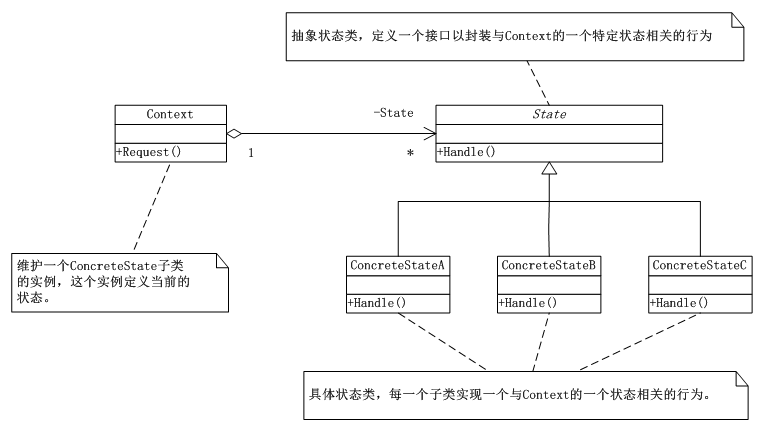
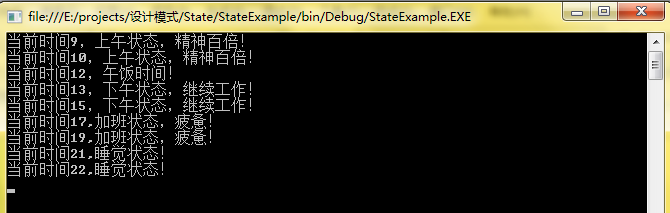

# 状态模式（State）
状态模式（State），当一个对象的内在状态改变时，允许改变其行为，这个对象看起来好像改变了其类。状态模式主要解决的是当控制一个对象的状态转换条件表达式过于复杂时的情况。把状态的判断逻辑转移到不同状态的一系列类中，可以把复杂的判断逻辑简化。

## 状态模式UML类图：



      分析：由上图可知（1）State类，抽象状态类，定义一个接口以封装与Context的一个特定状态相关的行为；（2）ConcreteState类，具体状态，每一个子类实现一个与Context的一个特定状态相关的行为；（3）Context类，维护一个ConcreteState子类的实例，这个实例定义当前的状态

## 状态模式实现：


```
using System;
using System.Collections.Generic;
using System.Linq;
using System.Text;

namespace State
{

   /*
    * State类，抽象状态类，定义一个接口以封装与Context的一个特定状态相关的行为
    */
   abstract class State
   {
       public abstract void Handle(Context context);
   }
   /*
    * ConcreteState类，具体状态，每一个子类实现一个与Context的一个特定状态相关的行为。
    */
   class ConcreteStateA : State
   {
       public override void Handle(Context context)
       {
           context.setState(new ConcreteStateB());//假设ConcreteStateA的下一个状态是ConcreteStateB
           //throw new NotImplementedException();
       }
   }


   class ConcreteStateB : State
   {
       public override void Handle(Context context)
       {
           context.setState(new ConcreteStateA());//假设ConcreteStateB的下一个状态是ConcreteStateA
           //throw new NotImplementedException();
       }
   }
   /*
    * Context类，维护一个ConcreteState子类的实例，这个实例定义当前的状态
    */
   class Context
   {
       private State state;

       public Context(State state)
       {
           this.state = state;
       }

       public State getState()
       {
           return this.state;
       }

       public void setState(State state)
       {
           this.state = state;
           Console.WriteLine("当前状态："+this.state.GetType().Name);
       }

       public void Request()
       {
           this.state.Handle(this);
       }
   }

}
```
客户端：


```
using System;
using System.Collections.Generic;
using System.Linq;
using System.Text;

namespace State
{
   //客户端代码
   class Program
   {
       static void Main(string[] args)
       {
           Context context = new Context(new ConcreteStateA());

           context.Request();
           context.Request();
           context.Request();
           context.Request();

           Console.Read();
       }
   }
}
```
## 状态模式总结：

      （1）状态模式的好处就是将于特定状态相关的行为局部化，并且将不同状态的行为分割开来。意即，将特定的状态相关的行为都放入一个对象中，由于所有与状态相关的代码都存在于某个ConcreteState中，所以通过定义新的子类可以很容易地增加新的状态和转换。

      （2）这样做的目的是为了消除庞大的条件分支语句，大的分支判断会使得它们难以修改和扩展，状态模式通过把各种状态转移逻辑分布到State的子类之间，来减少相互间的依赖。

      （3）当一个对象的行为取决于它们的状态，并且它必须在运行时刻根据状态改变它的行为时，就可以考虑使用状态模式。


## 状态模式案例—工作状态


```
using System;
using System.Collections.Generic;
using System.Linq;
using System.Text;

namespace StateExample
{
   /*
    * 抽象状态类
    */
   abstract class State
   {
       public abstract void writeProgram(Work work);
   }

   /*
    * 具状态类
    */
   class ForenoonState : State
   {
       public override void writeProgram(Work work)
       {
           if (work.getHour() < 12)
           {
               Console.WriteLine("当前时间{0}，上午状态，精神百倍！", work.getHour());
           }
           else
           {
               work.setState(new NoonState());
               work.writeProgram();
           }
           //throw new NotImplementedException();
       }
   }

   class NoonState : State
   {
       public override void writeProgram(Work work)
       {
           if (work.getHour() < 13)
           {
               Console.WriteLine("当前时间{0}，午饭时间！", work.getHour());
           }
           else
           {
               work.setState(new AfterNoonState());
               work.writeProgram();
           }
           //throw new NotImplementedException();
       }
   }

   class AfterNoonState : State
   {
       public override void writeProgram(Work work)
       {
           if (work.getHour() < 17)
           {
               Console.WriteLine("当前时间{0}，下午状态，继续工作！", work.getHour());
           }
           else
           {
               work.setState(new EveningState());
               work.writeProgram();
           }
           //throw new NotImplementedException();
       }
   }

   class EveningState : State
   {
       public override void writeProgram(Work work)
       {
           if (work.getIsFinish())
           {
               work.setState(new RestState());
               work.writeProgram();
           }
           else
           {
               if (work.getHour() < 21)
               {
                   Console.WriteLine("当前时间{0},加班状态，疲惫！", work.getHour());
               }
               else
               {
                   work.setState(new SleepState());
                   work.writeProgram();
               }
           }
           //throw new NotImplementedException();
       }
   }

   class RestState : State
   {
       public override void writeProgram(Work work)
       {
           Console.WriteLine("当前时间{0},完成工作，下班回家！",work.getHour());
           //throw new NotImplementedException();
       }
   }

   class SleepState : State
   {
       public override void writeProgram(Work work)
       {
           Console.WriteLine("当前时间{0},睡觉状态！", work.getHour());
           //throw new NotImplementedException();
       }
   }
   /*
    * 工作类
    */
   class Work
   {
       private double hour;
       private State state;
       private bool isFinish;

       public Work(State state)
       {
           this.state = state;
       }

       public State getState()
       {
           return this.state;
       }
       public void setState(State state)
       {
           this.state = state;
       }

       public double getHour()
       {
           return this.hour;
       }
       public void setHour(double hour)
       {
           this.hour = hour;
       }
       public bool getIsFinish()
       {
           return this.isFinish;
       }
       public void setIsFinish(bool b)
       {
           this.isFinish = b;
       }

       public void writeProgram()
       {
           this.state.writeProgram(this);
       }

   }
}
```
客户端：


```
using System;
using System.Collections.Generic;
using System.Linq;
using System.Text;

namespace StateExample
{
   class Program
   {
       static void Main(string[] args)
       {
           Work work = new Work(new ForenoonState());
           work.setHour(9);
           work.writeProgram();
           work.setHour(10);
           work.writeProgram();
           work.setHour(12);
           work.writeProgram();
           work.setHour(13);
           work.writeProgram();
           work.setHour(15);
           work.writeProgram();
           work.setHour(17);
           work.writeProgram();

           work.setIsFinish(false);
           work.setHour(19);
           work.writeProgram();
           work.setHour(21);
           work.writeProgram();
           work.setHour(22);
           work.writeProgram();

           Console.Read();
       }
   }
}
```
运行结果：

