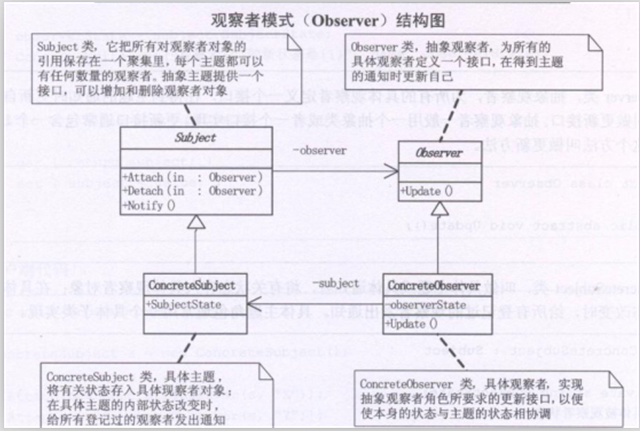

# 观察者模式（Observer）
 观察者模式（Observer）：定义了一种一对多的依赖关系，让多个观察者对象同时监听某一个主题对象。这个主题对象在状态发生变化时，会通知所有观察者对象，使它们能够自动更新自己。

## UML类图：



      分析：

     Observer类，抽象观察者，为所有的具体观察者定义一个接口，在得到主题的通知时，更新自己这个接口叫做更新接口。抽象观察者一般用一个抽象类或者一个接口实现。更新接口通常包含一个 Update方法，这个方法叫做更新方法。

       Subject类，可翻译为主题或者抽象通知者，一般用一个抽象类或者一个接口实现。它把所有对观察者对象的引用，保存在一个聚集里，每个主题都可以有任意数量的观察者。抽象主题提供一个接口，可以增加和删除观察者对象。

      ConcreteSubject类叫做具体主题或者具体通知者，将有关状态存入具体观察者对象：在具体主题的内部状态得到改变时，给所有登记过的观察者发出通知。具体主题通常用一个具体子类实现。

      ConcreteObserver类，具体观察者，实现抽象观察者角色所要求的更新接口。以便使本身的状态与主题的状态相协调。具体观察者角色可以保存一个指向具体主题对象的引用，具体 观察者角色通常由一个具体子类实现。

## 观察者模式（Observer）实现：


```
using System;
using System.Collections.Generic;
using System.Linq;
using System.Text;

namespace Observer
{

   /*
    * Observer类，抽象观察者，为所有的具体观察者定义一个接口，在得到主题的通知时，更新自己
    * 这个接口叫做更新接口。抽象观察者一般用一个抽象类或者一个接口实现。更新接口通常包含一个
    * Update方法，这个方法叫做更新方法。
    */
   abstract class Observer
   {
       public abstract void Update();
   }
   /*
    * Subject类，可翻译为主题或者抽象通知者，一般用一个抽象类或者一个接口实现。
    * 它把所有对观察者对象的引用，保存在一个聚集里，每个主题都可以有任意数量的观察者。
    * 抽象主题提供一个接口，可以增加和删除观察者对象。
    */
   abstract class Subject
   {
       private List<Observer> observers = new List<Observer>();

       //增加观察者
       public void Attach(Observer observer)
       {
           observers.Add(observer);
       }

       //移除观察者
       public void Detach(Observer observer)
       {
           observers.Remove(observer);
       }

       //通知
       public void Notify()
       {
           foreach(Observer o in observers)
           {
               o.Update();//通知到每一个观察者，使得每一个观察者修改自身状态
           }
       }
   }
   /*
    * ConcreteSubject类叫做具体主题或者具体通知者，将有关状态存入具体观察者对象：
    * 在具体主题的内部状态得到改变时，给所有登记过的观察者发出通知。具体主题通常
    * 用一个具体子类实现。
    */
   class ConcreteSubject : Subject
   {
       private string subjectState;

       public string getSubjectState()
       {
           return this.subjectState;
       }

       public void setSubjectState(string state)
       {
           this.subjectState = state;
       }
   }
   /*
    * ConcreteObserver类，具体观察者，实现抽象观察者角色所要求的更新接口。以便使本身
    * 的状态与主题的状态相协调。具体观察者角色可以保存一个指向具体主题对象的引用，具体
    * 观察者角色通常由一个具体子类实现。
    */
   class ConcreteObserver : Observer
   {
       private string name;
       private string observerState;
       private ConcreteSubject cSubject;

       public ConcreteObserver(ConcreteSubject cSubject,string name)
       {
           this.cSubject = cSubject;
           this.name = name;
       }

       public ConcreteSubject getCSubject()
       {
           return this.cSubject;
       }
       public void setCSubject(ConcreteSubject cSubject)
       {
           this.cSubject = cSubject;
       }
       public override void Update()
       {
           this.observerState = this.cSubject.getSubjectState();
           Console.WriteLine("观察者{0}的状态是{1}",this.name,this.observerState);
           //throw new NotImplementedException();
       }
   }
}
```
客户端：


```
using System;
using System.Collections.Generic;
using System.Linq;
using System.Text;

namespace Observer
{
   //客户端代码
   class Program
   {
       static void Main(string[] args)
       {
           ConcreteSubject cSubject = new ConcreteSubject();

           cSubject.Attach(new ConcreteObserver(cSubject,"X"));
           cSubject.Attach(new ConcreteObserver(cSubject,"Y"));
           cSubject.Attach(new ConcreteObserver(cSubject,"Z"));

           cSubject.setSubjectState("ABC");
           cSubject.Notify();

           Console.Read();
       }
   }
}
```
## 观察者模式总结：

      我们知道将一个系统分割成一系列相互协作的类有一个很不好的副作用，那就是需要维护相关对象间的一致性。我们不希望为了维护一致性而使各类紧密耦合，这样会给维护、扩展和重用都带来不便。而观察者模式的关键对象是主题Subject和观察者Observer，一个Subject可以有任意数量依赖它的Observer，一旦Subject的状态发生了变化，所有的Observer都可以得到通知。Subject发出通知时，并不需要知道谁是它的观察者，也就是说，具体观察者是谁，它根本不需要知道。而任何一个具体观察者不知道也不需要知道其他观察者的存在。

      当一个对象的改变需要同时改变其他对象，而且它不知道有多少对象待改变时，应该考虑使用观察者模式。

      总的来说，观察者模式所做的工作其实就是在解除耦合。让耦合的双方都依赖于抽象而不是依赖于具体。从而使得各自的变化都不会影响另一边的变化。