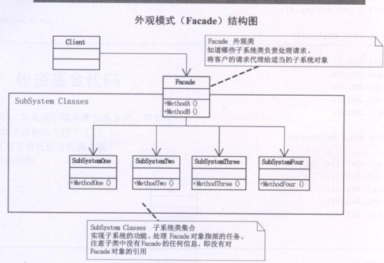

# 外观模式（Facade）
  外观模式(Facade)，为子系统中的一组接口提供一个一直的界面，此模式定义了一个高层接口，这个接口使得这一子系统更加容易使用。

## 外观模式UML类图：



      如上图所示为外观模式结构图，其中Facade类即外观类，它需要了解所有的子系统的方法或属性，进行组合以备外界调用，它知道哪些子系统类负责处理请求，将客户的请求代理给适当的子系统对象。SubSystem classes为子系统类集合，实现子系统功能，处理Facade对象指派的任务，注意各子类中没有Facade的任何信息，即没有对Facade对象的引用。

## 外观模式实现代码：


```
using System;
using System.Collections.Generic;
using System.Linq;
using System.Text;

namespace Facade
{
   /*
    * 子系统类集合实现子系统的功能，处理Facade对象指派的任务，
    * 注意子系统类中不包含外观类的任何信息，即没有对Facade对象的引用
    */
   class SubSystemOne
   {
       public void MethodOne()
       {
           Console.WriteLine("子系统实现方法一...");
       }
   }

   class SubSystemTwo
   {
       public void MethodTwo()
       {
           Console.WriteLine("子系统实现方法二...");
       }
   }

   class SubSystemThree
   {
       public void MethodThree()
       {
           Console.WriteLine("子系统实现方法三...");
       }
   }

   class SubSystemFour
   {
       public void MethodFour()
       {
           Console.WriteLine("子系统实现方法四...");
       }
   }
   /*
    * 外观类，它需要了解所有的子系统的方法或属性，进行组合，已被外界调用
    * 外观模式Facade，为子系统中的一组接口提供一个一致的界面，此模式定义了一个高层接口，
    * 这个接口使得这一子系统更加容易使用
    */
   class Facade
   {
       SubSystemOne sOne;
       SubSystemTwo sTwo;
       SubSystemThree sThree;
       SubSystemFour sFour;

       public Facade()
       {
           sOne = new SubSystemOne();
           sTwo = new SubSystemTwo();
           sThree = new SubSystemThree();
           sFour = new SubSystemFour();
       }

       public void MethodGroupA()
       {
           Console.WriteLine("方法组A...");
           sOne.MethodOne();
           sThree.MethodThree();
       }

       public void MethodGroupB()
       {
           Console.WriteLine("方法组B...");
           sTwo.MethodTwo();
           sFour.MethodFour();
       }
   }
}
```
客户端：


```
using System;
using System.Collections.Generic;
using System.Linq;
using System.Text;

namespace Facade
{
   class Program
   {
       static void Main(string[] args)
       {
           Facade facade = new Facade();

           facade.MethodGroupA();
           facade.MethodGroupB();

           Console.Read();
       }
   }
}
```
## 外观模式总结：

    首先，在设计初期阶段，应该要有意识的将不同的两个阶层分离，比如经典的三层架构，就需要考虑在数据访问层和业务逻辑层、业务逻辑层和表示层的层与层之间建立外观Facade，这样可以为复杂的子系统提供一个简单的接口，使得耦合大大降低。

    其次，在开发阶段子系统往往因为不断的重构演化而变得越来越复杂，大多数的模式使用时也都会产生很多很好的类，这本是好事，但也给外部调用它们的用户程序带来了使用上的困难，增加外观Facade可以提供一个简单的接口，减少它们之间的依赖。

     第三，在维护一个遗留的大型系统时，可能这个系统已经非常难以维护和扩展，但因为它包含非常重要的功能，新的需求开发必须要依赖于它，此时用外观模式Facade也是非常合适的。你可以为新系统开发一个外观Facade类，来提供设计粗糙或高度复杂的遗留代码比较清晰简单的接口，让新系统与Facade对象交互，Facade与遗留代码交互所有复杂的工作。