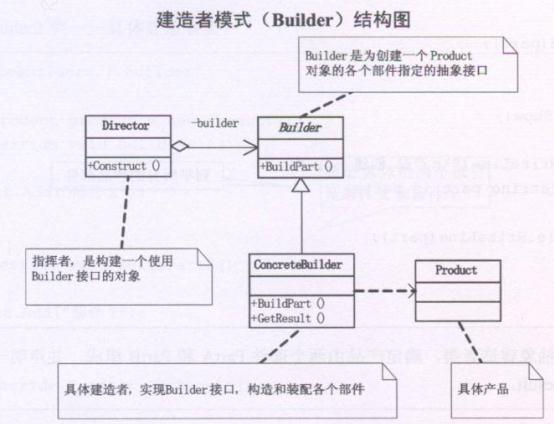

# 建造者模式（Builder）
  建造者模式（Builder），将一个复杂对象的构建和它的表示分离，使得同样的构建过程可以创建不同的表示。

      如果需要将一个复杂对象的构建和他的表示分离，使得同样的构建过程可以创建不同的表示，此时适合使用建造者模式，使用了建造者模式，用户只需要指定建造的类型就可以得到他们，而具体建造的过程和细节就不需要知道了。

## 建造者模式UML类图：



      如上图所示，product是具体的产品类，Builder是为如何创建一个Product对象的各个部件指定的抽象接口。ConcreteBuilder是具体建造者，实现Builder接口，构造和装配各个部件。而Director是指挥者，构建一个使用Builder 接口的对象。

##  建造者模式实现：


```
using System;
using System.Collections.Generic;
using System.Linq;
using System.Text;

namespace Builder
{
   /*
    * 产品类，有多个部件组成
    */
   class Product
   {
       List<String> parts = new List<string>();

       public void add(String part)
       {
           parts.Add(part);
       }

       public void show()
       {
           Console.WriteLine("产品创建...");
           foreach (String part in parts)
           {
               Console.WriteLine(part);
           }
       }
   }//class

   /*
    * Builder类，抽象建造者类，确定产品由几个部件组成并声明一个得到产品
    * 建造后结果的方法getResult()
    */
   abstract class Builder
   {
       public abstract void buildPartA();
       public abstract void buildPartB();
       public abstract void buildPartC();
       public abstract Product getResult();
   }
   /*
    * 具体建造者类
    */
   class ConcreteBuildType1 : Builder
   {
       private Product product = new Product();

       public override void buildPartA()
       {
           product.add("类型1物品，部件1...");
           //throw new NotImplementedException();
       }

       public override void buildPartB()
       {
           product.add("类型1物品，部件2...");
           //throw new NotImplementedException();
       }

       public override void buildPartC()
       {
           product.add("类型1物品，部件3...");
           //throw new NotImplementedException();
       }

       public override Product  getResult()
       {
           return this.product;
           //throw new NotImplementedException();
       }
   }

   class ConcreteBuildType2 : Builder
   {
       private Product product = new Product();

       public override void buildPartA()
       {
           product.add("类型2物品，部件1...");
           //throw new NotImplementedException();
       }

       public override void buildPartB()
       {
           product.add("类型2物品，部件2...");
           //throw new NotImplementedException();
       }

       public override void buildPartC()
       {
           product.add("类型2物品，部件3...");
           //throw new NotImplementedException();
       }

       public override Product getResult()
       {
           return this.product;
           //throw new NotImplementedException();
       }
   }
   /*
    * 指挥者类用来指挥建造过程
    */
   class Director
   {
       public void Construct(Builder builder)
       {
           builder.buildPartA();
           builder.buildPartB();
           builder.buildPartC();
       }
   }
}
```
客户端：


```
using System;
using System.Collections.Generic;
using System.Linq;
using System.Text;

namespace Builder
{
   class Program
   {
       static void Main(string[] args)
       {
           Director director1 = new Director();

           Builder builder1 = new ConcreteBuildType1();
           Builder builder2 = new ConcreteBuildType2();

           director1.Construct(builder1);
           Product product1 = builder1.getResult();
           product1.show();

           Director director2 = new Director();

           director2.Construct(builder2);
           Product product2 = builder2.getResult();
           product2.show();

           Console.Read();

       }
   }
}
```
## 建造者模式总结：

     建造者模式主要用于创建一些复杂的对象，这些对象内部构建间的建造顺序通常是稳定的，但对象内部的构建通常是面临着复杂的变化。

     建造者模式是在当前创建复杂对象的算法应该独立于该对象的组成部分以及他们的装配方式时适用的模式。

     使用建造者模式可以使得建造代码与表示代码分离，由于建造者隐藏了该产品是如何组装的，所以若需要改变一个产品的内部表示，只需要再定义一个具体的建造者就可以了。