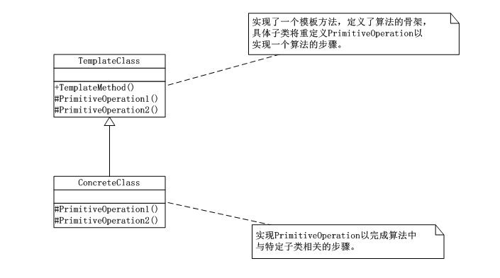
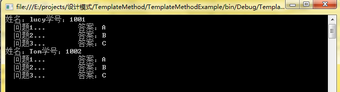

# 模板方法模式（TemplateMethod）
模板方法模式(TemplateMethod)：定义一个操作中的算法的骨架，而将一些步骤延迟到子类。模板方法使得子类可以不改变一个算法的结构即可重定义该算法的某些特定步骤。

## UML类图:



      TemplateClass是抽象类，其实也就是一个抽象模板，定义并实现一个模板方法，这个模板方法一般是一个具体的方法，它给出了一个顶级逻辑的骨架，而逻辑的组成步骤在相应的抽象操作中，推迟到子类实现，顶级逻辑也有可能调用一些具体方法；

      ConcreteClass实现父类所定义的一个或者多个抽象方法，每一个TemplateClass都可以有任意多个ConcreteClass与之对应，而每一个ConcreteClass都可以给出这些抽象方法（也就是顶级逻辑的组成步骤）的不同实现，从而使得顶级逻辑的实现各不相同；


```
using System;
using System.Collections.Generic;
using System.Linq;
using System.Text;

namespace TemplateMethod
{
   /*
    * 模板类是一个抽象类，定义并实现了一个模板方法，定义了算法的骨架，具体子类
    * 将重定义PrimitiveOperation以实现一个算法的步骤
    */
   abstract class TemplateClass
   {
       public void TemplateMethod()
       {
           PrimitiveOperation1();
           PrimitiveOperation2();
       }
       public abstract void PrimitiveOperation1();
       public abstract void PrimitiveOperation2();
   }
   /*
    * ConcreteClass实现父类所定义的一个活多个抽象方法，每一个TemplateClass都可以有
    * 任意多个ConcreteClass与之对应，因而每个ConcreteClass都可以给出这些抽象方法（也
    * 就是顶级逻辑的组成步骤）的不同实现，从而使得顶级逻辑的实现各不相同
    */
   class ConcreteClassA : TemplateClass
   {
       public override void PrimitiveOperation1()
       {
           Console.WriteLine("具体类A的PrimitiveOperation1的方法实现...");
           //throw new NotImplementedException();
       }
       public override void PrimitiveOperation2()
       {
           Console.WriteLine("具体类A的PrimitiveOperation2的方法实现...");
           //throw new NotImplementedException();
       }
   }

   class ConcreteClassB : TemplateClass
   {
       public override void PrimitiveOperation1()
       {
           Console.WriteLine("具体类B的PrimitiveOperation1的方法实现...");
           //throw new NotImplementedException();
       }
       public override void PrimitiveOperation2()
       {
           Console.WriteLine("具体类B的PrimitiveOperation2的方法实现...");
           //throw new NotImplementedException();
       }
   }
}
```
      客户端调用：


```
using System;
using System.Collections.Generic;
using System.Linq;
using System.Text;

namespace TemplateMethod
{
   class Program
   {
       static void Main(string[] args)
       {
           TemplateClass tc;

           tc = new ConcreteClassA();
           tc.TemplateMethod();

           tc = new ConcreteClassB();
           tc.TemplateMethod();

           Console.Read();
       }
   }
}
```
## 模板方法模式特点：
    模板方法模式是通过把不变行为搬移到子类，去除子类中的重复代码来体现它的优势。也就是说模板方法模式就是提供了一个很好的代码复用平台，因为有时候，我们会遇到一系列步骤构成的过程需要执行。这个过程从层次上看是相同的，但有些步骤的实现可能不同，这时候通常就考虑使用模板方法模式。

      碰到这个情况，当不变的和可变的行为在方法的子类实现中混合在一起的时候，不变的行为就会在子类中重复出现，我们通过模板方法模式把这些行为搬移到单一的地方，这样就帮助子类摆脱重复的不变行为的纠缠。

      模板方法模式是一个很常用的模式，对继承和多态有很大帮助，比如在.NET或java类库的设计中，通常都会利用模板方法模式提取类库中的公共行为到抽象类中。
## 下面描述一个模板方法模式的一个应用案例，有助于该设计模式的理解与运用。

```
using System;
using System.Collections.Generic;
using System.Linq;
using System.Text;

namespace TemplateMethodExample
{
   /*
    * 试卷类是一个抽象类
    */
   abstract class TestPaper
   {
       private string sName;//学生姓名
       private string sNo; //学生学号

       public TestPaper()
       {
           this.sName = "";
           this.sNo = "";
       }
       public string getSName()
       {
           return this.sName;
       }
       public void setSName(string name)
       {
           this.sName = name;
       }

       public string getSNo()
       {
           return this.sNo;
       }
       public void setSNo(string no)
       {
           this.sNo = no;
       }

       public void answerQuestion1()
       {
           Console.Write("  问题1...    ");
           Console.WriteLine(/*"姓名："+ this.getSName() +"学号："+ this.getSNo() + */"    答案：" + answer1());
       }
       public void answerQuestion2()
       {
           Console.Write("  问题2...    ");
           Console.WriteLine(/*"姓名："+ this.getSName() +"学号："+ this.getSNo() + */"    答案：" + answer2());
       }
       public void answerQuestion3()
       {
           Console.Write("  问题3...    ");
           Console.WriteLine(/*"姓名："+ this.getSName() +"学号："+ this.getSNo() + */"    答案：" + answer3());
       }

       protected abstract  string answer1();
       protected virtual string answer2()
       {
           return "";
       }
       protected virtual string answer3()
       {
           return "";
       }
   }
   /*
    * 具体的子类，实现父类中的虚方法
    */
   class TestPaper_StudentA : TestPaper
   {
       public TestPaper_StudentA(string name, string no)
       {
           this.setSName(name);
           this.setSNo(no);
       }
       protected override string answer1()
       {
           return "A";
       }
       protected override string answer2()
       {
           return "B";
       }
       protected override string answer3()
       {
           return "C";
       }
   }

   class TestPaper_StudentB : TestPaper
   {
       public TestPaper_StudentB(string name, string no)
       {
           this.setSName(name);
           this.setSNo(no);
       }
       protected override string answer1()
       {
           return "A";
       }
       protected override string answer2()
       {
           return "B";
       }
       protected override string answer3()
       {
           return "C";
       }
   }
}
```
客户端：


```
using System;
using System.Collections.Generic;
using System.Linq;
using System.Text;

namespace TemplateMethodExample
{
   class Program
   {
       static void Main(string[] args)
       {
           TestPaper tpA = new TestPaper_StudentA("lucy","1001");
           Console.WriteLine("姓名："+tpA.getSName()+"学号："+tpA.getSNo());
           tpA.answerQuestion1();
           tpA.answerQuestion2();
           tpA.answerQuestion3();

           TestPaper tpB = new TestPaper_StudentB("Tom","1002");
           Console.WriteLine("姓名：" + tpB.getSName() + "学号：" + tpB.getSNo());
           tpB.answerQuestion1();
           tpB.answerQuestion2();
           tpB.answerQuestion3();

           Console.Read();
       }
   }
}
```
运行结果：



      该例中，TestPaper是抽象模板类，TestPaper_StudentA、TestPaper_StudentB为其子类，实现其抽象方法。