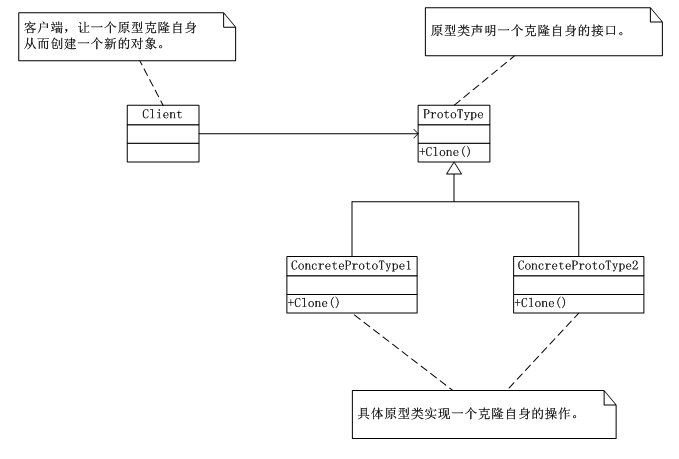
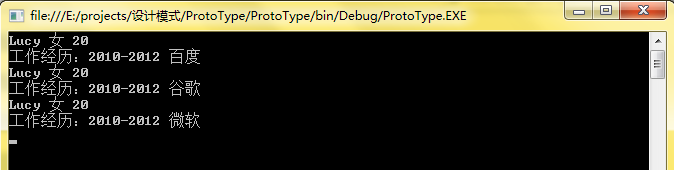

# 原型模式（ProtoType）
   原型模式（ProtoType）：用原型实例指定创建对象的种类，并且通过拷贝这些原型创建新的对象。字面理解其意思就是从一个对象创建另外一个可定制的对象，而无需知道任何创建的细节，并能提高创建的性能，说白了就是copy技术，把一个对象完整的copy出一份。

## 原型模式UML类图：



      实现克隆方法时，调用了.NET中封装的方法MemberwiseClone()方法，该方法创建一个浅表副本，方法是创建一个新对象， 然后将当前对象的非静态字段复制到该新对象。如果字段是值类型的，则对该字段执行逐位复制。如果字段是引用类型，则复制引用但不复制引用的对象；因此，原始对象及其复本引用同一对象。

      对于.NET而言原型抽象类ProtoType是用不到的，因为克隆的实用性，.NET在System的命名空间中提供了ICloneable接口，其中包含唯一的一个方法clone()，这样只需要实现这个接口就可以完成原型模式了。

      原型模式的有效利用会使得项目的性能大大的提高，在所创建对象的初始化不发生变化的情况下，使用克隆技术可以大大减少构造函数的调用，对于一个比较复杂费时间的构造函数来说，使用原型模式的克隆技术可以节省大量的时间，这样便很大程度上提高了性能，同时克隆技术还隐藏了对象创建的细节。

      但是我们必须了解在使用原型模式时，通过实现.NET中封装的接口IConeable，调用MemberwiseClone()方法来完成，该方法完成的是“浅拷贝”，在不涉及拷贝引用的情况下，可以达到很好的效果，然而，一旦涉及拷贝引用类型的深拷贝时，则不能达到想要的效果。

      首先，区分一下“浅拷贝”和“深拷贝”的区别，“浅拷贝”是指被复制的对象的所有变量都含有与原来的对象相同的值，而所有的对其他对象的引用都仍然指向原来的对象。而“深拷贝”则把引用对象的变量指向复制过的新对象。而不是原有被引用的原有对象。

## 原型模式应用实例-简历的深复制实现：

（1）工作经历类


```
using System;
using System.Collections.Generic;
using System.Linq;
using System.Text;

namespace ProtoType
{
   class WorkExperience :ICloneable
   {
       private string startDate;
       private string endDate;
       private string company;

       public string getStartDate()
       {
           return this.startDate;
       }
       public void setStartDate(string date)
       {
           this.startDate = date;
       }
       public string getEndDate()
       {
           return this.endDate;
       }
       public void setEndDate(string endDate)
       {
           this.endDate = endDate;
       }

       public string getCompany()
       {
           return this.company;
       }
       public void setCompany(string company)
       {
           this.company = company;
       }

       public Object Clone()
       {
           /*
            * MemberwiseClone 方法创建一个浅表副本，方法是创建一个新对象，
            * 然后将当前对象的非静态字段复制到该新对象。如果字段是值类型的，
            * 则对该字段执行逐位复制。如果字段是引用类型，则复制引用但不复制
            * 引用的对象；因此，原始对象及其复本引用同一对象。
            */
           return (Object)this.MemberwiseClone();
       }
   }
}
```
（2）简历类


```
using System;
using System.Collections.Generic;
using System.Linq;
using System.Text;

namespace ProtoType
{
   class Resume : ICloneable
   {
       private string name;
       private string sex;
       private int age;
       private WorkExperience workExperience;

       public Resume(String name)
       {
           this.name = name;
           this.workExperience = new WorkExperience();
       }
       public Resume(WorkExperience we)
       {
           this.workExperience = new WorkExperience();
           this.workExperience.setStartDate(((WorkExperience)workExperience.Clone()).getStartDate());
           this.workExperience.setEndDate(((WorkExperience)workExperience.Clone()).getEndDate());
           this.workExperience.setCompany(((WorkExperience)workExperience.Clone()).getCompany());
       }
       public string getName()
       {
           return this.name;
       }
       public void setName(string name)
       {
           this.name = name;
       }

       public string getSex()
       {
           return this.sex;
       }
       public void setSex(string sex)
       {
           this.sex = sex;
       }

       public int getAge()
       {
           return this.age;
       }
       public void setAge(int age)
       {
           this.age = age;
       }

       public WorkExperience getWorkExperience()
       {
           return this.workExperience;
       }
       public void setWorkExperience(string startDate,string endDate,string company)
       {
           this.workExperience.setStartDate(startDate);
           this.workExperience.setEndDate(endDate);
           this.workExperience.setCompany(company);
       }

       public void display()
       {
           Console.WriteLine("{0} {1} {2}",this.name,this.sex,this.age);
           Console.WriteLine("工作经历：{0}-{1} {2}",this.workExperience.getStartDate(),
           this.workExperience.getEndDate(),this.workExperience.getCompany());
       }

       public Object Clone()
       {
           Resume resume = new Resume(this.workExperience);
           resume.setName(this.name);
           resume.setAge(this.age);
           resume.setSex(this.sex);
           return resume;
           //return (Object)this.MemberwiseClone();
       }
   }
}
```
（3）客户端


```
using System;
using System.Collections.Generic;
using System.Linq;
using System.Text;

namespace ProtoType
{
   class Program
   {
       static void Main(string[] args)
       {
           Resume re = new Resume("Lucy");
           re.setSex("女");
           re.setAge(20);
           re.setWorkExperience("2010","2012","百度");


           Resume re2 = (Resume)re.Clone();
           re2.setWorkExperience("2010","2012","谷歌");


           Resume re3 = (Resume)re.Clone();
           re3.setWorkExperience("2010", "2012", "微软");
           re.display();
           re2.display();
           re3.display();
           Console.Read();
       }
   }
}
```
（4）运行结果

