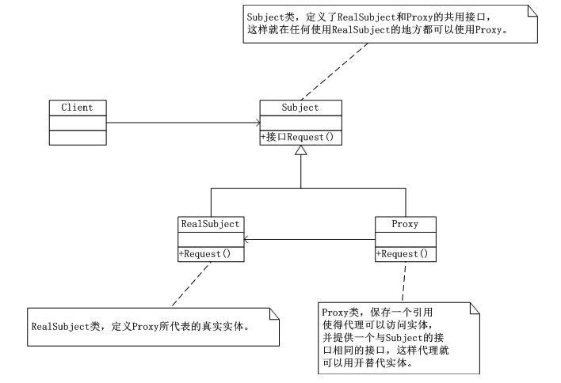

# 代理模式（Proxy）
  代理模式（Proxy）：为其他对象提供一种代理以控制对这个对象的访问。

   一般来说分为4种：
   （1）远程代理，也就是为一个对象在不同的地址空间提供局部代表，这样就可以隐藏一个对象存在于不同地址空间的事实。
   （2）虚拟代理，是根据需要创建需求很大的对象，通过它来存放实例化需要很长时间的真实对象。这样就可以达到性能的最优化，比如说你打开一个很大的HTML网页时，里面可能有很多的文字和图片，但是你还是可以很快的打开它，此时你所看到的是所有的文字，但图片却是一张一张的下载后才能看到，那些未打开的图片框，就是通过虚拟代理来替代了真实图片，此时代理存储了真是图片的路径和尺寸。
   （3）安全代理，用来控制真是对象访问的权限。
   （4）智能指引，是指当调用真实的对象时，代理处理另外一些事。

## 代理模式（Proxy）的UML类图：



      代理模式（Proxy）说白了就是“真实对象”的代表，在访问对象时引入一定程度的间接性，因为这种间接性可以附加多种用途。

## 代理模式实现：

```
using System;
using System.Collections.Generic;
using System.Linq;
using System.Text;

namespace Proxy
{
   //定义实体和代理的实现接口
   abstract class Subject
   {
       public abstract void request();
   }
   //RealSubject代表了真实实体
   class RealSubject : Subject
   {
       public override void request()
       {
           Console.WriteLine("真实实体实现接口中的方法，真实的请求...");
           //throw new NotImplementedException();
       }
   }
   //Proxy类代表代理类，同样实现接口方法
   class Proxy : Subject
   {
       private RealSubject rs;
       public RealSubject getRS()
       {
           return this.rs;
       }

       public void setRS(RealSubject rs)
       {
           this.rs = rs;
       }

       public override void request()
       {
           this.rs = new RealSubject();
           //调用真实实体的方法实现
           Console.WriteLine("该代理实体调用真是实体的方法...");
           this.rs.request();
           //throw new NotImplementedException();
       }
   }

}
````

//客户端程序

 ```
using System;
using System.Collections.Generic;
using System.Linq;
using System.Text;

namespace Proxy
{
   class Program
   {
       static void Main(string[] args)
       {
           //实体化一个代理对象
           Proxy proxy = new Proxy();
           //代理对象实现真实实体的请求，体现出来代理模式
           proxy.request();
           Console.Read();
       }
   }
}
```
## 代理模式（Proxy）案例

   场景：参加家长会

   描述：孩子学校组织家长会，做为家长的我们没有时间，正好媳妇她姐有空，所以由她代替我们去参加家长会

   代理，说到底是一个代理，最大程度上能执行被代理的最大能力。在一定程度上与被代理者执行力相同。

（一）参加家长会要做的事

```
/// <summary>
/// 执行三个动作：去学校，开会，回家
/// </summary>
public interface IMeet
{
    void ToSchool();
    void Meeting();
    void GoHome();
}
```
（二）做为家长的我们应该做的

```
public class Parents:IMeet
{
   #region IMeet 成员

   public void ToSchool()
   {
       Console.WriteLine("去学校，");
   }

   public void Meeting()
   {
       Console.WriteLine("开会！");
   }

   public void GoHome()
   {
       Console.WriteLine("回家。");
   }

   #endregion
}
```
（三）因为一些原因我们不能去，而由代理人（孩子他姨）去，她执行与我们相同的能力

```
/// <summary>
/// 实现与父母相同的接口
/// </summary>

public class AuntProxy:IMeet
{
   private Parents parents = new Parents();
   #region IMeet 成员

   public void ToSchool()
   {
       parents.ToSchool();
   }

   public void Meeting()
   {
       parents.Meeting();
   }

   public void GoHome()
   {
       parents.GoHome();
   }

   #endregion
}
```
（四）测试

```
       public void TestProxy()
       {
           AuntProxy proxy = new AuntProxy();

           proxy.ToSchool();
           proxy.Meeting();
           proxy.GoHome();
       }
```
    结果： 去学校， 开会！ 回家。


    在面向对象系统中，有些对象由于某种原因（比如对象创建的开销很大，或者某些操作需要安全控制，或者需要进程外的访问等），直接访问会给使用者、或者系统结构带来很多麻烦。 如何在不失去透明操作对象的同时来管理/控制这些对象特有的复杂性？增加一层间接层是软件开发中常见的解决方式。 为其他对象提供一种代理以控制对这个对象的访问。《设计模式》GOF