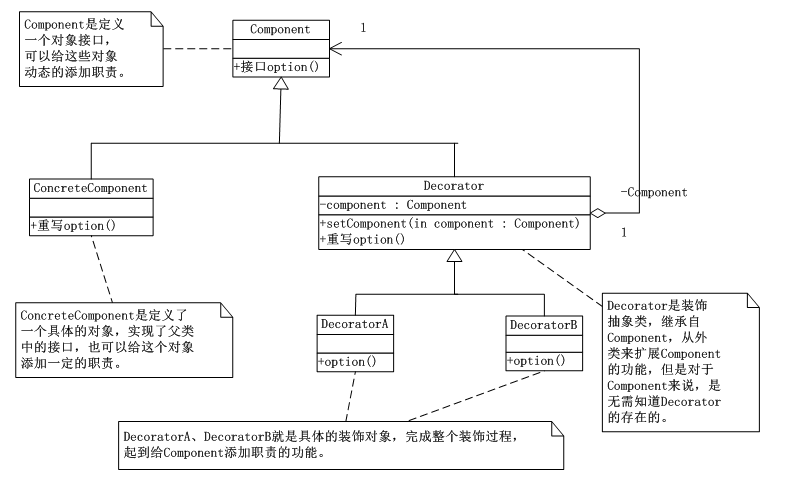

# 装饰模式(Decorator)
 装饰模式(Decorator)：动态地给一个对象添加一些额外的职责，就增加功能来说，装饰模式比生成子类更加灵活。

      其中Component定义了一个对象接口，可以给这些对象动态的添加职责；ConcreteComponent是定义了一个具体的对象，也可以给这个对象添加一些职责；Decorator装饰抽象类，继承自Component，从外类来扩展Component的功能，但对于Component来说，是无需知道Decorator的存在的；对于DecoratorA、DecoratorB是具体的装饰对象，起到给Component添加职责的功能。

      装饰模式利用setComponent()方法进行包装，这样每个对象的实现和使用该对象得到了分离，每个装饰对象只需要关心自己的功能，不需要涉及如何添加到装饰链。

      装饰模式是一个为已有功能添加更多功能提供便利的方式，当系统需要新的功能时，只需要向旧的类中添加新的功能代码，这些代码通常装饰了原有类