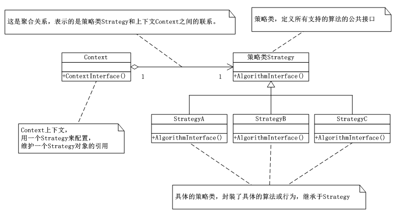

# 策略模式(Strategy)
   今天研究了一下策略模式，策略模式(Strategy)定义了一个算法家族，对每个算法分别封装成为一个单独的类，让他们之间可以相互的替换，此模式让算法的变化不会影响到使用算法的客户，可以减少了各种算法类与使用算法类之间的耦合。策略模式包含Strategy、context两个模块，Strategy为Context定义可一系列可供重用的算法或行为，继承有助于析取出这些算法中的公用功能。

      策略模式就是用来封装算法的，在实践中，我们可以用它来封装几乎封装任何类型的规则，只要在分析过程中需要在不同时间应用不同的业务规则，就可以考虑用策略模式处理这种变化的可能性。

      在策略模式中，选择所用具体实现的职责有客户端负责，然后转给策略模式的Context对象。

## 策略模式的UML类图：

      分析对比策略模式和简单工厂设计模式，我们可以发现，这两个设计模式的用法思路非常相似，唯一的不同之处就是，对于简单工厂设计模式来讲，选择具体实现方法是由工厂类Factory来负责，而在策略模式中是由客户端程序来负责的。因此，为了即达到定以算法家族实现独立算法的目的，又可以不让客户端来负责具体实现的选择，在具体的实践项目中我们可以将简单工厂设计模式与策略模式结合起来使用。