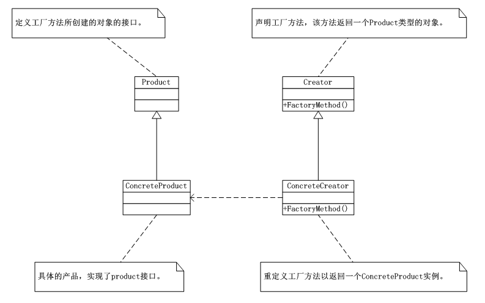
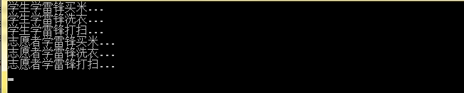

# 工厂方法模式（Factory Method）
工厂方法模式（Factory Method）：定义一个用于创建对象的接口，让子类决定实例化哪一个类，工厂方法使一个类的实例化延迟到其子类。

  工厂方法模式实现时，客户端需要决定实例化哪一个工厂，决定创建哪一个类的对象，也就是说，工厂方法模式把简单工厂的内部逻辑判断移到了客户端代码来进行，本来是要改工厂类的，而现在是修改客户端。总体来说，工厂方法模式修正了简单工厂中不遵循的开放-封闭原则。

## 工厂方法模式（Factory Method）的UML类图：



      简单工厂模式的最大优点就在于工厂类中包含了必要的逻辑判断，根据客户的选择条件动态实例化相关的类，对于客户端来说，去除了与具体产品的依赖。但是在面对功能扩展时，对于简单工厂模式在添加功能类的同时，必须修改工厂类，这就违反了开放-封闭原则；而对于工厂方法模式恰恰解决了这一问题，由结构图可以看出，在工厂方法模式中添加了工厂方法类，该工厂方法实现了实例化具体的功能类对象，扩展功能时不需要修改内部代码。

## Factory Method的应用实例：

     （1）具体的product对象接口

```
using System;
using System.Collections.Generic;
using System.Linq;
using System.Text;

namespace FactoryMethod2
{
//定义工厂方法所创建的对象的接口
abstract class LeiFeng
   {
public abstractvoid buyRice();
public abstractvoid wash();
public abstractvoid sweep();
   }

class Student : LeiFeng
   {

public overridevoid buyRice()
       {
           Console.WriteLine("学生学雷锋买米...");
//throw new NotImplementedException();
       }

public overridevoid wash()
       {
           Console.WriteLine("学生学雷锋洗衣...");
//throw new NotImplementedException();
       }

public overridevoid sweep()
       {
           Console.WriteLine("学生学雷锋打扫...");
//throw new NotImplementedException();
       }
   }

class Volunteer : LeiFeng
   {
public overridevoid buyRice()
       {
           Console.WriteLine("志愿者学雷锋买米...");
//throw new NotImplementedException();
       }

public overridevoid wash()
       {
           Console.WriteLine("志愿者学雷锋洗衣...");
//throw new NotImplementedException();
       }

public overridevoid sweep()
       {
           Console.WriteLine("志愿者学雷锋打扫...");
//throw new NotImplementedException();
       }
   }
}
```
    （2）工厂方法

```
using System;
using System.Collections.Generic;
using System.Linq;
using System.Text;


namespace FactoryMethod2
{

//声明工厂方法。该方法返回一个LeiFeng类型的对象
abstract class IFactory
   {
public abstract LeiFeng createLeiFeng();
   }

class StudentFactory : IFactory
   {
public override LeiFeng createLeiFeng()
       {
return new Student();
//throw new NotImplementedException();
       }
   }

class VolunteerFactory : IFactory
   {
public override LeiFeng createLeiFeng()
       {
return new Volunteer();
//throw new NotImplementedException();
       }
   }
}
```
    （3）客户端代码

```
using System;
using System.Collections.Generic;
using System.Linq;
using System.Text;

namespace FactoryMethod2
{
class Program
   {
static void Main(string[] args)
       {
           IFactory iFactory1 = new StudentFactory();
           LeiFeng leifeng1 = iFactory1.createLeiFeng();
           leifeng1.buyRice();
           leifeng1.wash();
           leifeng1.sweep();

           IFactory iFactory2 = new VolunteerFactory();
           LeiFeng leifeng2 = iFactory2.createLeiFeng();
           leifeng2.buyRice();
           leifeng2.wash();
           leifeng2.sweep();
           Console.Read();
       }
   }
}
```
    （4）运行结果

