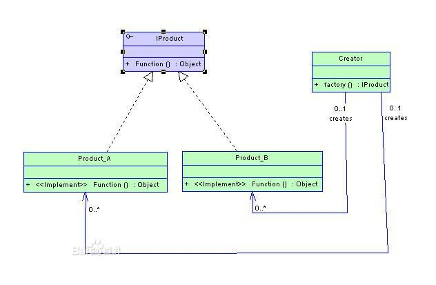

# 简单工厂设计模式(OperationFactory)
  今天学习了简单工厂设计模式（OperationFactory），随笔写写自己的理解，便于学以致用。

  简单工厂设计模式中，工厂类是核心，是与外界直接交互的接口，包含了必要的逻辑判断，根据外界操作决定应该创建哪一个操作（Operation）类的对象。在简单工厂设计模式中，秉承减少冗余代码的原则，将所有操作抽象成一个独立的父类，父类中包含着所有操作需要的共有属性和方法。对于每一个独立的操作通过继承父类，创建出独立的子类。

  下面是简单工厂设计模式的UML类图：

 如图所示，工厂类Creator，包含创建操作类对象的接口，操作的父类IProduct，包含两个子类Product_A 、 Product_B ，类间相互独立，当需要修改功能时，可独立修改类内代码，与工厂类无关。

   简单工厂设计模式通过工厂类，使得外界从直接创建操作对象的尴尬局面中摆脱出来，直接负责“消费”对象即可，而不必介入消费对象的创建中，有利于整个软件体系结构更加清晰。但是，简单工厂只适合于具体系统操作较少

，类间具有比较相似的属性方法的情况下，由于工厂类集中了所有实例的创建逻辑，违反了高内聚责任分配原则，将全部创建逻辑集中到了一个工厂类中。对于系统功能复杂时，难以用于系统的功能扩展。