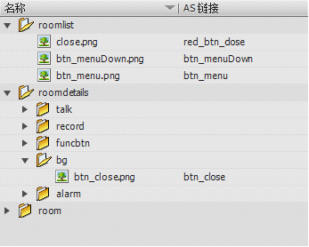
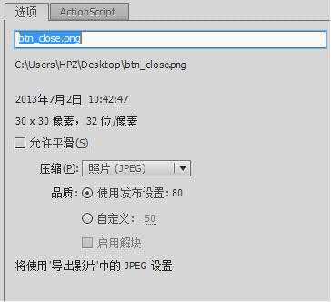

# 资源嵌入到swf文件
在flash新建一个fla的文档，导入需要的图片到库中，设置其AS链接，该值是唯一的



在库中点击图片右键属性，设置图片压缩，选择jpeg格式，建议品质设置为80，避免图片失真太过严重，处理完毕后就可以发布为swf或swc，然后添加到项目中



以下代码为在AS中声明该图片的类，source为swf文件相对位置，symbol为该图片的AS链接名
```
[Bindable][Embed(source="assets/smartHome/smartHome.swf",symbol="btn_close"]
private var close:Class;
```