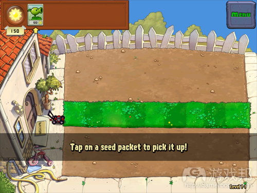

# “植物大战僵尸”开发者传授十大设计技巧
opCap热门策略游戏《植物大战僵尸》罕见地完成了一项使命——成功地将休闲玩家引进这种一般只有硬核群体才会感兴趣的游戏。该游戏开发者 George Fan在2012年GDC大会上分析了它能够吸引广泛用户群体的原因，并重点指出低调而完整的新手教程所发挥的作用。

他认为，“假如新手教程处理不当……游戏中的其他元素也就不可能引导我妈这类用户通关。”他分享了设计更有效而有趣的游戏新手教程的10点建议。

1. 让新手教程融入游戏中

Fan表示，“我们致力于淡化新手教程的‘指导’色彩”，多数玩家喜欢立即玩游戏，如果游戏迫使他们先掌握一些内容，他们很可能就会失去玩游戏的兴致。
“我有意淡化新手教程与游戏内容的界限……虽然人们喜欢学习，学习也具有内在的趣味性，但有时候我们得富有技巧地修饰它。”
“我们可以将教程与游戏无缝融合在一起……我们应该以潜移默化的方式引导玩家，不要让他们意识到自己正在接受指导。”

2. 不要让玩家光“看”不“做”

“执行操作是让玩家在游戏中获得学习的最理想引导方式”，文本教程内容当然可以传达更多信息，但让玩家“做”些事情往往更为有趣。
《植物大战僵尸》的首个关卡就体现了这一特点，它为玩家指明植物向右射击，僵尸向左行进，让玩家通过自己动手并查看操作结果，了解其需知的一切信息。
“玩家只需要玩游戏，就能掌握一切情况，我们不需要刻意告知情况。”

3. 扩展引导游戏机制

Fan表示PopCap认为玩家并不需要立即领悟一切游戏机制，如果将教程扩展至整个游戏，这种做法将更有效果。
“我们在《植物大战僵尸》中的做法很保守，我们缓慢而逐渐引进边缘机制”，即使像金钱这种基本概念也会等到玩家闯过10关后才出场。
而针对Zen Garden模式这类最复杂的游戏元素，PopCap直到游戏将近尾声才令其亮相。因为在这个时候，玩家已经有了许多经验，并且更原意掌握一些新的游戏机制。
“我刚开始玩游戏时，我学习新内容的积极性并不高。但深入玩游戏之后，我就会更有继续投入其中的意愿。”

4. 不要让玩家重复操作

有时候，玩家完成一次操作就能掌握游戏机制。“他们看到自己的操作结果，基本上就能领会该操作的含义”。
在《植物大战僵尸》中，Fan通过在地面投掷钱币，并在其上设置一个巨大的箭头，为游戏引进了金钱的概念。玩家点击钱币后，马上就会理解如何搜集地面上的物品。
在游戏的其他环节中，有些图标会以不断闪烁的方式，促使玩家点击并领会该操作的意义。

5. 使用简洁明了的语言

“不管是什么时候，最好只让屏幕最多显示8个字，我有时也会破例，但这确实是我们应该追求的理想状态”。

    

例如，游戏中就使用了“点击并拾取种子袋”这种简洁且便于玩家理解的描述。Fan称开发者应该使用最简练的措辞来传递核心理念。
“这会让玩家更愿意先看文字内容，然后玩游戏”。

6. 尽量不出现突兀的信息
Fan建议，如果在游戏过程中需要呈现文本内容，开发者最好使用不会暂停或打断游戏的被动方式传递信息。
“我每次在游戏过程中呈现信息时，都会尽量让它以被动方式体现出来，这样就不会干扰玩家的游戏操作。”

7. 灵活呈现信息

Fan认为开发者不但要让玩家知晓如何玩游戏，还要顾及已知晓如何操作游戏的玩家情绪。
在测试《植物大战僵尸》时，他发现有些玩家不知道息应该将植物放在屏幕左侧，为解决这个问题，他植入了一个信息提示系统。该系统只会为“操作失误”的玩家提供建议，而其他玩家却不会看到这些提示。
“我们必须让操作正确的玩家觉得自己很聪明……通过灵活的信息设置，我们能够让游戏在覆盖硬核游戏群体的同时，也兼顾像我妈这种休闲玩家”。

8. 不要频繁出现无用信息

“另一注意要点就是不要出现嘈杂的信息。我们都需要避免玩家因其他事情而转移注意力……我们应强调玩家需关注的内容”。
Fan鼓励开发者设置富有启发性或娱乐性的文本信息——要删繁就简，否则就可能失去玩家。“如果我们接二连三地向玩家抛出无关紧要的信息，这看起来就像是谎报军情，也会导致玩家关掉游戏”。

9. 使用图像传递信息

明智的视觉设计是一种传递游戏系统信息的必要工具，在《植物大战僵尸》中，每一个角色外观就会体现其自身功能。
例如一般的“射豆枪”植物，就有一个发射炮弹的大嘴，从它的名称就能看出这一特点。Fan表示游戏中的铁栅门僵尸、咖啡豆等其他角色也几乎都遵循了同样的原则。

10. 结合人们所掌握的常识

Fan最后解释道，《植物大战僵尸》使用这种看似极为常规的名称和假设条件的原因——这归根结底还是与视觉设计有关。

Fan称他从塔防游戏中得到灵感，他想设置静态的“塔”，这样玩家很快就会明白为何植物不能移动。而僵尸则行动缓慢，这样才会与游戏的单屏界面相称。

当玩家看到角色以自己能够理解的方式行动时，他们就会更愿意进入游戏世界，即便游戏机制乍一看有些可笑。

这种原则甚至也运用到了游戏中最微妙的系统。例如，游戏中的货币系统，使用的是钱币和宝石，这可以让玩家快速理解其价值。Fan本来还想使用大脑元素，但玩家并不理解这种元素的价值。

“这些设计决策看似微不足道，但如果你掉以轻心，可能就会产生令人困惑的结果”。

Fan用一句话总结了自己的演讲，“将这些经验运用到你的游戏上，你也可以制作出一款像《植物大战僵尸》一样容易上手的游戏。”